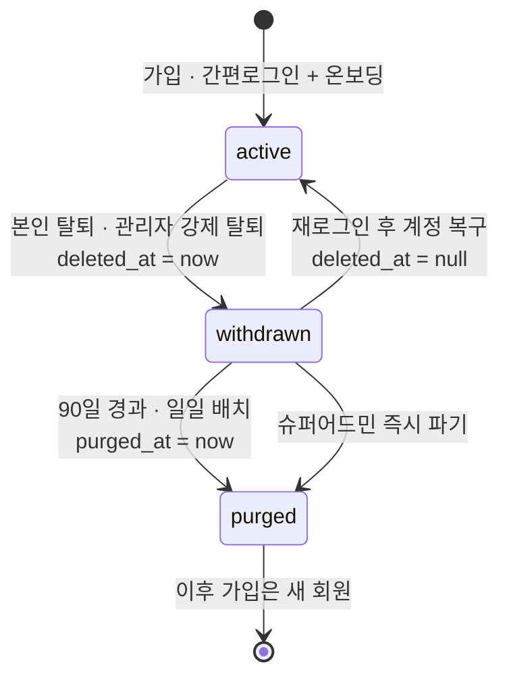
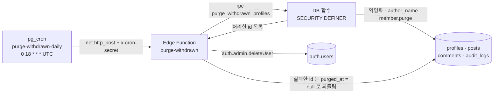
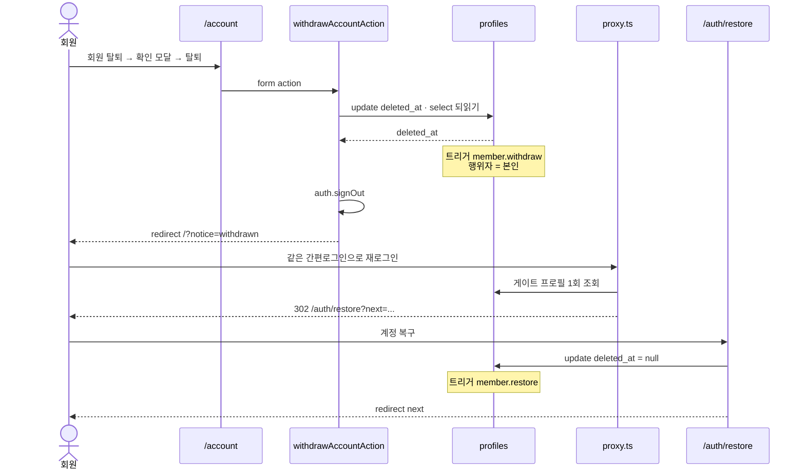

# 회원 탈퇴 라이프사이클 — 개발팀 인수인계 가이드

최종 갱신 2026-09-09 · 기준 커밋 `2e95e92` · 설계 원문 `docs/admin/ACCOUNT-WITHDRAWAL-PLAN.md`

> 이 문서는 **실제로 배포된 코드**를 설명한다. 계획서(PLAN)는 결정 이전의 선택지와 추정 규모를 담고 있어 코드와 다른 대목이 있다. 두 문서가 어긋나면 이 문서와 코드가 기준이다.

---

## 1. 개요 & 결정 사항

회원 탈퇴는 **두 단계 소프트 삭제**다. 탈퇴 요청은 `profiles.deleted_at` 을 찍을 뿐이고, 90일이 지나야 개인정보가 실제로 사라진다(`purged_at`). 프로필 행은 파기 후에도 **남는다** — 글·댓글의 `author_id` 가 살아 있어야 게시판이 그대로이기 때문이다.

| 구성 요소                              | 상태        | 근거                                                                                        |
| -------------------------------------- | ----------- | ------------------------------------------------------------------------------------------- |
| DB 마이그레이션                        | 적용됨      | `supabase/migrations/20260909000400_account_withdrawal.sql`                                 |
| Edge Function `purge-withdrawn`        | 배포됨      | 인증 없는 POST → 401, GET → 405 (실호출 확인)                                               |
| pg_cron 스케줄 `purge-withdrawn-daily` | 등록됨      | 마이그레이션 시점엔 확장이 꺼져 있어 스킵, 2026-09-09 운영자가 수동 등록 (확인 쿼리 → §4.2) |
| 개인정보처리방침 `20260918-2`          | 발행됨      | `current_legal_version('privacy')` 확인                                                     |
| 월드 연동 필수 글쓰기 플래그           | OFF(기본값) | `lib/constants/features.ts`                                                                 |

### 오너 결정 → 코드

| #   | 결정                                                       | 구현                                                                                                                                                                                                        |
| --- | ---------------------------------------------------------- | ----------------------------------------------------------------------------------------------------------------------------------------------------------------------------------------------------------- |
| 1   | 탈퇴 후 **90일 보존**, 이후 파기                           | `WITHDRAWAL_RETENTION_DAYS = 90`(`lib/auth/lifecycle.ts`) · `PURGE_RETENTION_DAYS = 90`(`admin/lib/validation/member-status.ts`) · `purge_withdrawn_profiles(p_cutoff interval default interval '90 days')` |
| 2   | 탈퇴 대기 중에는 **기존 닉네임 그대로** 표시               | 파기 전에는 `posts/comments.author_name` 스냅샷을 건드리지 않는다. 화면은 평소처럼 `maskNickname()` 결과를 그린다                                                                                           |
| 3   | 파기 후에는 **`탈퇴한 회원#xxxxxxxx`**                     | DB 는 `'탈퇴한 회원#' \|\| left(id::text, 8)` 을 저장하고, 사용자 사이트는 접두사를 보고 고정 문구 `탈퇴한 회원` 으로 그린다(`lib/utils/author-display.ts`). 관리자 콘솔은 저장값을 그대로 보여 준다        |
| 4   | **글·댓글은 유지**                                         | `profiles` 행을 지우지 않고 익명화한다. `profiles.id → auth.users` FK 를 걷어 내 auth 계정만 지워도 행이 남는다                                                                                             |
| 5   | 제재는 **탈퇴해도 유지**, **파기 시 소멸**                 | 탈퇴는 `suspended_until` 을 건드리지 않는다. 파기 함수가 `suspended_until`·`suspension_reason` 을 비운다(식별 근거가 사라지므로)                                                                            |
| 6   | 90일 뒤 재가입은 **새 계정** — 제재 미적용                 | 파기 시 `auth.users` 가 삭제되어 다시 로그인하면 `handle_new_user()` 가 **새 프로필**을 만든다. 옛 익명화 행과는 무관하다                                                                                   |
| 7   | 월드 계정 연동 필수 글쓰기는 **플래그로 준비만, 기본 OFF** | `FEATURES.postingRequiresMswLink` ← `NEXT_PUBLIC_FEATURE_POSTING_REQUIRES_MSW === 'true'`                                                                                                                   |
| 8   | 월드 **UID·프로필 코드 유니크**                            | `profiles_msw_uid_key`(부분 유니크) · `profiles_msw_profile_code_key`(`lower(msw_profile_code)` 부분 유니크)                                                                                                |

> **"아이디 중복 불가"의 해석** — 서비스에 별도 아이디가 없다(간편로그인만 쓴다). 닉네임은 이미 `lower(nickname)` 유니크였고, 이번에 월드 UID·프로필 코드에 유니크를 걸어 "같은 월드 계정을 두 프로필에 연결"하는 것을 막았다. 제재 회피를 막는 실질적 장치가 이것이다.

---

## 2. 상태 모델



### 컬럼 · 파생값

| 값                             | 어디에                                  | 뜻                                                                   |
| ------------------------------ | --------------------------------------- | -------------------------------------------------------------------- |
| `profiles.deleted_at`          | DB · `timestamptz`                      | 탈퇴 요청 시각. `null` 이면 정상 회원. 파기 뒤에도 **비우지 않는다** |
| `profiles.purged_at`           | DB · `timestamptz`                      | 개인정보 파기 시각. 값이 있으면 익명화 완료 · 복구 불가              |
| `memberLifecycle()`            | `admin/lib/validation/member-status.ts` | `active` / `withdrawn` / `purged`. **파기가 탈퇴를 이긴다**          |
| `purgeDueAt(deletedAt)`        | 동                                      | `deleted_at + 90일` (UTC ISO). 탈퇴 전이면 `null`                    |
| `daysUntilPurge()`             | 동                                      | 남은 일수. **올림**(`Math.ceil`), 음수는 `0` 으로 누른다             |
| `purgeCountdownLabel()`        | 동                                      | `D-nn`                                                               |
| `lifecycleLabel()`             | 동                                      | `탈퇴 대기 D-nn` — 목록·상세 상태 칸 문구                            |
| `purgedNickname(id)`           | 동                                      | `탈퇴한 회원#<id 앞 8자>` — DB 함수와 같은 규칙                      |
| `isWithdrawnProfile()`         | `lib/auth/lifecycle.ts`                 | `deleted_at` 이 채워졌는가(파기 포함)                                |
| `isPurgedProfile()`            | 동                                      | `purged_at` 이 채워졌는가                                            |
| `canRestoreProfile()`          | 동                                      | 탈퇴 대기 **이면서** 아직 파기 전                                    |
| `daysSinceWithdrawal()`        | 동                                      | 탈퇴 후 경과 일수(내림). 복구 화면 문구용                            |
| `resolvePostAuthDestination()` | 동                                      | 로그인 직후 목적지. **탈퇴 판정이 온보딩보다 먼저**                  |

> `purged` 인 행에도 `deleted_at` 이 남아 있다(언제 탈퇴했는지가 기록이다). 그래서 두 값을 모두 보는 판정 함수에서 **`purged_at` 을 먼저 본다** — 그러지 않으면 운영자가 "아직 복구할 수 있다"고 읽는다.

---

## 3. 데이터베이스

원문: `supabase/migrations/20260909000400_account_withdrawal.sql` (원격 적용 완료)

### 3.1 컬럼 · 인덱스

```sql
alter table public.profiles
  add column if not exists deleted_at timestamptz,
  add column if not exists purged_at  timestamptz;

-- 파기 배치가 "deleted_at <= 기준 시각 and purged_at is null" 로 훑는다.
create index if not exists profiles_deleted_at_idx
  on public.profiles (deleted_at) where deleted_at is not null;

create unique index if not exists profiles_msw_uid_key
  on public.profiles (msw_uid) where msw_uid is not null;

create unique index if not exists profiles_msw_profile_code_key
  on public.profiles (lower(msw_profile_code)) where msw_profile_code is not null;
```

프로필 코드는 저장 전에 소문자로 정규화되지만(`lib/validation/auth.ts`), DB 를 직접 고친 값까지 막으려고 `lower()` 로 건다. 적용 시점(2026-09-09) 중복 점검 결과 0건.

### 3.2 `auth.users` FK 제거 — 왜

```sql
alter table public.profiles drop constraint if exists profiles_id_fkey;
```

파기 순서는 **프로필 익명화 → `auth.users` 삭제**다. 기존 `on delete cascade` 가 남아 있으면 auth 삭제 순간 익명화된 프로필까지 사라지고, 글·댓글의 `author_id` 가 `null` 로 비워져 "게시판에는 영향이 없다"는 약속이 깨진다.

FK 를 **다시 걸지 않는다.** 프로필을 만드는 경로는 `handle_new_user()` 트리거(`auth.users AFTER INSERT`) 하나뿐이므로, auth 없는 프로필은 파기 배치에서만 생기고 그것이 의도한 상태다.

### 3.3 `is_withdrawn()`

```sql
create or replace function public.is_withdrawn()
returns boolean language sql stable security invoker set search_path = public
as $$
  select exists (
    select 1 from public.profiles
    where id = (select auth.uid()) and deleted_at is not null
  );
$$;
```

`is_suspended()` 와 같은 구조(SECURITY INVOKER · 자기 행만 읽는다). 실행 권한은 `authenticated`·`service_role` 에만 준다(`public`·`anon` 회수).

`not public.is_withdrawn()` 이 추가된 정책 8개:

| 테이블       | 정책                     | 명령         | 함께 걸린 조건                               |
| ------------ | ------------------------ | ------------ | -------------------------------------------- |
| `posts`      | `posts_insert_community` | INSERT check | `not is_suspended()`                         |
| `posts`      | `posts_update_own`       | UPDATE using | 본인 · community · 미삭제                    |
| `comments`   | `comments_insert_own`    | INSERT check | `not is_suspended()`                         |
| `comments`   | `comments_update_own`    | UPDATE using | 본인 · 미삭제                                |
| `post_likes` | `post_likes_insert_own`  | INSERT check | `not is_suspended()`                         |
| `reports`    | `reports_insert_own`     | INSERT check | `not is_suspended()` · `can_report_target()` |
| `inquiries`  | `inquiries_insert_own`   | INSERT check | 본인 · `status = 'pending'`                  |
| `inquiries`  | `inquiries_update_own`   | UPDATE using | 본인                                         |

> 화면은 탈퇴 대기 계정을 `/auth/restore` 로 보내지만, **서버 액션은 직접 POST 로도 호출된다.** 최종 방어선은 이 정책들이다.

### 3.4 `guard_profile_role()` — 상태 컬럼 잠금

`SECURITY INVOKER` 여야 한다. 순서대로:

1. `current_user` 가 `postgres`·`supabase_admin`·`service_role` 이면 그대로 통과한다.
2. `new.purged_at := old.purged_at` — **관리자를 포함해 누구도 직접 못 쓴다.** 파기 함수(SECURITY DEFINER, 소유자 postgres)와 서비스 롤만 1번 분기로 통과한다.
3. `is_admin()` 이면 — 슈퍼어드민이 아닐 때 `role`·`admin_role_id` 만 되돌리고 반환한다. 즉 **관리자는 다른 회원의 `deleted_at` 을 쓸 수 있다**(강제 탈퇴의 근거).
4. 일반 사용자는 `role`·`admin_role_id`·`id`·`created_at`·`email`·`provider`·`provider_id`·`suspended_until`·`suspension_reason` 가 전부 `old` 로 되돌아간다.
5. 일반 사용자의 `deleted_at` 변경은 두 가지만:
   - `null` 로 만들기(복구) — 단 `old.purged_at` 이 있으면 무시한다(파기된 계정은 복구 불가).
   - 값 채우기(탈퇴) — 값이 무엇이든 **`now()` 로 고정**한다. 과거 시각을 넣어 파기를 앞당기거나 먼 미래를 넣어 영원히 보존시키는 요청이 통하지 않는다.

### 3.5 감사 로그 트리거 `log_profile_lifecycle`

```sql
create trigger log_profile_lifecycle
  after update of deleted_at on public.profiles
  for each row execute function public.log_profile_lifecycle();
```

- `null → 값` 이면 `member.withdraw`, `값 → null` 이면 `member.restore`. 그 밖의 변경은 아무것도 남기지 않는다.
- 행위자는 `auth.uid()` — 본인 탈퇴는 본인 id, 관리자 강제 탈퇴는 관리자 id, 서비스 롤 경로는 `null`.
- `before`/`after` 는 `{"deleted_at": …}` jsonb.
- `SECURITY DEFINER`(소유자 postgres = 테이블 소유자)라 RLS 를 타지 않는다. 사용자 사이트는 `audit_logs` 에 직접 쓸 수 없기 때문에(`audit_logs_insert_admin`) 트리거가 필요하다.
- 실행 권한은 `public`·`anon`·`authenticated` 에서 모두 회수했다(트리거 전용).

### 3.6 `purge_withdrawn_profiles(interval)`

`returns setof uuid` · `SECURITY DEFINER` · **실행 권한은 `service_role` 뿐**.

대상: `deleted_at is not null and deleted_at <= now() - p_cutoff and purged_at is null`, `order by deleted_at`, `for update skip locked`.

한 행마다:

| 대상         | 처리                                                                                                                                                                                                                               |
| ------------ | ---------------------------------------------------------------------------------------------------------------------------------------------------------------------------------------------------------------------------------- |
| `profiles`   | `email = null`, `nickname = '탈퇴한 회원#'\|\|left(id::text,8)`, `avatar_url = null`, `provider_id = null`, `msw_uid = null`, `msw_profile_code = null`, `suspended_until = null`, `suspension_reason = null`, `purged_at = now()` |
| `posts`      | `author_name` → 같은 익명 닉네임 (`author_id` 일치 & 값이 다를 때만)                                                                                                                                                               |
| `comments`   | `author_name` → 같은 익명 닉네임 (동일 조건)                                                                                                                                                                                       |
| `audit_logs` | `member.purge` · `actor_id = null` · `after = {"purged_at": …, "cutoff": "…"}`                                                                                                                                                     |
| 반환         | 처리한 `id` 를 `return next`                                                                                                                                                                                                       |

**건드리지 않는 것**: `deleted_at`, `created_at`, `role`·`admin_role_id`, 약관·개인정보·연령 동의 시각, 글·댓글 본문, `auth.users`.

`auth.users` 삭제를 여기서 하지 않는 이유 — DB 함수가 `auth` 스키마를 직접 지우는 것은 Supabase 가 권장하지 않는다. 처리한 id 를 돌려주면 Edge Function 이 서비스 롤로 `auth.admin.deleteUser` 를 부른다.

닉네임 충돌은 없다. 실제 회원 닉네임은 공백·`#` 을 쓸 수 없고(`nicknameSchema`), `lower(nickname)` 유니크는 id 조각으로 만족한다.

```sql
revoke all on function public.purge_withdrawn_profiles(interval) from public, anon, authenticated;
grant execute on function public.purge_withdrawn_profiles(interval) to service_role;
```

---

## 4. 자동 파기 배치



### 4.1 Edge Function

`supabase/functions/purge-withdrawn/index.ts` · `supabase/config.toml` 의

```toml
[functions.purge-withdrawn]
verify_jwt = false
```

게이트웨이 JWT 검증을 끈 이유는 pg_cron 이 Supabase JWT 없이 `x-cron-secret` 헤더만 보내기 때문이다. 인가는 함수 안에서 한다.

| 항목   | 값                                                                                               |
| ------ | ------------------------------------------------------------------------------------------------ |
| 인가 ① | `x-cron-secret` 헤더 == secret `CRON_SECRET` (길이 차이도 감추는 바이트 단위 상수시간 비교)      |
| 인가 ② | `Authorization: Bearer <SUPABASE_SERVICE_ROLE_KEY>` (수동 실행용)                                |
| 요청   | `POST {}` · 선택 `{"cutoffDays": n}` — 1 이상 3650 이하 정수만 인정, 그 밖에는 기본 90           |
| 200    | `{ ok: true, purged, authDeleted, failed: [{ id, reason }] }`                                    |
| 401    | `{"error":"unauthorized"}`                                                                       |
| 405    | `{"error":"method_not_allowed"}` — POST 가 아닐 때                                               |
| 500    | `{"error":"purge_failed"}` — RPC 실패                                                            |
| 503    | `{"error":"not_configured"}` — `CRON_SECRET` 과 `SUPABASE_SERVICE_ROLE_KEY` 가 **둘 다** 없을 때 |

- `auth.admin.deleteUser` 가 404 를 내면 성공으로 본다(지난 실행에서 이미 지워졌을 수 있다).
- 삭제 실패한 건은 `purged_at` 을 `null` 로 되돌려 다음 실행이 다시 태운다. 익명화는 멱등이라 두 번 돌아도 같은 값이다.
- 한 건이 실패해도 나머지는 계속 처리한다.

### 4.2 스케줄

비밀값은 마이그레이션 파일에 적지 않는다. pg_cron 이 Vault 의 `purge_withdrawn_cron_secret` 을 읽어 헤더에 싣고, 함수는 자기 secret `CRON_SECRET` 과 비교한다.

```sql
select cron.schedule(
  'purge-withdrawn-daily',
  '0 18 * * *',                              -- UTC 18:00 = KST 03:00
  $job$
    select net.http_post(
      url := 'https://zafouiovmsfebfkjuyos.supabase.co/functions/v1/purge-withdrawn',
      headers := jsonb_build_object(
        'Content-Type', 'application/json',
        'x-cron-secret', (
          select decrypted_secret from vault.decrypted_secrets
          where name = 'purge_withdrawn_cron_secret' limit 1
        )
      ),
      body := '{}'::jsonb,
      timeout_milliseconds := 30000
    );
  $job$
);
```

확인:

```sql
select jobname, schedule, active from cron.job;
```

수동 실행(서비스 롤 키 또는 크론 secret):

```bash
curl -X POST https://zafouiovmsfebfkjuyos.supabase.co/functions/v1/purge-withdrawn \
  -H 'Content-Type: application/json' \
  -H "x-cron-secret: $CRON_SECRET" \
  -d '{}'
```

> **주의** — 마이그레이션의 8절은 `pg_cron` 과 `pg_net` 이 **둘 다 켜져 있을 때만** 스케줄을 만든다. 적용 시점(2026-09-09) 프로젝트에는 두 확장이 없어 `raise notice` 만 남기고 지나갔다. 확장을 켠 뒤 위 `cron.schedule` 을 SQL 편집기에서 그대로 실행해야 한다(같은 이름이면 갱신된다). **지금은 자동 파기가 돌지 않는다.**

---

## 5. 클라이언트 플로우



### 5.1 탈퇴

- 진입: `/account` 맨 아래 "회원 탈퇴" 섹션(`app/(auth)/account/page.tsx`) → `WithdrawAccountButton`.
- 확인 모달 3요소는 `lib/auth/lifecycle.ts` 의 상수다 — `WITHDRAW_DIALOG_TITLE`("회원 탈퇴") · `WITHDRAW_DIALOG_DESCRIPTION`(90일 보존 · 파기 항목 · 글은 남고 "탈퇴한 회원" 표시 · 제재 유지) · 취소 + 위험 버튼.
- `withdrawAccountAction`(`lib/actions/account-actions.ts`)은 **세션 클라이언트**로 자기 행의 `deleted_at` 만 쓴다. 값은 트리거가 `now()` 로 고정한다.
- 갱신 뒤 `.select('deleted_at').maybeSingle()` 로 **되읽는다** — 정책에 걸려 0행이 바뀌어도 PostgREST 는 오류를 내지 않기 때문이다.
- 실패 문구: `탈퇴를 처리하지 못했습니다. 계정은 그대로입니다. 다시 시도해 주세요.`
- 성공하면 `signOut()` 후 `/?notice=withdrawn` 으로 리다이렉트. 홈은 `FlashNotice` 로 `WITHDRAWN_NOTICE_MESSAGE` 를 한 번 보여 준다(`app/(public)/page.tsx`).

### 5.2 프록시 게이트

`proxy.ts`(Next.js 16 에서 `middleware.ts` 를 대체한다)는 **로그인 사용자 + 게이트 대상 경로**일 때만 프로필을 한 번 읽는다.

| 상수                          | 값                                                                       | 동작                                                                       |
| ----------------------------- | ------------------------------------------------------------------------ | -------------------------------------------------------------------------- |
| `WITHDRAWN_READ_PREFIXES`     | `/community/write`, `/account`, `/auth/onboarding`, `/support/inquiries` | GET·HEAD → `302 /auth/restore?next=<원래 경로+쿼리>`                       |
| `WITHDRAWN_MUTATION_PREFIXES` | `/community`, `/support`, `/account`, `/auth/onboarding`                 | 비-GET → `403 {"error":"account_withdrawn","restorePath":"/auth/restore"}` |

- `/auth/restore` 자체와 그 액션은 게이트에서 제외된다(가야 하는 곳이므로).
- 리다이렉트에는 `updateSession()` 이 심은 갱신 쿠키를 옮겨 싣는다(`redirectWithSession`). 안 그러면 리프레시 토큰이 유실돼 임의 로그아웃이 난다.
- 프로필 조회 실패는 "정상 회원"으로 본다(오탐 차단 방지). 쓰기는 RLS 가 최종적으로 막는다.
- **탈퇴 대기 중에도 공개 읽기는 그대로 열려 있다** — 홈·커뮤니티 목록/상세·뉴스·정책 문서 등.

### 5.3 복구

- `/auth/restore`(`app/auth/restore/page.tsx`)는 프로필의 `deleted_at`·`purged_at` 만 읽는다.
- 정상 회원이 주소로 들어오면 `next` 로 그냥 보낸다.
- 복구 가능하면 본문은 `restoreNotice()` — "탈퇴 후 N일이 지났습니다. 계속하면 계정이 복구됩니다. 이용 제한이 있었다면 그대로 적용됩니다."
- 파기가 끝난 계정이면 `PURGED_ACCOUNT_MESSAGE` 와 **로그아웃 버튼만** 남는다(복구 버튼 없음).
- `restoreAccountAction` 은 `canRestoreProfile()` 을 다시 확인하고 `deleted_at = null` 을 쓴 뒤 `sanitizePostAuthPath(next)` 로 리다이렉트한다.
- 헤더는 탈퇴 대기 계정에게 닉네임 메뉴 대신 **"계정 복구" 버튼 하나**만 보인다(`components/layout/AuthMenu.tsx` · `MobileNav.tsx`, 근거는 `getCurrentUser()` 의 `isWithdrawn`).
- 로그인 직후 목적지는 `resolvePostAuthDestination()` 하나가 소유한다 — **탈퇴 > 온보딩 > next** 순서. `app/auth/callback/route.ts` 와 `stubSocialSignIn` 이 같은 함수를 쓴다.

### 5.4 작성자 표시

공개 조회(anon)는 `profiles` 를 읽을 수 없다. 화면의 유일한 근거는 `posts/comments.author_name` 스냅샷이다.

```
lib/data/mappers.ts   authorPurged = isPurgedAuthorName(row.author_name)   // '탈퇴한 회원#' 접두사
lib/utils/author-display.ts
  PURGED_AUTHOR_LABEL = '탈퇴한 회원'
  authorLabel({ author, authorPurged }) → authorPurged ? '탈퇴한 회원' : maskNickname(author)
```

탈퇴 대기 중에는 스냅샷이 그대로라 기존 마스킹 닉네임이 보인다(오너 결정 2).

### 5.5 월드 계정 유니크 충돌(23505)

`lib/actions/pg-error.ts` 가 코드 `23505` 를 판정하고 오류 메시지에서 제약 이름만 뽑는다(`constraint "…"`). 원문은 절대 노출하지 않는다.

| 제약 이름 조각        | 필드 오류        | 문구                                                                   |
| --------------------- | ---------------- | ---------------------------------------------------------------------- |
| `nickname`(또는 미상) | `nickname`       | 이미 사용 중인 닉네임입니다.                                           |
| `msw_profile_code`    | `mswProfileCode` | 이미 다른 계정에 연결된 프로필 코드입니다.                             |
| `msw_uid`             | `mswUid`         | 이미 다른 계정에 연결된 월드 계정 UID입니다. 고객지원에 문의해 주세요. |

판정 순서가 중요하다 — `msw_profile_code` 를 `msw_uid` 보다 먼저 본다. 대표적인 충돌 원인은 **탈퇴 대기 중인 옛 계정이 그 값을 붙잡고 있는 경우**라 사용자가 스스로 풀 수 없어 고객지원으로 안내한다. `completeOnboarding` 과 `updateAccount` 가 같은 헬퍼를 쓴다.

### 5.6 월드 연동 필수 글쓰기 플래그

```
FEATURES.postingRequiresMswLink = process.env.NEXT_PUBLIC_FEATURE_POSTING_REQUIRES_MSW === 'true'   // 기본 OFF
```

- 판정·문구는 `lib/utils/msw-link.ts` 한 곳: `requiresMswLink()` · `mswLinkNotice()` · `MSW_LINK_REQUIRED_MESSAGE`("월드 계정을 연동하면 글을 쓸 수 있습니다. 내 정보에서 연동해 주세요.").
- 서버 액션 `createPost`·`createComment`(`lib/actions/post-actions.ts`)가 **정지 검사 다음에** 같은 조건을 다시 본다.
- 화면은 `components/board/MswLinkNotice.tsx` 배너 — 글쓰기 페이지와 댓글 폼에서 입력을 잠근다.
- 켤 때는 `NEXT_PUBLIC_FEATURE_MSW_ACCOUNT_FIELDS` 도 함께 켜야 연동 경로(입력칸)가 열린다. 두 값 모두 **빌드 타임 치환**이므로 재배포가 필요하다.

### 5.7 개인정보처리방침

- 코드 문안: `lib/content/privacy-policy/section-04-07.ts` §4(보유 기간 — 90일 보존, 파기 항목 목록, 게시글 비식별화)·§7(파기 절차 — "매일 자동 배치").
- 버전: `PRIVACY_POLICY_VERSION = '20260918-2'`, 시행일은 그대로 `2026년 9월 18일`.
- 발행 경로: `scripts/seed-legal.mjs` 가 코드 문안 → HTML(`policy-to-html` + `sanitizeLegalHtml`) 로 바꿔 마이그레이션 SEED 구간을 갱신한다. 이미 심어진 문서는 `legal_document_versions` 에 새 버전 행을 `is_published = true` 로 넣고, `current_legal_version('privacy')` 로 확인한 뒤 클라이언트 캐시 태그 `legal` 을 revalidate 한다.
- 관리자 콘솔에서 발행할 때도 같은 태그를 비운다(`admin/lib/actions/legal-actions.ts` → `revalidateClient([LEGAL_CLIENT_CACHE_TAG])`).
- 현재 배포본 확인 결과: `version = 20260918-2`, `effective_date = 2026-09-18`.

---

## 6. 관리자 콘솔

### 6.1 회원 목록 `/members`

- 상태 칸은 `MemberStatusBadges`(`admin/components/members/MemberIdentity.tsx`).
  - `purged` → 회색 뱃지 **삭제됨** 하나만. 제재는 이미 비었고 로그인 계정도 없다.
  - `active` → 기존 뱃지(정상 / 정지 ~날짜 / 관리자).
  - `withdrawn` → **탈퇴 대기 D-nn** + 제재가 있으면 정지 뱃지를 **덧붙인다**(탈퇴해도 제재가 유지된다는 사실이 목록에서 보여야 한다).
- 필터 `?status=` — `normal` · `suspended` · `withdrawn` · `purged` · `admin`(`MEMBER_STATUS_FILTERS`). 허용 목록 밖의 값은 조용히 "전체"로 떨어진다(`parseMemberListParams`).
  - `withdrawn` → `deleted_at is not null and purged_at is null`
  - `purged` → `purged_at is not null`
  - `normal` → `role='user' and deleted_at is null and (suspended_until is null or <= now)`
  - 필터는 뱃지와 달리 배타적이지 않다 — "탈퇴 대기이면서 정지"는 양쪽에서 찾힌다.
- 필터 `?msw=` — 월드 UID·프로필 코드 **정확 일치** 검색(`msw_uid.eq` / `msw_profile_code.ilike`, `\ % _` 이스케이프). 부분 일치를 쓰지 않는다. 검색 폼은 이 값을 hidden 으로 보존하고, 해제 링크를 따로 둔다.

### 6.2 회원 상세

- `MemberLifecycleCard` — `active` 면 **아예 그리지 않는다**. 탈퇴일 · 파기 예정일(+`D-nn`, 위험 톤) · 파기일. 파기된 계정은 남은 일수를 적지 않는다.
  - 복구 이력은 적지 않는다(복구는 `deleted_at` 을 비우는 것이라 별도 기록이 없다). 감사 로그 `member.restore` 로 안내한다.
- `MemberProfileCard` — 파기된 계정은 **이메일 · 공급자 ID · MSW UID · 프로필 코드 칸을 렌더하지 않는다**(빈 칸을 남기면 "조회 실패"로 읽힌다). 그 외 칸(가입일·동의 시각·권한 등)은 그대로.
- `MemberActions` — `purged` 면 조치 버튼을 **전부 감춘다**. `active` + 자기 자신이 아님 → 강제 탈퇴. `withdrawn` + 슈퍼어드민 + 자기 자신이 아님 → 개인정보 즉시 파기. 정지·정지 해제·닉네임 강제 변경은 탈퇴 대기 중에도 가능하다.
- 회원을 관리자로 올리는 조작과 계정 삭제 버튼은 없다(삭제는 탈퇴 → 90일 → 파기 두 단계로만).

### 6.3 개인정보 즉시 파기 (슈퍼어드민)

`purgeMemberNowAction`(`admin/lib/actions/member-lifecycle-actions.ts`)

- 권한: `requireSuperAdmin()`. 자기 자신 금지(파기는 auth 계정까지 지워 세션이 끊긴다).
- 상태 확인: `purged` → "이미 개인정보가 파기된 회원입니다." / `active` → "탈퇴하지 않은 회원입니다. 먼저 탈퇴 처리를 한 뒤에 파기할 수 있습니다."
- **DB 배치 함수를 쓰지 않는다.** `purge_withdrawn_profiles(p_cutoff)` 도 Edge Function 도 대상 지정 인자가 없어, 한 명을 지우려고 부르면 기간이 지난 다른 회원까지 함께 파기된다. 그래서 서비스 롤(`createAdminClient()`)로 **같은 필드를 한 명분만** 지운다 — 필드 목록은 §3.6 과 한 줄씩 같다.
- 순서: 프로필 익명화 → `posts`/`comments`의 `author_name` 갱신 → `auth.admin.deleteUser`.
  - 스냅샷 갱신 실패는 파기를 되돌리지 않는다(개인정보는 이미 지워졌고, 되돌리면 더 나쁜 상태가 된다). 다음 배치가 다시 시도한다.
  - **auth 삭제 실패 시 `purged_at` 을 `null` 로 되돌린다** — 로그인 수단이 남았는데 "파기됨"으로 표시되면 다음 배치가 이 회원을 건너뛰어 이메일이 영영 남는다.
- 감사 로그 `member.purge` — 행위자 = 슈퍼어드민, `before` 에 닉네임·이메일·MSW 값·`deleted_at`, `after` 에 `{ nickname, purged_at, immediate: true }`.
- 사용자 사이트 캐시 태그 `community-list` 를 revalidate 한다(작성자 표시 이름이 바뀌었다).

### 6.4 강제 탈퇴 (`members:write`)

`forceWithdrawMemberAction`

- 자기 자신 금지. `role = 'admin'` 인 계정 금지(관리자는 `/admins` 에서 다룬다).
- 이미 `withdrawn`/`purged` 면 거절.
- 제재는 건드리지 않는다 — 복구하면 남은 제재가 그대로 적용되어야 "탈퇴로 제재를 피한다"는 길이 막힌다.
- **세션 클라이언트로 쓴다**(서비스 롤 아님). `profiles_update_admin` 정책이 관리자에게 다른 회원의 UPDATE 를 열어 주고, `guard_profile_role()` 도 관리자 분기에서 `deleted_at` 을 잠그지 않는다. 서비스 롤을 쓰면 DB 트리거가 남기는 `member.withdraw` 의 행위자가 `null` 이 되어 추적이 끊긴다.
- 결과적으로 감사 로그에 **두 줄**이 남는다 — 트리거의 `member.withdraw`(행위자 = 관리자) + 액션의 `member.force_withdraw`.

### 6.5 대시보드

`admin/lib/data/dashboard.ts` → `admin/app/(admin)/page.tsx`

| 지표          | 정의                                           | 힌트 문구                                   | testId           |
| ------------- | ---------------------------------------------- | ------------------------------------------- | ---------------- |
| 탈퇴 대기     | `deleted_at is not null and purged_at is null` | `파기까지 90일 · 그 안에 재로그인하면 복구` | `stat-withdrawn` |
| 지난 7일 파기 | `purged_at >= 주 경계`                         | `개인정보 영구 삭제 완료`                   | `stat-purged`    |

### 6.6 감사 로그 액션

`admin/components/audit/audit-labels.ts`

| action                  | 라벨            | 남기는 주체                       | 행위자                                      |
| ----------------------- | --------------- | --------------------------------- | ------------------------------------------- |
| `member.withdraw`       | 회원 탈퇴(본인) | DB 트리거 `log_profile_lifecycle` | `auth.uid()` — 본인 또는 강제 탈퇴한 관리자 |
| `member.restore`        | 탈퇴 복구(본인) | DB 트리거                         | `auth.uid()` — 본인                         |
| `member.purge`          | 개인정보 파기   | 배치 함수 / 관리자 액션           | 배치는 `null`, 즉시 파기는 슈퍼어드민 id    |
| `member.force_withdraw` | 강제 탈퇴       | `forceWithdrawMemberAction`       | 관리자 id                                   |

---

## 7. 권한 · 보안 체크리스트

| 무엇                                  | 누가 할 수 있나                                                                                                              |
| ------------------------------------- | ---------------------------------------------------------------------------------------------------------------------------- |
| `deleted_at` 채우기(탈퇴)             | 본인(값은 트리거가 `now()` 로 고정) · 관리자(`profiles_update_admin` + 가드 관리자 분기) · 서비스 롤                         |
| `deleted_at` 비우기(복구)             | 본인 · 관리자 · 서비스 롤. 단 `purged_at` 이 있으면 일반 사용자 분기에서 무시된다                                            |
| `purged_at` 쓰기                      | **서비스 롤과 파기 함수(SECURITY DEFINER)만.** 관리자도 직접 못 쓴다 — 가드가 `new.purged_at := old.purged_at` 으로 되돌린다 |
| `suspended_until`·`suspension_reason` | 관리자·서비스 롤만. 파기 함수가 비운다                                                                                       |
| `purge_withdrawn_profiles()` 실행     | `service_role` 만(`public`·`anon`·`authenticated` 회수)                                                                      |
| `is_withdrawn()` 실행                 | `authenticated`·`service_role`                                                                                               |
| `log_profile_lifecycle()` 실행        | 트리거 전용(모든 롤에서 회수)                                                                                                |
| `auth.users` 삭제                     | 서비스 롤 — Edge Function `purge-withdrawn` 또는 관리자 즉시 파기 액션                                                       |
| 탈퇴 대기 계정의 쓰기                 | 전부 차단 — RLS 8개 정책 `not is_withdrawn()` + 프록시 게이트(403/302)                                                       |
| 배치 호출                             | `x-cron-secret` == `CRON_SECRET` 또는 서비스 롤 Bearer. secret 비교는 상수시간                                               |
| 감사 로그에 남는 것                   | 탈퇴·복구·파기·강제 탈퇴 4종. `audit_logs` 는 append-only(관리자 insert 정책만 있고 수정·삭제 경로가 없다)                   |

`admin/tests/unit/actions-no-raw-error.test.ts` 규약대로, 파기·강제 탈퇴 실패 시 사용자에게 보이는 것은 고정 문구뿐이다(원문 오류는 `logFailure` 로 서버 로그에만).

---

## 8. 테스트 · 검증

### 8.1 유닛 테스트 (2026-09-09 기준 전체 통과)

| 위치                                                | 테스트 수 | 무엇을 고정하나                                                                                             |
| --------------------------------------------------- | --------- | ----------------------------------------------------------------------------------------------------------- |
| `tests/unit/auth/lifecycle.test.ts`                 | 15        | 판정 함수·경과 일수·복구 문구·로그인 후 목적지 순서                                                         |
| `tests/unit/actions/account-actions.test.ts`        | 10        | 탈퇴·복구 액션의 되읽기, 실패 문구, 파기 계정 거절, 리다이렉트 목적지                                       |
| `tests/unit/utils/author-display.test.ts`           | 5         | `탈퇴한 회원#` 접두사 판정과 표시 문구                                                                      |
| `tests/unit/utils/msw-link.test.ts`                 | 6         | 플래그 OFF 통과 · UID 없음 판정 · 안내 문구                                                                 |
| `admin/tests/unit/member-lifecycle.test.ts`         | 17        | `memberLifecycle`·`purgeDueAt`·`D-nn` 올림·라벨·익명 닉네임                                                 |
| `admin/tests/unit/member-lifecycle-actions.test.ts` | 15        | **파기가 지우는 필드 목록**, 상태 가드, auth 실패 시 `purged_at` 롤백, 강제 탈퇴가 세션 클라이언트를 쓰는지 |
| `admin/tests/unit/member-list-params.test.ts`       | 11        | `?status=`·`?msw=` 파싱과 허용 목록 밖 값의 폴백                                                            |

전체: **클라이언트 907개(86파일) · 관리자 565개** 통과.

### 8.2 E2E 실사 검증

`purge-withdrawn` 배포본은 인증 없는 `POST` → `401 unauthorized`, `GET` → `405 method_not_allowed` 를 실제 호출로 확인했다.

브라우저 시나리오(스텁 로그인 + 원격 Supabase 서비스 롤)로 다음을 한 번에 확인했다:

1. 로그인·온보딩 → 검증용 글 1건 작성
2. `/account` → 회원 탈퇴 모달(제목·설명 문구 일치) → 탈퇴 → `/?notice=withdrawn` 안내 · 헤더가 로그인 상태로 되돌아감 · `deleted_at` 세팅 · 감사 로그 `member.withdraw`(행위자 = 본인)
3. 같은 계정으로 재로그인 → `/auth/restore` 로 튕김. `/community/write` 직접 진입도 복구 화면으로. 헤더에 "계정 복구"
4. 복구 → 마지막 `next`(`/community/write`)로 착지 · `deleted_at` 비워짐
5. 다시 탈퇴 → `purge_withdrawn_profiles('0 seconds')`(서비스 롤 RPC)로 즉시 파기 → 프로필 익명화 확인 · `posts.author_name` 갱신 · 상세 화면 작성자 "탈퇴한 회원" · 감사 로그 `member.purge`
6. `auth.admin.deleteUser` 뒤에도 **프로필 행이 남는지**(FK 제거 확인)

로컬 재현 요령: 서비스 롤 클라이언트로 `rpc('purge_withdrawn_profiles', { p_cutoff: '0 seconds' })` 를 부르면 대기 시간 없이 같은 경로를 탈 수 있다. **기간이 지난 다른 계정도 함께 파기되므로 운영 DB 에서는 절대 쓰지 않는다.**

---

## 9. 운영 체크리스트 & 주의사항

- [x] **cron 등록** — `pg_cron`·`pg_net` 확장을 켜고 §4.2 의 `cron.schedule` 실행(2026-09-09 운영자 완료). 새 환경을 만들 때마다 `select jobname, schedule, active from cron.job;` 으로 확인하고, Vault 에 `purge_withdrawn_cron_secret`, 함수 secret 에 `CRON_SECRET` 이 같은 값으로 있어야 한다.
- [x] **스텁 계정 정리 시 `profiles` 행도 함께 지운다.** FK 를 걷어 냈으므로 `auth.admin.deleteUser()` 만으로는 프로필이 남는다. `supabase/README.md` §"스텁 계정 정리"에 프로필 삭제 단계가 추가돼 있다.
- [x] **`.env.example` 에 `NEXT_PUBLIC_FEATURE_POSTING_REQUIRES_MSW=false` 가 있다.** 플래그를 켜기로 하면 배포 환경 변수도 함께 추가한다.
- 감사 로그는 append-only다. 탈퇴·복구는 트리거가 남기므로 사용자 사이트 코드가 로그를 건너뛸 방법이 없다.
- **파기는 되돌릴 수 없다.** 즉시 파기는 슈퍼어드민만, 자기 자신에게는 불가. 확인 모달이 "되돌릴 수 없습니다 / 글·댓글은 남습니다"를 모두 적는다.
- 이메일 중복 재가입 동작:
  - 보존 기간(90일) 안에 **같은 간편로그인 계정**으로 로그인 → 복구 안내 → `deleted_at` 만 비운다. 닉네임·월드 계정·제재 그대로.
  - **다른 간편로그인 계정**으로 가입 → 지금도 막을 수단이 없다(이메일이 다르면 다른 사람이다). 제재 회피는 월드 UID 유니크로만 막힌다.
  - 파기 후 재가입 → `auth.users` 가 없으므로 `handle_new_user()` 가 **새 프로필**을 만든다. 제재는 따라오지 않는다(오너 결정 6).
- 배치 함수가 지우는 컬럼을 바꾸면 `purgeMemberNowAction` 도 함께 고친다. 어긋나면 관리자 경로로 지운 계정에만 개인정보가 남는다(`admin/tests/unit/member-lifecycle-actions.test.ts` 가 필드 목록을 고정한다).
- 파기 배치가 여러 번 실행돼도 안전하다 — 대상 조건에 `purged_at is null` 이 있고, 익명화 결과는 멱등이다. `for update skip locked` 로 동시 실행도 서로 밟지 않는다.

---

## 10. 파일 인덱스

| 경로                                                        | 역할                                                                     |
| ----------------------------------------------------------- | ------------------------------------------------------------------------ |
| `supabase/migrations/20260909000400_account_withdrawal.sql` | 컬럼·인덱스·FK 제거·`is_withdrawn()`·RLS·가드·트리거·파기 함수·cron 블록 |
| `supabase/functions/purge-withdrawn/index.ts`               | 일일 파기 배치 Edge Function(인가·RPC 호출·auth 삭제·롤백)               |
| `supabase/config.toml`                                      | `[functions.purge-withdrawn] verify_jwt = false`                         |
| `lib/auth/lifecycle.ts`                                     | 판정 순수 함수 · 보존 기간 상수 · 모달/안내 문구 · 로그인 후 목적지      |
| `lib/auth/current-user.ts`                                  | 헤더·서버 액션이 쓰는 `isWithdrawn` 주입                                 |
| `lib/actions/account-actions.ts`                            | `withdrawAccountAction` · `restoreAccountAction`                         |
| `lib/actions/auth-actions.ts`                               | 온보딩·내 정보 저장, 23505 → 필드별 문구                                 |
| `lib/actions/pg-error.ts`                                   | `23505` 판정 · 제약 이름 추출                                            |
| `lib/utils/author-display.ts`                               | `탈퇴한 회원#` 접두사 판정 · `authorLabel()`                             |
| `lib/data/mappers.ts`                                       | 스냅샷 → `authorPurged` 매핑                                             |
| `lib/utils/msw-link.ts`                                     | 월드 연동 필수 글쓰기 판정·문구                                          |
| `lib/constants/features.ts`                                 | `postingRequiresMswLink` 등 기능 플래그                                  |
| `proxy.ts`                                                  | 탈퇴·온보딩 상태 게이트(302 / 403)                                       |
| `app/(auth)/account/page.tsx`                               | 내 정보 — 회원 탈퇴 섹션                                                 |
| `app/auth/restore/page.tsx`                                 | 복구 화면(파기 계정은 사유 + 로그아웃만)                                 |
| `app/auth/callback/route.ts`                                | 로그인 콜백 — 탈퇴 우선 목적지 판정                                      |
| `app/(public)/page.tsx`                                     | `/?notice=withdrawn` 안내                                                |
| `components/auth/WithdrawAccountButton.tsx`                 | 확인 모달 3요소                                                          |
| `components/auth/RestoreAccountForm.tsx`                    | 복구 · 로그아웃 폼                                                       |
| `components/layout/AuthMenu.tsx` · `MobileNav.tsx`          | 탈퇴 대기 계정 헤더의 "계정 복구"                                        |
| `components/board/MswLinkNotice.tsx`                        | 월드 연동 안내 배너                                                      |
| `lib/content/privacy-policy/section-04-07.ts`               | 방침 §4 보유 기간 · §7 파기 절차                                         |
| `lib/content/privacy-policy.ts`                             | `PRIVACY_POLICY_VERSION = '20260918-2'`                                  |
| `scripts/seed-legal.mjs`                                    | 코드 문안 → HTML → 마이그레이션 SEED                                     |
| `admin/lib/validation/member-status.ts`                     | 생애주기 판정 · `D-nn` · 익명 닉네임                                     |
| `admin/lib/validation/member-list-params.ts`                | `?status=` · `?msw=` 파싱                                                |
| `admin/lib/validation/members.ts`                           | 상태 필터 목록·라벨, 파기/강제 탈퇴 스키마                               |
| `admin/lib/actions/member-lifecycle-actions.ts`             | 즉시 파기(서비스 롤) · 강제 탈퇴(세션 클라이언트)                        |
| `admin/lib/data/members.ts`                                 | 목록 상태·월드 계정 필터, 상세 조회                                      |
| `admin/lib/data/dashboard.ts`                               | 탈퇴 대기 · 지난 7일 파기 지표                                           |
| `admin/components/members/MemberLifecycleCard.tsx`          | 탈퇴일 · 파기 예정일 · 파기일                                            |
| `admin/components/members/MemberIdentity.tsx`               | 상태 뱃지(생애주기 + 제재)                                               |
| `admin/components/members/MemberProfileCard.tsx`            | 파기 계정 개인정보 칸 숨김 · 월드 계정 중복 검색 링크                    |
| `admin/components/members/MemberActions.tsx`                | 조치 노출 규칙                                                           |
| `admin/components/members/MemberPurgeDialog.tsx`            | 즉시 파기 확인 모달                                                      |
| `admin/components/members/MemberForceWithdrawDialog.tsx`    | 강제 탈퇴 확인 모달                                                      |
| `admin/components/members/MemberFilters.tsx`                | 상태·가입 방식·기간 필터 · `msw` 보존                                    |
| `admin/components/audit/audit-labels.ts`                    | `member.*` 감사 로그 라벨                                                |
| `docs/admin/DEVELOPER-GUIDE.md` §10-11·12                   | 알려진 제약(즉시 파기 이중 경로 · 감사 로그 두 줄)                       |
| `docs/admin/ACCOUNT-WITHDRAWAL-PLAN.md`                     | 설계 원문(피드백·선택지·결정 대기 항목)                                  |
