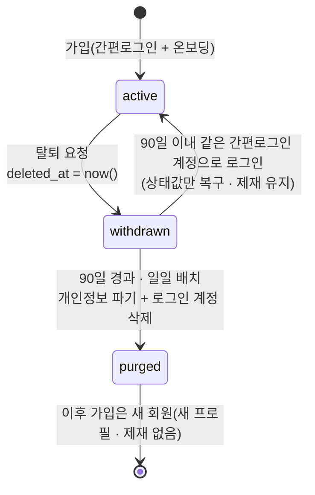

# 회원 탈퇴 · 재가입 · 제재 유지 — 피드백 분석과 변경 설계

작성 2026-09-09 · 상태: 분석·설계(구현 전) · 대상: 사용자 사이트 + 관리자 콘솔

## 1. 받은 피드백 (원문 요지)

1. 홈페이지 탈퇴 시 데이터는 **90일 보존**, 이후 **영구 삭제**.
2. 삭제되는 것은 **아이디·비밀번호 등 개인정보만**. 게시판 등에는 영향이 없다.
3. **90일 이내 재가입 가능**. 오늘 탈퇴해도 다시 가입할 수 있고, 이때는 **상태값만 바뀐다**.
4. 자유게시판에 **제재(정지)** 가 걸린 계정은 탈퇴·재가입해도 **제재 기간이 유지**된다.
5. 90일이 지나 개인정보가 삭제된 뒤 다시 가입하면 **제재를 더 받지 않는다**(식별 근거가 사라졌으므로).
6. 자유게시판에 남긴 글은 **그대로 유지**된다.
7. 추후 자유게시판 글쓰기는 **월드 계정이 연동된 회원만** 가능하게 한다.
8. **월드 계정과 아이디는 중복 불가** — 등록 시 중복 체크가 필요하다.
9. 90일 후 영구 삭제는 **메스타 기준과 동일**하다.

## 2. 현재 상태 (코드 기준)

| 항목              | 현재                                                                                                                                                                                   | 근거                                                                                          |
| ----------------- | -------------------------------------------------------------------------------------------------------------------------------------------------------------------------------------- | --------------------------------------------------------------------------------------------- |
| 탈퇴 기능         | **없음.** 내 정보 화면(`/account`)에는 닉네임·(플래그 시) 월드 UID·프로필 코드 저장만 있다                                                                                             | `components/auth/AccountForm.tsx`                                                             |
| 계정 삭제 시 영향 | `profiles.id → auth.users on delete cascade`. auth 계정을 지우면 프로필이 함께 사라지고, 글·댓글의 `author_id` 는 `on delete set null` 로 비워진다 → 화면에서 작성자를 알 수 없게 된다 | `supabase/migrations/20260908000200_profiles.sql`, `20260908000300_boards_posts_comments.sql` |
| 제재              | `profiles.suspended_until` · `suspension_reason`. RLS `is_suspended()` 가 쓰기를 막고, 클라이언트는 정지 배너를 보인다. **프로필 행이 사라지면 제재도 사라진다**                       | `20260908001700_admin_foundation.sql`, `lib/utils/suspension.ts`                              |
| 닉네임 중복       | `lower(nickname)` 유니크 인덱스 → 중복 불가(이미 충족)                                                                                                                                 | `20260908000200_profiles.sql`                                                                 |
| 월드 계정 필드    | `profiles.msw_uid` · `msw_profile_code` 열과 형식 검사만 있고 **유니크 제약이 없다**. 입력 칸은 `NEXT_PUBLIC_FEATURE_MSW_ACCOUNT_FIELDS` 플래그로 **꺼져 있다**                        | `20260908001500_profiles_msw.sql`, `lib/constants/features.ts`, `lib/validation/auth.ts`      |
| 글쓰기 조건       | 로그인 + 온보딩 완료 + 정지 아님. 월드 계정 연동 여부는 보지 않는다                                                                                                                    | `lib/actions/post-actions.ts`                                                                 |
| 개인정보처리방침  | §4 "회원 탈퇴 시 지체 없이 파기", 일부 기록 "탈퇴 후 1년". **90일 보존 규칙이 문서에 없다**                                                                                            | `lib/content/privacy-policy/section-04-07.ts`                                                 |
| 관리자            | 회원 정지·해제·닉네임 강제 변경만 있다. 탈퇴 상태·삭제 예정일·영구 삭제 기능은 없다                                                                                                    | `admin/lib/actions/members-actions.ts`                                                        |

결론: 피드백은 "새 기능(탈퇴) + 그 기능이 제재·게시글·재가입과 맞물리는 규칙"이다. 현재 구조에서 auth 계정을 바로 지우면 2·4·6 항목이 깨지므로, **탈퇴를 두 단계(유예 → 파기)로 나눈 소프트 삭제** 설계가 필요하다.

## 3. 핵심 설계 — 두 단계 탈퇴



| 상태        | `profiles` 행 | 개인정보(이메일·간편로그인 식별자·월드 UID·닉네임)            | 게시글·댓글 | 제재            | 로그인                       |
| ----------- | ------------- | ------------------------------------------------------------- | ----------- | --------------- | ---------------------------- |
| `active`    | 유지          | 유지                                                          | 유지        | 적용            | 가능                         |
| `withdrawn` | 유지          | 유지(90일 보존)                                               | 유지        | **적용 유지**   | 로그인하면 즉시 복구 안내    |
| `purged`    | 유지(익명화)  | **삭제**: 이메일·식별자·UID·코드 null, 닉네임 → "탈퇴한 회원" | 유지        | 해제(식별 불가) | 계정 없음 → 가입하면 새 회원 |

- 프로필 행을 남기고 **익명화**하는 이유: 글·댓글의 `author_id` 가 살아 있어 "게시판에 영향이 없다"(6)를 지키면서도 개인정보는 사라진다(2). 화면에는 "탈퇴한 회원"으로 보인다.
- 제재는 `profiles.suspended_until` 에 있으므로 `withdrawn` 동안 자연히 유지된다(4). `purged` 에서 비우면 5 가 성립한다.
- 90일 이내 재가입(3)은 **같은 간편로그인 계정으로 다시 로그인**하는 것으로 처리한다. 새 프로필을 만들지 않고 `deleted_at` 만 비운다("상태값만 변경"). 닉네임·월드 UID 는 보존 기간 동안 그 사람에게 예약된 상태라 중복 검사와도 충돌하지 않는다.
- 다른 간편로그인 계정으로 가입하는 것은 지금도 막을 방법이 없다(이메일이 다르면 다른 사람이다). 월드 UID 유니크 제약(8)이 붙으면 **같은 월드 계정을 두 프로필에 연결하는 것**은 막힌다 — 제재 회피를 막는 실질적 장치는 이것이다.

## 4. 사용자 사이트 변경

### 4.1 데이터 (마이그레이션 1개)

```sql
alter table public.profiles
  add column deleted_at timestamptz,        -- 탈퇴 요청 시각. null = 정상
  add column purged_at  timestamptz;        -- 개인정보 파기 시각. null = 아직

-- 월드 계정 중복 불가 (피드백 8). 대소문자·공백 정리는 검증 단계에서 끝낸다.
create unique index profiles_msw_uid_key on public.profiles (msw_uid) where msw_uid is not null;
create unique index profiles_msw_profile_code_key on public.profiles (lower(msw_profile_code)) where msw_profile_code is not null;

-- 파기 뒤 auth 계정을 지워도 프로필(익명화된 행)이 남아야 한다.
alter table public.profiles drop constraint profiles_id_fkey;
alter table public.profiles add constraint profiles_id_fkey
  foreign key (id) references auth.users (id) on delete no action deferrable;
-- 파기 함수가 auth.users 를 지우기 직전에 FK 를 만족시키기 위해, 익명화 시 id 는 그대로 두고
-- auth 쪽만 지운다 → no action 이면 참조 오류. 따라서 파기 순서는 "프로필 익명화 → FK 제약 비활성(함수 내부 set constraints)"
-- 대신, 실무적으로 단순한 방법: profiles.id 의 FK 를 제거하고 트리거로 무결성을 유지한다(§4.3 참고).
```

> FK 처리 방식은 개발팀이 택일한다. 권장은 **FK 제거 + 가입 트리거 유지**: `handle_new_user()` 가 프로필을 만드는 경로가 유일하므로 고아 프로필은 파기 배치에서만 생기고, 그것이 의도한 상태다.

- RLS: `withdrawn` 프로필은 본인 조회만 허용(기존 `profiles_select_own`), 공개 조회(작성자 표시)는 닉네임만. `purged` 는 공개 조회에서 "탈퇴한 회원"으로 매핑된다(`lib/data/mappers.ts` 의 작성자 매핑에 분기).
- `is_suspended()` 는 그대로. 탈퇴 상태의 쓰기는 별도 정책 `not is_withdrawn()` 으로 막는다(탈퇴 중 API 직접 호출 방지).

### 4.2 화면 · 흐름

| 위치                           | 변경                                                                                                                                                                                                                                                                                                                                   |
| ------------------------------ | -------------------------------------------------------------------------------------------------------------------------------------------------------------------------------------------------------------------------------------------------------------------------------------------------------------------------------------- |
| 내 정보(`/account`)            | **"회원 탈퇴"** 섹션 추가. 확인 모달 3요소: 제목 "회원 탈퇴" · 설명 "탈퇴 후 90일 동안 개인정보가 보존되며, 그 안에 다시 로그인하면 복구됩니다. 90일이 지나면 이메일·간편로그인 정보·월드 계정 정보가 영구 삭제됩니다. 작성한 글과 댓글은 남고 '탈퇴한 회원'으로 표시됩니다. 진행 중인 이용 제한은 탈퇴해도 유지됩니다." · 버튼 "탈퇴" |
| 탈퇴 액션                      | `withdrawAccountAction`: `deleted_at = now()` → 세션 종료 → `/` 로 이동 + 안내. 감사 로그(`member.withdraw`, 행위자 = 본인)                                                                                                                                                                                                            |
| 재로그인(90일 이내)            | 콜백에서 프로필이 `withdrawn` 이면 **복구 안내 화면**("탈퇴 후 N일이 지났습니다. 계속하면 계정이 복구됩니다. 이용 제한이 있었다면 그대로 적용됩니다.") → 확인 시 `deleted_at = null`. 취소하면 로그아웃                                                                                                                                |
| 정지 + 탈퇴                    | 복구 뒤 기존 정지 배너가 그대로 보인다(추가 작업 없음)                                                                                                                                                                                                                                                                                 |
| 작성자 표시                    | `purged` 프로필은 목록·상세·댓글에서 "탈퇴한 회원"(마스킹 대신 고정 문구), 아바타 기본값                                                                                                                                                                                                                                               |
| 월드 계정 등록(온보딩·내 정보) | 플래그를 켤 때: 저장 전 **중복 확인**(UID·프로필 코드). 유니크 위반 `23505` → "이미 다른 계정에 연결된 월드 계정입니다. 고객지원에 문의해 주세요." 안내 + 실시간 확인 버튼(선택)                                                                                                                                                       |
| 글쓰기 조건(추후, 7)           | 기능 플래그 `NEXT_PUBLIC_FEATURE_POSTING_REQUIRES_MSW` 신설. 켜면 `msw_uid` 가 없는 회원에게 글쓰기 대신 "월드 계정을 연동하면 글을 쓸 수 있습니다 → 내 정보" 안내. 서버 액션도 같은 조건을 다시 검사. 기본 OFF                                                                                                                        |
| 개인정보처리방침               | §4 보유 기간: "탈퇴 요청 후 90일 보존(재가입 대비), 경과 시 지체 없이 파기" · 파기 항목·게시물 처리("작성자 정보 비식별화, 게시물은 유지") · §7 파기 절차에 자동 배치 명시. Legal 모듈에서 개정본 발행                                                                                                                                 |

### 4.3 파기 배치 (90일 경과)

- 실행: Supabase 스케줄(pg_cron 또는 예약 Edge Function) **매일 1회**. 대상 = `deleted_at <= now() - interval '90 days' and purged_at is null`.
- 처리(트랜잭션):
  1. `profiles` 익명화 — `email null`, `nickname = '탈퇴한 회원'`(유니크 인덱스와 충돌하지 않도록 `탈퇴한 회원#<짧은 id>` 저장 후 화면에서 고정 문구로 표시), `avatar_url null`, `msw_uid null`, `msw_profile_code null`, `suspended_until null`, `suspension_reason null`, `purged_at = now()`
  2. `auth.users` 삭제(서비스 롤 `auth.admin.deleteUser`) — 간편로그인 식별자·이메일이 여기서 사라진다
  3. 1:1 문의의 `contact_email` 등 개인 연락처는 방침 §4 의 보유 기간 규칙에 따라 별도 파기(기존 규칙 유지)
  4. 감사 로그 `member.purge`(행위자 = 시스템)
- 실패 시 다음 날 재시도. 부분 실패가 남지 않도록 프로필 익명화와 auth 삭제를 한 함수에서 처리하고, auth 삭제 실패 시 `purged_at` 을 비워 둔다.

## 5. 관리자 콘솔 변경

| 화면 · 기능     | 변경                                                                                                                                                                                          |
| --------------- | --------------------------------------------------------------------------------------------------------------------------------------------------------------------------------------------- |
| 회원 목록       | 상태 열: **정상 / 정지 / 탈퇴 대기(D-nn) / 삭제됨**. 상태 필터 추가. 탈퇴 대기는 파기 예정일(탈퇴일 + 90일) 표시                                                                              |
| 회원 상세       | 탈퇴일 · 파기 예정일 · 복구 이력. 제재 부여·해제는 **탈퇴 대기 중에도 가능**(복구되면 그대로 적용). 삭제된 회원은 개인정보 칸이 비고 "개인정보가 파기된 계정입니다" 안내, 작성 글 목록만 남음 |
| 즉시 파기       | 슈퍼어드민 전용 "개인정보 즉시 파기" 버튼(이용자의 삭제 요청 대응). 확인 모달: "90일을 기다리지 않고 지금 개인정보를 파기합니다. 되돌릴 수 없습니다. 글·댓글은 남습니다." 버튼 "파기"         |
| 강제 탈퇴(선택) | 운영 필요 시 관리자가 탈퇴 상태로 전환(`deleted_at` 설정). 정지와 다른 조치이므로 별도 확인 모달                                                                                              |
| 월드 계정       | 회원 상세에 UID·프로필 코드 표시, **중복 검색**(같은 UID 를 가진 다른 프로필 찾기). 유니크 제약이 걸린 뒤에는 새 중복은 생기지 않지만 과거 데이터 점검용                                      |
| 대시보드        | 지표 추가: 탈퇴 대기 수 · 이번 주 파기 수                                                                                                                                                     |
| 감사 로그       | `member.withdraw`(본인) · `member.restore`(본인) · `member.purge`(시스템/관리자) · `member.force_withdraw`(관리자)                                                                            |
| 문구 규약       | 개발자 가이드 §7 그대로(원문 오류 비노출, "…하지 못했습니다 + 다음 행동", 확인 모달 3요소)                                                                                                    |

## 6. 결정이 필요한 것

1. **"아이디 중복 불가"의 뜻** — 간편로그인만 쓰므로 별도 아이디가 없다. 닉네임(이미 유니크)과 **월드 UID·프로필 코드**의 중복 금지로 해석해 설계했다. 다른 의미(예: 월드 계정 아이디 문자열)라면 열 하나가 더 필요하다.
2. **재가입 판정 기준** — "같은 간편로그인 계정으로 재로그인 = 복구"로 설계했다. 다른 간편로그인 계정으로 오는 사람은 새 회원이며, 제재 회피는 월드 UID 유니크로만 막힌다. 이 수준이면 충분한지 확인이 필요하다.
3. **탈퇴 중 게시글 표시** — 90일 보존 중에는 기존 마스킹 닉네임을 그대로 보이게 설계했다(게시판 영향 없음). 탈퇴 즉시 "탈퇴한 회원"으로 바꾸길 원하면 한 줄 변경이다.
4. **월드 계정 연동 필수 글쓰기(7)의 시점** — 플래그로 준비만 하고 기본 OFF. 켜는 시점을 정해 달라.
5. **"메스타 기준"** — 90일 후 영구 삭제 외에 참고할 세부(예: 재가입 제한 횟수, 삭제 항목 목록)가 있으면 공유 요청.

## 7. 구현 순서와 규모

| 단계 | 내용                                                                                                | 규모  |
| ---- | --------------------------------------------------------------------------------------------------- | ----- |
| 1    | 마이그레이션(열 · 유니크 · FK/트리거 · `is_withdrawn()` 정책) + 타입                                | 0.5일 |
| 2    | 클라이언트: 탈퇴 액션·모달, 재로그인 복구 화면, 작성자 "탈퇴한 회원" 매핑, 월드 계정 중복 오류 문구 | 1일   |
| 3    | 파기 배치(스케줄 함수 + 감사 로그) + 단위 테스트                                                    | 0.5일 |
| 4    | 관리자: 상태 열·필터, 상세 정보, 즉시 파기(슈퍼어드민), 월드 UID 중복 검색, 대시보드 지표           | 1일   |
| 5    | 개인정보처리방침 개정본(Legal 발행), 개발자 가이드 갱신                                             | 0.5일 |
| —    | 글쓰기 월드 연동 필수 플래그(7)                                                                     | 0.5일 |

총 4일 안쪽. 1~3 은 사용자 사이트 배포, 4 는 관리자 배포, 5 는 콘솔에서 발행.
