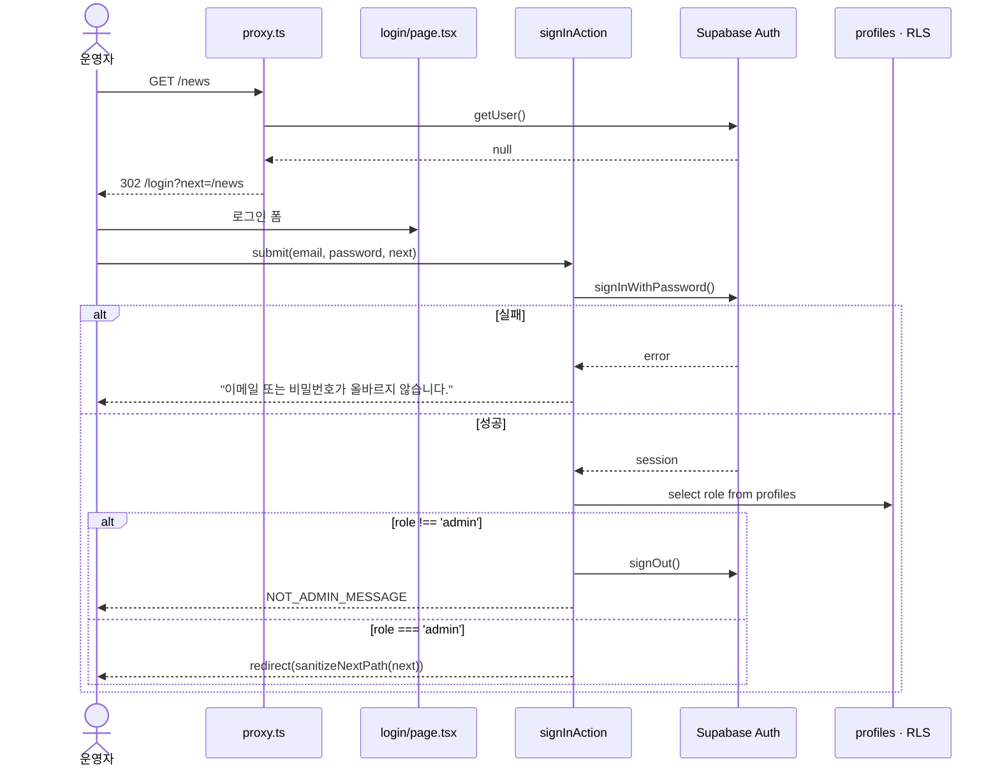
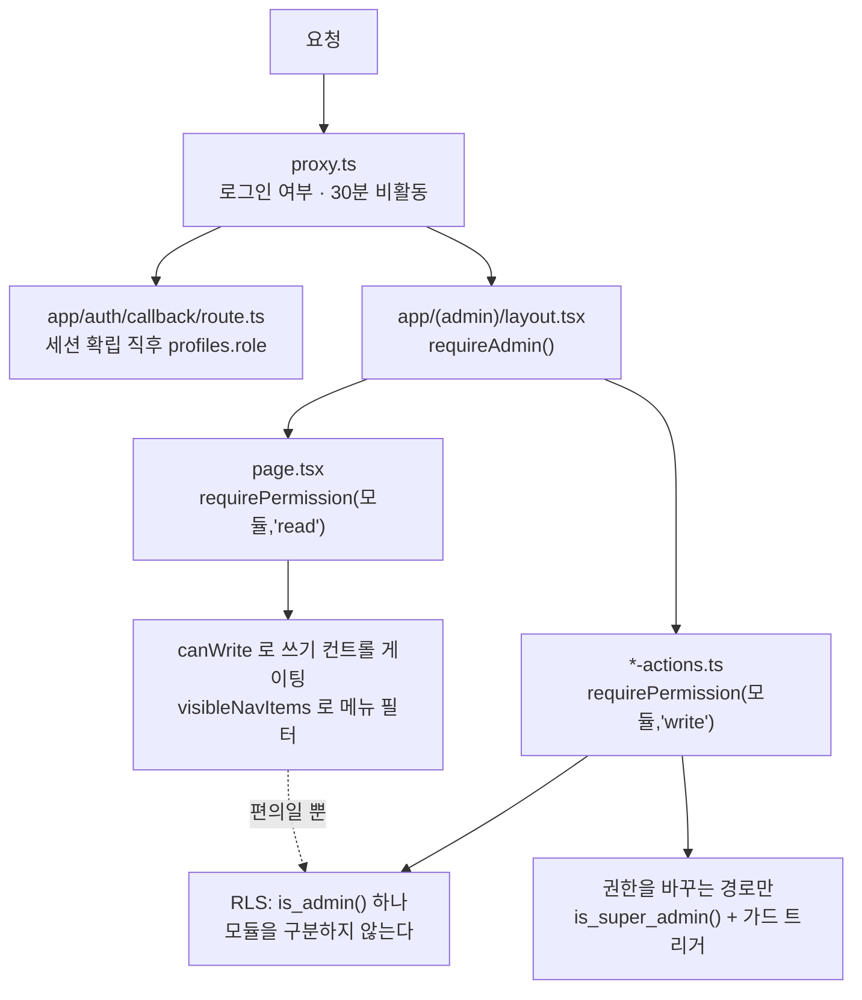
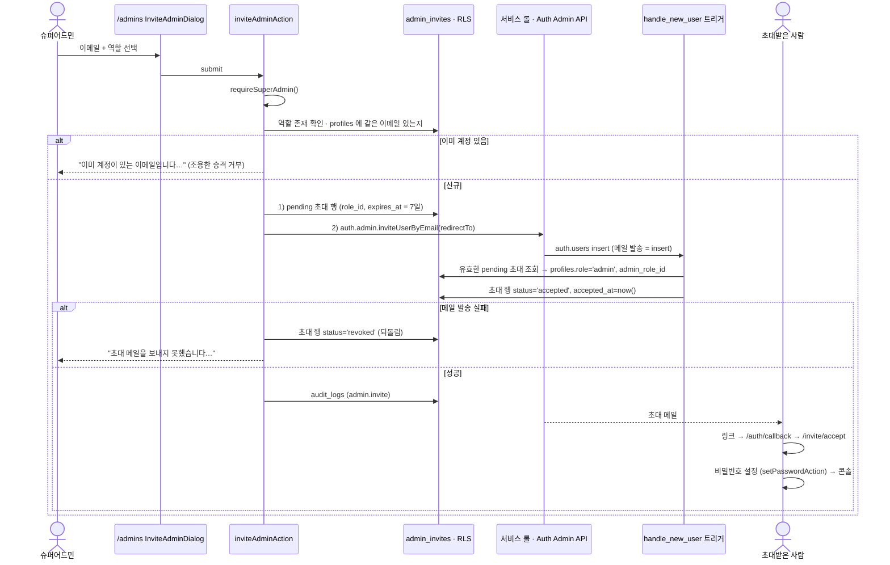
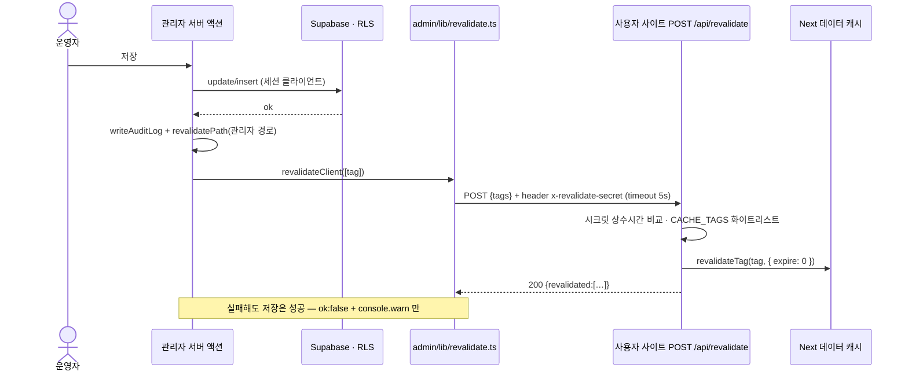
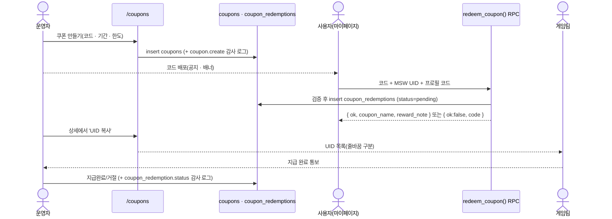

# 글자월드 관리자 콘솔 개발자 가이드

최종 갱신 2026-09-10 · 기준 커밋 a7b6c82 (+ 쿠폰 모듈 20260910000100)

이 문서는 관리자 콘솔(`admin/`)과 사용자 사이트의 연동을 **유지·확장**하는 개발팀을 위한 것이다. 기획 의도는 `docs/admin/PLAN.md`, 코드 배치는 `admin/README.md`, DB 계약은 `supabase/README.md` 가 각각 단일 출처다. 이 문서는 그 셋을 잇는 실무 지도다. 모든 항목에 근거 파일 경로를 붙였다.

---

## 1. 개요

한 저장소에 **두 개의 Next.js 앱**이 있고, **하나의 Supabase 프로젝트**를 공유한다.

| 앱            | 패키지         | 위치        | 배포                                                                            | 포트(로컬) |
| ------------- | -------------- | ----------- | ------------------------------------------------------------------------------- | ---------- |
| 사용자 사이트 | `maple`        | 저장소 루트 | Vercel `maple-web` — https://maple-web-sigma.vercel.app                         | 3000       |
| 관리자 콘솔   | `@maple/admin` | `admin/`    | Vercel `maple-admin`(Root Directory = `admin`) — https://maple-admin.vercel.app | 3100       |

- 저장소: https://github.com/GoodBlock-Nill/maple · 작업 브랜치 `develop` → `main`
- pnpm 워크스페이스 정의는 `pnpm-workspace.yaml` (패키지는 `admin` 하나)
- Vercel 프로젝트 식별은 `.vercel/project.json`(`projectName: maple-web`)

```
maple/
  app/ components/ lib/ types/     사용자 사이트
  app/api/revalidate/route.ts      관리자가 부르는 캐시 무효화 훅
  lib/data/cache.ts                CACHE_TAGS · 캐시 수명

  admin/
    app/(auth)/                    로그인 · 비밀번호 재설정 · 초대 수락 (사이드바 없음)
    app/(admin)/                   인증된 관리 화면 전부 (layout 이 requireAdmin())
    app/auth/callback/             초대·재설정 링크 착지점(role 게이트)
    components/ui/                 공용 프리미티브 (Button · Table · Dialog · Toast …)
    lib/nav.ts                     사이드바 정보 구조 = 단일 출처
    lib/auth/                      requireAdmin · requirePermission · permissions · 세션 만료
    lib/actions/                   서버 액션(+ FormState 계약)
    lib/data/                      읽기 전용 조회
    lib/revalidate.ts              사용자 사이트 캐시 무효화
    lib/audit.ts                   writeAuditLog()
    scripts/bootstrap-admin.mjs    첫 슈퍼어드민
    proxy.ts                       Next 16 의 구 middleware

  supabase/
    migrations/                    스키마 · RLS · 함수 · 트리거
    config.toml                    [auth] redirect URL 등 (supabase config push 로 원격 반영)
```

타입은 한 벌만 쓴다. `pnpm gen:types`(루트 `package.json`)가 `types/database.types.ts` 를 만들고 `admin/types/database.types.ts` 로 복사한다.

---

## 2. 인증

### 2.1 원칙

- 관리자 계정의 로그인 수단은 **이메일 + 비밀번호 하나뿐**이다. 간편로그인 버튼은 없앴다 (`admin/app/(auth)/login/page.tsx` 주석, 2026-09-09 제품 결정).
- 계정은 **초대로만** 만들어진다(§4). 사용자 사이트의 회원을 승격하는 화면은 없다.
- 로그인에 성공해도 `profiles.role !== 'admin'` 이면 **세션을 남기지 않고 즉시 로그아웃**한다 (`admin/lib/actions/auth-actions.ts` `signInAction`). 세션만 남겨 두면 "로그인은 됐는데 모든 화면이 튕기는" 상태에 갇힌다.
- 아이디/비밀번호 중 어느 쪽이 틀렸는지 구분해 알리지 않는다(계정 열거 차단, 같은 파일).
- 비밀번호는 10자 이상 72자 이하(`admin/lib/validation/auth.ts` `ADMIN_PASSWORD_MIN_LENGTH`, `ADMIN_PASSWORD_MAX_LENGTH` — bcrypt 가 73바이트째부터 버린다).

### 2.2 로그인 시퀀스



### 2.3 세션 · 쿠키

- `admin/proxy.ts` 가 Next 16 의 구 `middleware.ts` 다(파일명이 바뀌었다). 하는 일은 셋이다.
  1. 모든 요청에서 세션 갱신 — `admin/lib/supabase/middleware.ts` `updateSession()`
  2. 미로그인 요청을 `/login?next=…` 로 (낙관적 검사)
  3. 30분 비활동 세션 만료
- 검증은 `getSession()` 이 아니라 **`getUser()`** 다. `getSession()` 은 쿠키의 JWT 를 그대로 신뢰해 위조 쿠키를 통과시킨다(`admin/lib/supabase/middleware.ts` 주석).
- 리다이렉트를 만들 때는 **갱신된 인증 쿠키를 반드시 복사**한다(`proxy.ts` `redirectWithSession`). 복사하지 않으면 리프레시된 토큰이 저장되지 않아 관리자가 임의로 로그아웃된다.
- 30분 타이머는 `admin_last_seen` 쿠키다(`admin/lib/auth/session.ts`, `INACTIVITY_LIMIT_MS = 30분`). 쿠키가 없으면 만료로 보지 않는다 — 로그인 직후 첫 요청에는 쿠키가 없기 때문이다. 이 쿠키는 **보안 경계가 아니라 편의 장치**다.
- 공개 경로는 `PUBLIC_PREFIXES` 다: `/login` `/forgot-password` `/reset-password` `/invite/accept` `/auth/callback`.
- 정적 자산은 matcher 에서 제외한다. 통과시키면 CSS/JS/폰트마다 Auth 서버 왕복이 생긴다.

### 2.4 비밀번호 재설정

1. `/forgot-password` → `requestPasswordResetAction`(`admin/lib/actions/auth-actions.ts`) → `resetPasswordForEmail(redirectTo: {ADMIN_URL}/auth/callback?next=/reset-password)`
2. 성공/실패를 구분해 답하지 않는다(계정 열거 차단). 실제 발송 실패는 서버 로그만 남는다.
3. 링크가 세션을 만들면 `/reset-password` 에서 `setPasswordAction` 이 비밀번호를 바꾼다. 세션이 없으면 "링크가 만료되었습니다"로 안내한다.
4. 같은 비밀번호(`error.code === 'same_password'`)만 필드 오류로 되돌린다.

### 2.5 개발용 로그인 미리 채움

`admin/.env.example` 의 `ADMIN_LOGIN_PREFILL_EMAIL` · `ADMIN_LOGIN_PREFILL_PASSWORD` 를 넣으면 로그인 칸이 미리 채워진다(`admin/app/(auth)/login/page.tsx`).

> **운영에는 설정 금지.** 이 값은 공개 로그인 페이지의 HTML 에 그대로 실린다.
> 운영 배포에서는 제거 대상이다.

---

## 3. 권한 체계(RBAC)

### 3.1 데이터 모델

`supabase/migrations/20260909000200_admin_roles.sql`

- `admin_roles(id, key, name, description, permissions jsonb, is_system, …)`
  - `key` 는 `^[a-z][a-z0-9_]{1,30}$` 이고 **생성 후 불변**이다(가드 트리거가 되돌린다).
  - `permissions` 는 `{ "<module>": "none" | "read" | "write" }` 모양의 jsonb. enum·컬럼이 아닌 이유: 모듈이 늘 때마다 마이그레이션과 배포가 묶인다.
  - 시드 역할 둘 — `super_admin`(전체 write, `is_system = true`), `editor`(예시, 삭제 가능).
- `profiles.role = 'admin'` = **콘솔에 들어올 수 있는가**
- `profiles.admin_role_id` = **무엇을 할 수 있는가** (`on delete set null`)
- `public.is_admin()` — RLS 전체가 쓰는 거친 문
- `public.is_super_admin()` — 역할·관리자 관리의 판정(SECURITY DEFINER, `search_path` 고정)

가드 트리거 둘.

- `guard_admin_roles()` — 시스템 역할의 수정·삭제 차단, `key`/`is_system`/`created_at` 불변화. `postgres` · `supabase_admin` 만 빠져나간다.
- `guard_profile_role()` — **SECURITY INVOKER 여야 한다.** DEFINER 로 두면 `current_user` 가 함수 소유자로 평가되어 가드가 통째로 사라진다(20260908001000 의 사고). 슈퍼어드민이 아닌 관리자는 `role` · `admin_role_id` 를 바꿀 수 없다.

### 3.2 모듈 14개

단일 출처는 `admin/lib/auth/permissions.ts` 의 `ADMIN_MODULES` 다. 마이그레이션의 시드 권한과 키가 같아야 한다.

`dashboard` · `news` · `community` · `reports` · `members` · `coupons` · `inquiries` · `faqs` · `gacha` · `rankings` · `settings` · `legal` · `admins` · `audit`

- 등급은 `none < read < write`(`LEVEL_RANK`). `write` 는 `read` 를 포함한다.
- 값이 없는 모듈은 `none` 으로 읽는다(`permissionLevel`) — **닫힘 실패**. 모듈을 새로 추가해도 기존 역할에서 자동으로 열리지 않는다.
- `parsePermissions()` 는 모르는 키·모르는 값을 **버린다**. 타입에 없는 문자열이 비교에서 조용히 `none` 보다 크게 취급되는 것을 막는다.
- 이 파일에는 `server-only` 를 붙이지 않는다. 사이드바(클라이언트 컴포넌트)가 같은 판정으로 메뉴를 감춰야 하기 때문이다.

### 3.3 두 겹 강제 — RLS(거친 문) vs 앱(세밀한 문)



**RLS 는 모듈별 권한을 모른다.** 정책에 역할을 녹이면 정책 수가 모듈 × 역할로 폭발하고, 역할을 추가할 때마다 마이그레이션이 필요해진다(`20260909000200` 머리말). 그래서 DB 는 "관리자인가" 까지만 보고, 모듈별 read/write 는 앱이 강제한다.

> 따라서 **모듈 권한만으로는 데이터가 보호되지 않는다.** 읽기 전용 역할의 계정도 anon 키 +
> 자기 세션으로 REST 를 직접 부르면 관리자 테이블을 쓸 수 있다. 역할은 "운영자가 실수로 남의
> 영역을 건드리지 않게 하는 경계"이고, 신뢰 경계는 여전히 `role='admin'` 이다
> (`admin/README.md` §4.2). 신뢰할 수 없는 사람에게는 관리자 계정을 주지 않는다.

앱 계층 가드는 `admin/lib/auth/require-admin.ts` 에 넷 있다.

| 함수                                 | 실패 시                 | 쓰는 곳                        |
| ------------------------------------ | ----------------------- | ------------------------------ |
| `requireAdmin()`                     | **로그아웃** + `/login` | `(admin)/layout.tsx`, 대시보드 |
| `requirePermission(module, level)`   | `/?error=forbidden`     | 각 페이지 · 쓰기 액션 첫 줄    |
| `requireAnyPermission(modules, lvl)` | `/?error=forbidden`     | 신고 처리의 콘텐츠 숨김        |
| `requireSuperAdmin()`                | `/?error=forbidden`     | `/admins` · 초대 · 삭제 · 역할 |

`requireAdmin()` 만 로그아웃시키는 이유: 관리자가 아니면 계정 자체가 콘솔의 대상이 아니다. 반대로 모듈 권한 부족은 계정이 정상이고 이 화면만 닫힌 것이라, 세션을 끊으면 쓸 수 있는 화면까지 잃는다. 그래서 대시보드로 되돌리고 거기서 사유를 배너로 알린다(`(admin)/page.tsx`).

역할은 `requireAdmin()` 이 프로필과 **같은 질의**로 읽는다. 화면마다 다시 조회하면 왕복이 늘고, "권한을 읽지 못한 화면"이 생겨 판정이 갈린다.

### 3.4 모듈 × 페이지 × 권한 × 쓰기 액션

| 모듈        | 페이지 경로                                                  | 페이지 가드                                              | 쓰기 액션 파일                                                                      |
| ----------- | ------------------------------------------------------------ | -------------------------------------------------------- | ----------------------------------------------------------------------------------- |
| `dashboard` | `/`                                                          | `requireAdmin()` + `hasPermission(…,'dashboard','read')` | 없음                                                                                |
| `news`      | `/news`<br>`/news/new`<br>`/news/[id]`                       | `read`<br>`write`<br>`write`                             | `admin/lib/actions/news-actions.ts`                                                 |
| `community` | `/community/posts`<br>`/community/comments`                  | `read`                                                   | `admin/lib/actions/moderation-actions.ts`                                           |
| `reports`   | `/reports`                                                   | `read`                                                   | `admin/lib/actions/reports-actions.ts`                                              |
| `members`   | `/members`<br>`/members/[id]`                                | `read`                                                   | `admin/lib/actions/members-actions.ts`                                              |
| `coupons`   | `/coupons`<br>`/coupons/[id]`                                | `read`                                                   | `coupons-actions.ts` · `coupon-redemption-actions.ts`                               |
| `inquiries` | `/inquiries`<br>`/inquiries/[id]`<br>`/inquiries/categories` | `read`                                                   | `inquiries-actions.ts` · `inquiry-email-actions.ts` · `inquiry-category-actions.ts` |
| `faqs`      | `/faqs`                                                      | `read`                                                   | `admin/lib/actions/faqs-actions.ts`                                                 |
| `gacha`     | `/gacha`<br>`/gacha/new`<br>`/gacha/[id]`                    | `read`<br>`write`<br>`write`                             | `admin/lib/actions/gacha-actions.ts`                                                |
| `rankings`  | `/rankings`                                                  | `read`                                                   | `admin/lib/actions/rankings-actions.ts` (롤백 하나뿐)                               |
| `settings`  | `/settings`                                                  | `read`                                                   | `admin/lib/actions/settings-actions.ts`                                             |
| `legal`     | `/legal`<br>`/legal/[slug]`                                  | `read`<br>`write`                                        | `admin/lib/actions/legal-actions.ts`                                                |
| `admins`    | `/admins`                                                    | **`requireSuperAdmin()`**                                | `admin-actions.ts` · `admin-invite-actions.ts` · `admin-role-actions.ts`            |
| `audit`     | `/audit`                                                     | `read`                                                   | 없음(추가 전용)                                                                     |

특이 케이스 둘.

- 대시보드는 `requirePermission()` 을 쓰지 않는다. 권한 없는 화면의 **착지점이 대시보드 자신** 이라 여기서 다시 리다이렉트하면 무한히 튕긴다. 직접 판정해 지표를 감춘다.
- 신고 처리의 콘텐츠 숨김·삭제는 `requireAnyPermission(['community','reports'], 'write')` 다 (`moderation-actions.ts` `moderateTarget`). 신고 종결에 커뮤니티 쓰기까지 요구하면 '신고 담당' 역할이 성립하지 않는다.

### 3.5 UI 게이팅

- 사이드바: `admin/components/layout/Sidebar.tsx` 가 `visibleNavItems(permissions)` (`admin/lib/nav.ts`)로 메뉴를 거른다. `none` 인 모듈은 **지운다**(흐리게 두면 눌러 보고 튕기는 경험이 반복된다). 하위가 전부 닫힌 부모는 사라지고, 첫 하위가 닫혔으면 부모 링크가 남아 있는 첫 하위로 옮겨 간다.
- 쓰기 컨트롤: 각 페이지가 `hasPermission(permissions, '<모듈>', 'write')` 를 `canWrite` 로 내려 보내 버튼·폼을 감춘다(`settings/page.tsx` · `news/page.tsx` · `faqs/page.tsx` 등). 값은 그대로 보여 주고 **저장 수단만** 없앤다(`components/settings/SiteSettingsForm.tsx`).
- 이것은 **편의이지 인가가 아니다**(`Sidebar.tsx` 주석). 인가는 페이지와 서버 액션이 한다.

### 3.6 새 모듈을 추가할 때 체크리스트

1. `admin/lib/auth/permissions.ts` 의 `ADMIN_MODULES` 에 `{ key, label }` 한 줄. 기존 역할에서는 값이 없으므로 자동으로 `none` 이다(닫힘 실패).
2. 시드 역할의 권한을 함께 갱신할 것인지 결정한다. 필요하면 마이그레이션에서 `admin_roles.permissions` 를 갱신한다(`super_admin` 은 전체 write 를 유지해야 한다).
3. `admin/lib/nav.ts` 의 `NAV_ITEMS` 에 항목 추가. 작성 화면은 `level: 'write'`, 부모와 다른 모듈을 가리키는 하위는 `module` 을 적는다.
4. `admin/app/(admin)/<경로>/page.tsx` 첫 줄에 `requirePermission('<모듈>', 'read')`. 작성/편집 전용 화면은 `'write'`.
5. 조회는 `admin/lib/data/<모듈>.ts`(`import 'server-only'` + 세션 클라이언트), 변경은 `admin/lib/actions/<모듈>-actions.ts` 로 나눈다.
6. 쓰기 액션 첫 줄은 **항상** `const actor = await requirePermission('<모듈>', 'write')`. 서버 액션은 UI 를 거치지 않는 직접 POST 로도 호출된다.
7. 상태를 바꾸면 `writeAuditLog(actor.id, …)`(§6).
8. 사용자 사이트에 보이는 변경이면 `revalidateClient([...])`(§5). 태그를 새로 만든다면 **사용자 사이트의 `lib/data/cache.ts` `CACHE_TAGS` 에 먼저 넣고** `admin/lib/revalidate.ts` 의 `CLIENT_CACHE_TAGS` 에 같은 값을 더한다. 순서가 반대면 400 으로 반려된다.
9. RLS 를 확인한다. 새 테이블이라면 `revoke all … from anon, authenticated` 뒤 필요한 `grant` 를 명시한다 — **정책은 권한을 주지 않는다**(20260908002000 · 20260908002100 의 사고).
10. 목록은 `components/ui/Table` + `Pagination` + `lib/utils/table-query.ts`. 정렬·페이지는 컴포넌트 상태가 아니라 **쿼리스트링**에 적는다.
11. 유닛 테스트를 더한다(`admin/tests/unit/`). 특히 새 액션은 `actions-no-raw-error.test.ts` 의 규약(원문 오류 비노출)을 지키는지 확인한다.

---

## 4. 관리자 초대 · 삭제 플로우

### 4.1 초대

`admin/lib/actions/admin-invite-actions.ts` · `supabase/migrations/20260909000200_admin_roles.sql`



**순서가 생명이다.** `inviteUserByEmail()` 은 메일을 보내는 순간 `auth.users` 행을 만들고, 그 순간 `handle_new_user()` 가 돈다. 초대 행 insert 가 먼저여야 트리거가 그 행을 찾는다. 반대로 하면 초대받은 사람이 일반 사용자로 만들어진다.

메일 발송이 실패하면 **반드시 초대 행을 `revoked` 로 되돌린다.** 남겨 두면 그 주소로 가입하는 누구나 관리자가 된다.

트리거의 승격 조건(`handle_new_user()`):

- `lower(email)` 일치 + `status = 'pending'` + `expires_at is null or expires_at > now()`
- 여러 건이면 `created_at` 오름차순 첫 행
- `role` 은 `raw_user_meta_data` 에서 **절대** 읽지 않는다(클라이언트가 `signUp` 옵션에 `role:'admin'` 을 실을 수 있다)
- 초대에 `role_id` 가 비어 있는 옛 행은 슈퍼어드민으로 떨어뜨리지 않는다 — 권한 없는 관리자로 만들고 슈퍼어드민이 화면에서 역할을 지정하게 한다(안전한 실패)

### 4.2 링크 착지 — `/auth/callback`

`admin/app/auth/callback/route.ts` 가 세 가지 형태를 모두 처리한다.

| 형태                 | 언제                             | 처리                                                                                        |
| -------------------- | -------------------------------- | ------------------------------------------------------------------------------------------- |
| `?code=`             | PKCE                             | `exchangeCodeForSession()`                                                                  |
| `?token_hash=&type=` | 메일 템플릿이 `{{ .TokenHash }}` | `verifyOtp()` (허용 타입 5종)                                                               |
| `#access_token=…`    | 암시적 흐름                      | `/auth/callback/complete` 가 브라우저에서 읽어 서버 액션(`establishSessionAction`)으로 넘김 |

해시는 서버로 전송되지 않으므로 3번만 브라우저를 한 번 거친다. 토큰은 `setSession()` 으로 **httpOnly 쿠키**에 옮겨져 JS 접근 가능한 저장소에 남지 않는다.

어느 경로든 세션이 생기면 곧바로 `rejectNonAdmin()` 이 `profiles.role` 을 확인하고, 관리자가 아니면 `signOut()` 후 `/login?error=not_admin` 으로 되돌린다. 링크 하나로 비관리자가 관리자 쿠키를 얻는 우회로를 남기지 않는다.

초대 메일은 `?next=/invite/accept` 로 온다. `admin/app/(auth)/invite/accept/page.tsx` 는 세션이 있으면 비밀번호 폼을, 없으면 "초대 재발송을 요청해 주세요" 안내를 그린다.

### 4.3 재발송 · 취소 · 만료

- **재발송**(`resendInviteAction`): `expires_at` 을 7일 뒤로 갱신한 뒤 같은 API 를 다시 부른다. Supabase 는 미확인 초대 사용자에게 새 링크를 보낸다. 링크만 새로 오고 허용 목록이 만료돼 있으면 트리거가 승격을 거르므로 **둘을 함께 연장**해야 한다.
- **취소**(`revokeInviteAction`): `status = 'revoked'`. 행은 지우지 않는다 — `admin_invites` 에는 DELETE 정책 자체가 없다(`20260908001700`).
- **만료**: `INVITE_TTL_MS = 7일`(`admin/lib/actions/admin-shared.ts`). 이것은 Supabase 초대 **링크**의 수명(기본 24시간)과 다른 개념이다. 이쪽은 "이 주소로 가입하면 관리자가 된다"는 **근거의 수명**이다. 목록은 만료된 초대도 보여 준다 — 재발송 대상이기 때문이다 (`admin/lib/data/admins.ts`).
- 같은 이메일의 초대는 `upsert` 가 아니라 조회 후 update/insert 로 처리한다. 유니크 인덱스가 `lower(email)` 이라는 **식**이라 `on conflict (email)` 과 맞지 않는다.

### 4.4 이미 계정이 있는 이메일

조용히 승격하지 않고 **거절**한다. 승격은 "초대를 수락했다"는 사실이 없는 권한 부여라, 나중에 그 사람이 어떻게 관리자가 됐는지 설명할 수 없다.

### 4.5 삭제 = 비활성화

`deleteAdminAction`(`admin/lib/actions/admin-actions.ts`)은 계정 행을 지우지 않는다. 지우면 그 사람이 쓴 뉴스·답변의 작성자 참조가 통째로 끊긴다. 실제로 일어나는 일은 셋이다.

1. `profiles.role = 'user'`, `admin_role_id = null`
2. 그 이메일의 초대를 `revoked` 로 — 같은 주소로 재가입해도 다시 관리자가 되지 않는다
3. 서비스 롤로 `auth.admin.updateUserById(id, { ban_duration: '876600h' })` (`PERMANENT_BAN_DURATION` = 100년. Supabase 에 영구 차단 플래그가 없다)

3번이 없으면 role 만 내려간 계정이 **로그인은 계속 성공하고** 화면에서만 튕긴다. 셋을 함께 해야 문이 잠긴다. 3번이 실패해도 삭제를 되돌리지 않는다 — role 은 이미 내려갔고, 되돌리면 "지웠는데 관리자로 남아 있는" 더 나쁜 상태가 된다(로그만 남긴다).

### 4.6 보호 규칙

| 규칙                       | 역할 변경                                     | 삭제                           |
| -------------------------- | --------------------------------------------- | ------------------------------ |
| 자기 자신                  | 불가 — "자기 자신의 권한은 바꿀 수 없습니다." | 불가 — 버튼 자리에 "본인" 표시 |
| 마지막 슈퍼어드민          | 불가 (`countSuperAdmins() <= 1`)              | 불가 (같은 판정)               |
| 시스템 역할(`super_admin`) | 수정·삭제 불가 (앱 + `guard_admin_roles()`)   | —                              |
| 멤버가 있는 역할           | 삭제 불가 — "…관리자가 N명 있습니다"          | —                              |

0 이 되는 순간 권한 체계를 되돌릴 사람이 사라지고 복구에 서비스 롤 스크립트가 필요해진다. 자기 자신 판정은 `DeleteAdminButton` 이 버튼 단계에서 미리 알리고, 서버 액션도 다시 막는다.

### 4.7 운영자가 반드시 해야 하는 설정

- **커스텀 SMTP.** Supabase 기본 메일러는 시간당 발송 한도가 매우 낮다. 초대와 비밀번호 재설정이 모두 메일에 의존하므로 운영에서 SMTP 연결은 선택이 아니다(`admin/README.md` §5).
- **Redirect URLs.** Supabase Auth → URL Configuration 에 관리자 콜백을 등록한다. 저장소의 단일 출처는 `supabase/config.toml` 의 `[auth].additional_redirect_urls` 이고, 여기에 이미 `http://localhost:3100/**` 과 `https://maple-admin.vercel.app/**` 이 들어 있다. `supabase config push` 로 원격에 반영한다. 등록하지 않으면 링크가 `redirectTo` 를 무시하고 사용자 사이트로 가서 초대 수락 자체가 불가능해진다.
- **`NEXT_PUBLIC_ADMIN_URL`.** 초대 메일 링크가 이 값에서 만들어진다 (`admin/lib/supabase/env.ts` `adminSiteUrl()`, 기본값 `http://localhost:3100`).

---

## 5. 관리자 ↔ 사용자 사이트 데이터 흐름

### 5.1 쓰기는 세션 클라이언트로

- 관리자의 모든 읽기·쓰기는 **세션 클라이언트**(`admin/lib/supabase/server.ts`)로 한다. RLS(`is_admin()`)가 다시 검사하므로, 권한이 사라지면 화면도 함께 비는 것이 정상이다. `admin/lib/data/*.ts` 헤더 주석이 모듈마다 이 근거를 적어 두었다.
- **서비스 롤**(`admin/lib/supabase/admin.ts`)은 `import 'server-only'` 이고, 쓰는 곳은 **Auth Admin API 뿐**이다 — 초대 메일 발송(`inviteUserByEmail`), 계정 차단 (`updateUserById`), 부트스트랩 스크립트. 일반 경로에 쓰면 권한 버그가 조용히 통과한다.

### 5.2 캐시 무효화



핵심 계약(`app/api/revalidate/route.ts`).

- `POST /api/revalidate`, 헤더 `x-revalidate-secret`, 본문 `{ "tags": ["site","gacha"] }`
- 200 `{ revalidated: [...] }` / 400 알 수 없는 태그·잘못된 본문 / 401 시크릿 불일치·미설정
- 시크릿 미설정이면 **401 로 닫는다.** "설정 안 됨 = 통과"가 되면 누구나 캐시를 비운다.
- 시크릿 비교는 조기 반환 없는 상수시간 비교(`isSecretEqual`)
- 무효화는 `revalidateTag(tag, { expire: 0 })` 다. `'max'`(stale-while-revalidate)를 쓰면 숨기거나 지운 **직후 첫 요청이 여전히 이전 값**을 돌려줘 read-your-own-writes 가 깨진다. `updateTag()` 는 Server Action 전용이라 Route Handler 에서 쓸 수 없다.

호출부 규칙(`admin/lib/revalidate.ts`).

- **절대 던지지 않는다.** 무효화는 저장의 후처리다. 여기서 예외가 새면 저장에 성공한 운영자에게 "저장하지 못했습니다"가 뜬다.
- **관리자 전용 테이블에는 부르지 않는다** — 감사 로그 · 관리자 계정 · 신고 상태. 회원 정지는 RLS 로 즉시 적용되므로 태그가 없다.
- 기준 URL 은 서버 전용 `CLIENT_SITE_URL` 을 **먼저** 본다. 로컬에서 `NEXT_PUBLIC_CLIENT_SITE_URL` 이 배포 도메인을 가리키는 일이 흔한데, 그대로 쓰면 개발 중에 운영 캐시를 태운다.

### 5.3 태그 매핑

| 모듈                    | 태그                 | 무효화 호출 위치                                       | 사용자 사이트 화면                                                               |
| ----------------------- | -------------------- | ------------------------------------------------------ | -------------------------------------------------------------------------------- |
| 뉴스                    | `news-list`          | `news-actions.ts` `revalidateNewsList()`               | `/news` (`lib/data/news.ts` `getNewsList`)                                       |
| 커뮤니티                | `community-list`     | `moderation-actions.ts` `revalidateFor()`              | `/community` (`lib/data/community.ts` `getCommunityList`)                        |
| 신고                    | `community-list`     | 신고 처리가 `moderateTarget()` 을 거쳐 위와 동일       | 위와 동일 (`reports-actions.ts` 는 직접 부르지 않는다)                           |
| FAQ                     | `faqs`               | `faqs-actions.ts`                                      | `/support/faq` (`lib/data/faqs.ts` `getFaqGroups`)                               |
| 문의 카테고리           | `inquiry-categories` | `inquiry-category-actions.ts` `revalidateCategories()` | `/support` 문의 폼의 카테고리 · 프리필 (`lib/data/inquiry-categories.ts`)        |
| 가이드                  | `gacha`              | `gacha-actions.ts`                                     | `/guide` (`lib/data/gacha.ts`)                                                   |
| 랭킹                    | `rankings`           | `rankings-actions.ts`                                  | `/ranking` (`lib/data/rankings.ts`)                                              |
| 사이트 설정·히어로 배너 | `site`               | `settings-actions.ts` `revalidateSite()`               | `/about` · 푸터 · `/play` `/discord` `/sns/[name]` · `/policy/[slug]` 의 IP 고지 |
| Legal                   | `legal`              | `legal-actions.ts` (`LEGAL_CLIENT_CACHE_TAG`)          | `/policy/[slug]` (`lib/data/legal.ts` `getLegalDocument`)                        |

수명은 `lib/data/cache.ts` — 목록 계열 `LIST_REVALIDATE_SECONDS = 60`, FAQ·설정 계열 `STATIC_REVALIDATE_SECONDS = 300`. 무효화가 실패하면 그 수명만큼 늦게 반영된다.

**문의 본문에는 태그가 없다(카테고리는 예외).** 사용자 사이트의 "내 문의 내역"은 `user_id` 로 세션마다 직접 읽고
캐시하지 않으므로, 관리자 답변·상태 변경 뒤에 `revalidateClient()` 를 부르지 않는다. 이메일 문의
(`inquiries.source = 'email'`, 2026-09-09)는 `user_id` 가 null 이라 사용자 사이트에 아예 보이지 않는다 —
발송은 Edge Function `email-outbound` 가 한다(`docs/admin/EMAIL-INQUIRY-PLAN.md`). 다만 **문의 카테고리**
(`inquiry_categories`)는 누가 보든 같은 공개 문구라 사용자 사이트가 `unstable_cache`(300초)로 담는다 —
그래서 카테고리 쓰기 액션만 `inquiry-categories` 태그를 태운다.

**쿠폰에도 태그가 없다.** 쿠폰 목록은 RLS 에 일반 사용자 select 정책이 아예 없어 사용자 사이트가
읽지 못하고(코드 열거 차단), 마이페이지의 등록 폼과 내 등록 내역은 세션마다 직접 읽는다. 태울 태그가
없으므로 `coupons-actions.ts` 는 `revalidateClient()` 를 부르지 않는다 — 문의와 같은 이유다.

### 5.4 "관리자 화면 표시 ↔ 실제 클라이언트"

**히어로 배너.** 사용자 사이트가 읽는 자리는 홈이 아니라 **소개 화면(`/about`) 상단 영상 영역** 이다(`lib/data/hero-banner.ts` 헤더 · 2026-09-09 제품 결정). 규칙은 `sort_order` 오름차순 · 노출 기간(`starts_at`~`ends_at`) 안 · `is_active` 인 것들 중 **첫 한 장** 이다(`admin/components/settings/HeroBannerList.tsx`). 배너가 없으면 사이트 설정의 유튜브 주소 영상이 나온다. 기간 판정은 캐시 시점 기준이라 최대 300초 늦게 바뀔 수 있다. 배너 종류는 `hero_banners.media_type`(`image` | `youtube`)이고, DB 제약 `hero_banners_media_shape` 가 종류와 주소의 불일치를 원천 차단한다 (`supabase/migrations/20260909000100_hero_banner_media.sql`).

**사이트 설정의 연동 표시.** `/settings` 의 각 필드에는 `사이트 반영` / `미연동` 태그가 붙는다 (`admin/components/settings/wiring.tsx`). 2026-09-09 기준 모든 필드가 연동돼 있고, 태그의 title 에 "어디에 보이는지"가 적혀 있다. 새 열을 추가했는데 사용자 사이트가 아직 읽지 않으면 `isLive: false` 로 넣어 그 사실을 드러낸다.

**1:1 문의 카테고리 · 프리필.** 사용자 문의 폼(`/support`)의 카테고리 선택지와 "문의 내용" 양식은
`public.inquiry_categories` 한 테이블이 소유한다(마이그레이션 `20260910000400`, 시드 8종은 `docs/1on1.md`).
관리 화면은 `/inquiries/categories`(문의 목록 헤더의 **카테고리 관리** 버튼 · 사이드바 고객지원 하위), 권한은
문의와 같은 `inquiries` 모듈이다.

| 열            | 쓰임                                                                                  |
| ------------- | ------------------------------------------------------------------------------------- |
| `key`         | 안정 식별자(슬러그). 라벨을 바꿔도 유지된다 — 화면에는 보이지 않는다.                 |
| `label`       | 셀렉트에 보이는 문구이자 **`inquiries.category` 에 저장되는 값**(≤ 20자).             |
| `description` | 셀렉트 아래 한 줄 안내(≤ 100자). 비우면 아무것도 그리지 않는다.                       |
| `prefill`     | 카테고리를 고르면 문의 내용에 채워지는 평문 양식(≤ 2000자, 줄바꿈 유지).              |
| `sort_order`  | 사용자 폼과 관리 화면의 표시 순서. ▲▼ + '순서 저장'.                                  |
| `is_active`   | 끄면 사용자 폼에서 사라지고 접수도 거절된다. 과거 문의의 분류 문자열은 그대로 남는다. |

- **프리필 동작.** 카테고리를 고르면 그 양식이 내용 칸을 채우고, 카테고리를 바꾸면 새 양식으로 **갈아 끼운다.**
  사용자가 직접 쓴 내용이 남아 있을 때만 확인 모달("작성 중인 내용이 지워집니다")을 세운다 — 양식 그대로면 잃을 것이 없다
  (`components/support/use-inquiry-prefill.ts` · `lib/utils/inquiry-prefill.ts`).
- **이름을 바꾸면 과거 문의가 따라온다.** `inquiries.category` 는 라벨 문자열이라, 이름만 바꾸면 그 라벨로 접수된
  문의가 목록 필터에서 사라진다. 그래서 수정은 `public.update_inquiry_category()` RPC 한 번(= 한 트랜잭션)으로
  카테고리 행과 과거 문의의 재라벨링을 함께 처리하고, 옮긴 건수를 감사 로그(`relabelled_inquiries`)와 완료 토스트에
  남긴다. 부수 효과 하나: 재라벨링은 그 문의들의 `updated_at` 을 밀어 올린다(내용·상태·이력은 그대로다).
- **삭제는 0건일 때만.** 접수된 문의가 있는 카테고리는 다이얼로그가 건수를 보여 주고 비활성화를 권한다. 액션도 같은
  규칙을 다시 검사한다(직접 POST 방어).
- **필터 옵션.** 목록 필터의 카테고리는 DB 의 카테고리(비활성 포함) + **데이터에만 남은 옛 라벨**이다
  (`public.inquiry_category_usage()`). 옛 라벨을 빼면 '계정' 으로 접수된 과거 문의를 찾을 길이 사라진다.
- **조회 실패 시.** 사용자 폼은 정적 폴백 라벨 8개로 떨어진다(`lib/constants/support.ts`
  `INQUIRY_CATEGORY_FALLBACK`). 카테고리를 못 읽었다고 접수를 막으면 하필 장애 때 문의가 들어올 길이 사라진다.
  폴백에는 양식이 없으므로 접수는 되고 프리필만 빠진다.

**1:1 문의 첨부 — 이미지·PDF 와 영상이 다른 길로 온다.** 한 문의에 붙는 첨부는 **최대 3개**다(DB CHECK
`inquiries_attachments_max_3`). 그 안에서 규칙이 둘로 갈린다.

| 종류       | 형식                         | 크기                   | 개수     | 전송 경로                      |
| ---------- | ---------------------------- | ---------------------- | -------- | ------------------------------ |
| 이미지·PDF | jpg · png · gif · webp · pdf | 각 5MB · **합계 12MB** | 3개 이내 | 폼 → 서버 액션 본문 → 스토리지 |
| 영상       | mp4 · mov · webm · m4v       | 각 **100MB**           | **2개**  | 브라우저 → 스토리지 **직접**   |

합계 12MB 는 버킷이 아니라 서버 액션 본문 상한(`next.config.ts` `bodySizeLimit` 14MB · `lib/supabase/storage.ts`)
때문에 있다. 본문이 상한을 넘으면 액션이 실행되기도 전에 요청이 500 으로 끊겨 **아무 문구도 돌려줄 수 없다**.
영상은 그 상한에 넣을 수 없어 길을 나눴다 — 상한을 100MB 로 올리면 모든 서버 액션이 한 요청에 그만큼을 받게 되고,
파일은 어차피 서버를 한 번 더 거쳐 스토리지로 간다.

- **직접 업로드.** 사용자가 영상을 고르는 즉시 브라우저가 `createSignedUploadUrl()` 로 서명 URL 을 받아
  XHR 로 PUT 한다(`lib/supabase/upload-inquiry-video.ts`). XHR 을 쓰는 이유는 진행률과 취소 때문이다 —
  supabase-js 의 `upload()` 는 fetch 기반이라 둘 다 안 된다. 화면(`components/support/InquiryVideoList.tsx`)은
  이름·크기·진행률·취소·다시 시도를 한 줄에 그리고, 하나라도 올라가는 중이면 제출을 잠근다.
- **pending 접두사 — 정책은 새로 만들지 않았다.** 접수 전 영상은
  `inquiry-attachments/<uid>/pending/<uuid>.<확장자>` 에 머문다. 기존 정책 셋이 전부 **첫 세그먼트(= uid)만**
  보므로 한 단계 깊은 pending 도 그대로 통과한다 — 업로드는 `inquiry_attachments_insert_own`, 읽기는
  `inquiry_attachments_read_own`, 업로드 취소는 `inquiry_attachments_delete_own`(20260908001900). pending 이
  하는 일은 권한 구분이 아니라 **"아직 아무 문의도 참조하지 않는 파일"의 표시**다(청소 대상 판정 · 서버의 경로 검사).
- **확정(move).** 접수·수정이 성공하면 서버가 pending 오브젝트를 `<uid>/<uuid>-<파일명>`(기존 첨부와 같은 자리)로
  옮기고 `inquiries.attachments` 에 같은 모양 `{ name, path, size, mimeType }` 으로 적는다
  (`lib/actions/inquiry-videos.ts`). 옮기는 주체는 **서비스 롤**이다 — `move` 는 storage.objects 의 UPDATE 인데
  이 버킷에는 사용자용 UPDATE 정책이 없다. 즉 **RLS 가 이 이동을 막아 주지 않으므로** 그 앞의 검사가 유일한
  경계다. 세 가지를 본다 — 경로가 **이 사용자의** `<uid>/pending/…` 인가, 오브젝트가 실제로 있는가,
  크기·형식이 규칙 안인가. 크기·형식은 폼이 신고한 값이 아니라 **스토리지가 아는 값**을 쓴다. 행 저장이 실패하면
  옮긴 오브젝트를 지운다. `SUPABASE_SERVICE_ROLE_KEY` 가 없는 환경에서는 영상 첨부만 거절되고(안내 문구)
  영상 없는 접수는 평소대로 동작한다.
- **버려진 pending 청소.** 폼에 영상만 올려 두고 떠나면 아무 문의도 참조하지 않는 파일이 남는다.
  **24시간이 지난 `<uid>/pending/…` 오브젝트는 야간 배치가 지운다** — `public.stale_inquiry_pending_attachments()`
  (서비스 롤 전용)가 경로를 돌려주고, Edge Function `purge-withdrawn` 이 Storage API 로 지운다(응답의
  `pendingAttachmentsRemoved`). SQL 로 `storage.objects` 행만 지우면 실제 파일이 남아 용량이 새기 때문에
  두 단계로 나눴다. 이 청소는 개인정보 파기와 독립이라 실패해도 파기 결과를 막지 않는다.
  **마이그레이션(`20260910000600_inquiry_video_attachments.sql`) 적용 후 `supabase functions deploy purge-withdrawn`
  을 함께 해야 청소가 돈다.**
- **보기.** 영상은 링크가 아니라 그 자리에서 재생한다 — 관리자 상세(`InquiryAttachments.tsx`)와 사용자 상세
  (`InquiryAttachmentList.tsx`) 모두 `<video controls preload="metadata">` + 내려받기 링크다. `preload="metadata"`
  라 상세를 여는 것만으로 100MB 를 내려받지 않는다. 서명 URL 은 5분짜리다.
- **버킷.** `inquiry-attachments` 는 비공개 · `file_size_limit` 200MiB · `allowed_mime_types` 에 이미지 4종 · pdf ·
  zip · txt(이메일 수신 첨부용) · 영상 4종이 들어 있다. 버킷 목록이 앱 목록보다 좁으면 업로드가 영문 400 으로 막힌다.

**Legal.** 관리자는 `/legal/[slug]` 에서 개정본을 쌓고, 사용자 사이트는 `/policy/[slug]` 에서 **시행 중인 발행본**을 읽는다. "지금 시행 중인 문안"의 규칙은 DB 함수 `current_legal_version(slug)` 하나가 소유한다(`20260908002200_legal_documents.sql`).

1. 발행본 중 `effective_date <= current_date` 인 것 → 시행일이 가장 늦은 것
2. 그런 것이 없으면(모두 예약) → 가장 최근에 발행한 것

RLS 는 임시저장본을 공개하지 않고(`legal_versions_select_published` = `is_published`), 예약(미래 시행일) 발행본은 열어 둔다 — 개정 예고는 사전 공지 대상이다. 조회 실패나 발행본 부재 시 `app/(public)/policy/[slug]/page.tsx` 가 코드 문안(`lib/content/policy-fallback.ts`)으로 떨어진다. 발행본은 **고치지 않고 쌓는다**(`legal-actions.ts` 헤더).

**뉴스 노출 판정.** 사용자 사이트에 보이는 조건은 RLS 정책 `posts_select_published` 하나다 (`20260908001700_admin_foundation.sql`).

```sql
is_published and deleted_at is null and not is_hidden and published_at <= now()
```

관리자 화면의 상태 뱃지는 같은 조건을 `deriveNewsVisibility()`(`admin/lib/constants/news.ts`)로 계산해 `visible` / `scheduled` / `invisible` 로 보여 준다. 숨김(`is_hidden`, 운영 행위)과 소프트 삭제(`deleted_at`, 작성자 행위)는 다른 축이다. 숨긴 글은 **작성자에게도 보이지 않는다** (`posts_select_own` 에 `and not is_hidden`) — 예외를 두면 운영 조치가 무의미해진다.

**랭킹.** 사용자 사이트는 `rank_type` 별 **가장 최근 `snapshot_at`** 만 읽는다. 그래서 새 스냅샷을 넣는 순간 교체가 끝난 것과 같고, "지우고 넣기"를 하지 않는다(`rankings-actions.ts` 헤더).

### 5.5 쿠폰 — 발급(관리자) · 등록(사용자) · 지급(게임팀)

`supabase/migrations/20260910000100_coupons.sql` ·
`supabase/migrations/20260910000200_my_coupon_redemptions.sql` ·
`admin/lib/{data,actions,validation}/coupon*` · `admin/components/coupons/**`

**콘솔은 아이템을 주지 않는다.** 실제 지급은 게임 안에서 사람이 하고, 콘솔은 "누가 무엇을
신청했는지"를 모아 두었다가 처리 결과를 되받아 적는다. 이 전제가 화면 문구와 상태 이름을 전부
결정한다 — '지급완료'는 지급하는 버튼이 아니라 **지급했다고 적는** 버튼이다.



#### 테이블

| 테이블                      | 요점                                                                                                                                                                                                                                                |
| --------------------------- | --------------------------------------------------------------------------------------------------------------------------------------------------------------------------------------------------------------------------------------------------- |
| `public.coupons`            | `code`(표기용) + `code_normalized`(**생성 열** = `upper` + 공백 제거, 유니크). 하이픈은 남긴다. `name`≤60 · `description`≤300 · `reward_note`≤200 · `starts_at`/`ends_at` · `max_redemptions`(null=무제한) · `per_user_limit`(기본 1) · `is_active` |
| `public.coupon_redemptions` | `coupon_id`(**on delete restrict**) · `user_id`(on delete set null) · `nickname_snapshot` · `msw_uid` · `msw_profile_code` · `status` · `admin_note`≤300 · `processed_by`/`processed_at`                                                            |

`user_id` 가 끊겨도 행은 남는다 — 게임팀과의 대사(對査) 근거는 프로필이 아니라 **MSW UID** 다.
그래서 닉네임은 등록 시점 스냅샷으로 함께 저장한다. `coupon_id` 를 `restrict` 로 둔 것은 화면 규칙
("등록 0건일 때만 삭제")의 두 번째 겹이다 — REST 직접 호출에도 같은 규칙이 걸린다.

#### RLS

- `coupons` — 관리자만 읽고 쓴다(`is_admin()`). **일반 사용자용 select 정책을 두지 않는다.** 두면
  무작위 대입으로 코드 목록을 만들 수 있다. 사용자는 오직 RPC 로만 코드에 닿는다.
- `coupon_redemptions` — 본인 행 select · 관리자 select/update. `authenticated` 에 **insert 권한
  자체를 주지 않는다**(정책이 아니라 권한으로 막는다).

#### RPC `public.my_coupon_redemptions()` — 사용자 마이페이지 "쿠폰 등록 내역"

SECURITY DEFINER · `authenticated` 전용. `auth.uid()` 의 등록 이력을 **최신순**으로 돌려준다
(`id · coupon_name · reward_note · code_masked · msw_uid · msw_profile_code · status · admin_note ·
created_at · processed_at`).

`coupons` 에 사용자 select 정책을 여는 대신 이 함수를 둔 이유가 셋이다.

- 등록 내역 화면은 **쿠폰 이름과 보상 안내**가 있어야 뜻이 있다. 임베드로는 읽히지 않는다.
- 열람 범위가 "내 `coupon_redemptions` 행"으로 못 박히므로 코드 목록은 여전히 만들 수 없다.
- 코드는 `public.mask_coupon_code()` 가 **DB 안에서** 가린다(`GLZA-TEST-0001` → `****-****-0001`).
  구분자는 남기고 마지막 영숫자 4자만 보인다. 화면에서 가리는 방식은 개발자 도구 앞에서 무의미하다.

**`admin_note` 는 거절 건에만 실린다.** 지급 완료 건의 메모는 운영 기록이라 나가지 않는다. 뒤집어
말하면 **거절 사유는 사용자에게 그대로 보인다** — 콘솔의 거절 다이얼로그가 그 사실을 안내하고
(`RedemptionStatusButton`), 비워 두면 사용자 화면에 "자세한 사유는 고객지원으로 문의해 주세요"가
대신 뜬다. 사용자 쪽 상태 낱말은 **대기 중 / 지급 완료 / 거절**이고, 처리 소요 기간 표기는
`lib/utils/coupon-result.ts` 의 `COUPON_DELIVERY_TIMEFRAME` 한 곳이 소유한다(운영팀이 바꾸는 값).

경계 점검은 `node --env-file=.env.local tests/manual/coupon-history-rpc-check.mjs` 로 실제 DB 에 대고
돌린다(다른 회원의 이력 비노출 · 마스킹 · anon 실행 거부 · `coupons` 열거 불가).

#### RPC `public.redeem_coupon(p_code, p_msw_uid, p_msw_profile_code)`

SECURITY DEFINER · `authenticated` 전용. **예외를 던지지 않는다** — PostgREST 가 예외를 4xx/5xx 로
바꾸며 제약명·컬럼명을 그대로 실어 보내기 때문이다. 성공·실패 모두 200 + jsonb 다.

```jsonc
// 성공
{ "ok": true, "redemption_id": "…", "coupon_name": "…", "reward_note": "성장의 비약 10개" }
// 실패
{ "ok": false, "code": "expired" }
```

| `code`                     | 뜻                                                   |
| -------------------------- | ---------------------------------------------------- |
| `unauthorized`             | 로그인하지 않았다(`auth.uid()` 없음)                 |
| `withdrawn`                | 탈퇴 대기(`profiles.deleted_at`)이거나 프로필이 없다 |
| `suspended`                | 제재 중(`suspended_until > now()`)                   |
| `invalid_code`             | 없는 코드 **또는 비활성 코드**                       |
| `invalid_msw_uid`          | UID 형식 오류(숫자 10~20자)                          |
| `invalid_msw_profile_code` | 프로필 코드 형식 오류(`#` + 영문 소문자·숫자 4~10자) |
| `msw_uid_taken`            | 다른 회원이 이미 그 UID 를 쓰고 있다                 |
| `msw_profile_code_taken`   | 다른 회원이 이미 그 프로필 코드를 쓰고 있다          |
| `not_started`              | `starts_at` 이전                                     |
| `expired`                  | `ends_at` 이후(종료 시각 **정각 포함**)              |
| `limit_reached`            | 전체 한도 소진                                       |
| `already_redeemed`         | 이 회원의 `per_user_limit` 소진                      |

- 없는 코드와 꺼진 코드를 모두 `invalid_code` 로 묶는 것은 의도다. "비활성 쿠폰입니다"는 코드의
  존재를 알려 주는 문장이다.
- 입력은 관대하게 받는다 — 코드는 대문자화 + 공백 제거, 프로필 코드는 소문자화·트림.
- **거절(rejected)된 등록은 한도를 소모하지 않는다**(전체·1인 모두). 잘못 온 신청을 거절했는데
  수량이 줄면 정상 신청자가 만나는 "품절"을 설명할 수 없다.
- 프로필의 `msw_uid` · `msw_profile_code` 가 **비어 있을 때만** 채운다. 이미 다른 값이 있으면
  덮어쓰지 않는다 — 계정 연동은 "내 정보"에서 바꾸는 일이다.
- 동시 등록은 쿠폰 행 `for update` 로 직렬화한다. 잠그지 않으면 마지막 한 장을 두 사람이 통과한다.
- **감사 로그를 남기지 않는다.** RPC 는 사용자 행위이고 `audit_logs` 는 관리자 행위 기록이다.

#### 상태

- 쿠폰(파생값, 컬럼 아님): `active` 활성 · `scheduled` 시작 전 · `expired` 기간 만료 · `inactive` 비활성.
  판정은 `deriveCouponStatus()`(`admin/lib/validation/coupons.ts`)가 소유하고, 목록 필터는 같은 식을
  **질의 조건**으로 옮긴다(`admin/lib/data/coupons.ts` `applyStatusFilter`) — 화면에서 거르면
  페이지네이션이 어긋난다.
- 등록 내역: `pending` 처리 대기 → `delivered` 지급 완료 | `rejected` 거절. **되돌리는 전이는 없다**
  (`COUPON_REDEMPTION_TRANSITIONS`). 게임 안에서 회수할 수단이 콘솔에 없어, 상태만 되돌리면 두 번
  지급된다. 잘못 눌렀다면 메모에 사유를 적는 것이 정확한 기록이다.

#### 권한 · 화면

- 모듈 `coupons`(라벨 **쿠폰**). 페이지는 `read`, 쓰기 액션은 전부 `requirePermission('coupons','write')`.
  마이그레이션이 `super_admin` 에 `coupons: write` 를 채운다 — 채우지 않으면 값이 없는 모듈은
  `none` 으로 읽혀(닫힘 실패) **슈퍼어드민도** 화면을 열지 못한다(§3.6-1·2).
- `/coupons` 목록 — 코드 · 이름 · 기간 · 사용 n/한도 · 상태 · 생성일. 등록·수정은 다이얼로그,
  비활성화·활성화·삭제는 확인 다이얼로그(§7.4). **하드 삭제는 등록 0건일 때만** 버튼이 나온다.
- `/coupons/[id]` 상세 — 요약 + 등록 내역 표(닉네임 · MSW UID · 프로필 코드 · 등록일 · 상태 ·
  처리자/처리일 · 메모) + 상태 탭 + **UID 복사**. 복사는 CSV 가 아니라 줄바꿈 구분 평문이다 —
  받는 쪽이 사내 도구 입력칸에 그대로 붙여 넣는다. 대상은 **지금 화면에 보이는 목록**이라
  "대기 건만 넘긴다"가 탭 하나로 끝난다.
- 코드 자동 생성은 `0/O/1/I` 를 뺀 32자 알파벳으로 `GLZA-XXXX-XXXX` 를 만든다
  (`admin/lib/validation/coupon-code.ts`). 손으로 적은 코드에는 경고만 하고 막지 않는다 — 이미
  인쇄물에 나간 코드를 그대로 등록해야 할 때가 있다.
- 대시보드에 **처리 대기 쿠폰** 카드가 있다(집계 실패는 `null` → "집계 실패", §7.6).
- 회원 상세에는 **이름** · **마케팅 수신거부** · **쿠폰 등록 n건**이 읽기 전용으로 붙는다. 세 값 모두
  바꾸는 주체는 본인(마이페이지)이다.

#### 함께 추가된 `profiles` 세 칸 · `avatars` 버킷

`name`(≤20) · `marketing_sms_opt_out` · `marketing_email_opt_out` 은 마이페이지 시안(§4)이 요구한다.
`guard_profile_role()` 은 **블랙리스트**라 새 컬럼은 그대로 소유자에게 열린다 — 트리거·정책을 고칠
것이 없다. 다만 `name` 은 개인정보라 `purge_withdrawn_profiles()` 의 삭제 목록에 함께 넣었고,
콘솔의 즉시 파기(`member-lifecycle-actions.ts` `purgeProfile()`)도 같이 고쳤다(§10-11).

스토리지 버킷 `avatars` 는 공개 읽기 + `<uid>/` 접두사 쓰기(10MiB · png/jpeg/webp)로
`post-images`(20260908000800)와 같은 형태다.

---

## 6. 감사 로그

`admin/lib/audit.ts` · `supabase/migrations/20260908001700_admin_foundation.sql`

- 테이블은 `audit_logs(actor_id, action, target_table, target_id, before jsonb, after jsonb, created_at)`. `target_id` 가 uuid 가 아니라 **text** 인 이유: 대상이 uuid 인 테이블만 있는 게 아니다 (`site_settings` 는 단일 행 키).
- **추가 전용**이다. UPDATE/DELETE 정책 자체를 만들지 않았다.
- 세션 클라이언트로 넣는다(서비스 롤 아님). `audit_logs_insert_admin` 정책이 `actor_id = auth.uid()` 를 강제하므로 남의 이름으로 로그를 남길 수 없다 — 위조 불가능성이 DB 에서 보장된다.
- **기록 실패는 본 작업을 되돌리지 않는다.** 로그를 못 남겼다고 이미 끝난 제재를 취소하면 상태가 더 어긋난다. `console.error` 로만 남긴다.

호출 규약: 쓰기 액션은 `const actor = await requirePermission(...)` 로 받은 `actor.id` 를 넘긴다.

```ts
await writeAuditLog(actor.id, {
  action: 'faq.publish',
  targetTable: 'faqs',
  targetId: id,
  before: { is_published: false },
  after: { is_published: true },
})
```

### action 이름 규칙

`<도메인>.<대상>.<행위>` 를 점으로 잇는다. 도메인은 소문자 단수. 되짚어 볼 일이 잦은 전이는 별도 이름으로 나눈다(임시저장 → 공개는 `news.update` 가 아니라 `news.publish`).

| 도메인      | action                                                                                                                                                    |
| ----------- | --------------------------------------------------------------------------------------------------------------------------------------------------------- |
| 뉴스        | `news.create` `news.update` `news.publish` `news.hide` `news.unhide` `news.delete` `news.restore`                                                         |
| 커뮤니티    | `community.post.hide` `…unhide` `…delete` `…restore` `…bulk_hide` — `community.comment.*` 도 같은 접미사                                                  |
| 신고        | `report.resolve` `report.dismiss`                                                                                                                         |
| 회원        | `member.suspend` `member.unsuspend` `member.nickname.force_change`                                                                                        |
| 문의        | `inquiry.status` `inquiry.reply` `inquiry_category.create` `inquiry_category.update` `inquiry_category.delete` `inquiry_category.reorder`                 |
| 쿠폰        | `coupon.create` `coupon.update` `coupon.activate` `coupon.deactivate` `coupon.delete` `coupon_redemption.status`                                          |
| FAQ         | `faq.create` `faq.update` `faq.delete` `faq.publish` `faq.reorder`                                                                                        |
| 가이드      | `gacha.create` `gacha.update` `gacha.delete`                                                                                                              |
| 랭킹        | `rankings.snapshot.rollback`                                                                                                                              |
| 사이트 설정 | `settings.update` `banner.create` `banner.update` `banner.delete` `banner.toggle` `banner.reorder`                                                        |
| Legal       | `legal.create` `legal.update` `legal.publish` `legal.delete_draft`                                                                                        |
| 관리자      | `admin.invite` `admin.invite.resend` `admin.invite.revoke` `admin.role.create` `admin.role.update` `admin.role.delete` `admin.role.change` `admin.delete` |

### 어디서 보는가

`/audit`(`admin/app/(admin)/audit/page.tsx`, 권한 `audit:read`). 페이지 크기 50 (`AUDIT_PAGE_SIZE`). 필터는 쿼리스트링이다 — `actor` · `table` · `action` · `from` · `to` · `q`(대상 ID 부분 일치) · `page`. 날짜는 한국시간 하루 경계로 환산한다 (`admin/lib/data/audit.ts`). 행위자가 탈퇴하면 `actor_id` 가 null 이 되어 `(삭제된 계정)` 으로 표시된다.

---

## 7. 오류 · 예외 처리 규약

### 7.1 원문은 로그에만

`admin/lib/actions/action-failure.ts` 가 실패를 "서버 로그"와 "운영자 문구"로 나눈다.

| 함수                                   | 반환        | 쓰는 곳                                          |
| -------------------------------------- | ----------- | ------------------------------------------------ |
| `logFailure(scope, message, error)`    | `string`    | 내부 헬퍼(`suspendMember` · `applyStatusChange`) |
| `actionFailure(scope, message, error)` | `FormState` | 서버 액션의 `return` 자리                        |

Supabase·Postgres 원문에는 정책명·제약명·컬럼명이 그대로 들어 있다. 운영자는 그것으로 할 수 있는 일이 없고, 화면에 스키마가 드러나는 것은 그 자체로 정보 노출이다. 그래서 원문은 `console.error` 로만 남기고 화면에는 **고정 문장**을 돌려준다. 이 규약은 `admin/tests/unit/actions-no-raw-error.test.ts` 가 고정한다.

예외는 운영자가 스스로 고칠 수 있는 제약 위반뿐이다. 각 액션이 `error.code` 를 보고 직접 번역한다 — 유니크 `23505` → "이미 사용 중인 키입니다."(`admin-role-actions.ts`), `same_password` → "이전과 다른 비밀번호를 입력해 주세요."(`auth-actions.ts`).

### 7.2 문구 규칙

**"…하지 못했습니다" + 다음 행동**을 한 문장 안에 담는다. 가능하면 **현재 상태**도 밝힌다.

```
"역할을 바꾸지 못했습니다. 권한은 그대로입니다. 다시 시도해 주세요."
"초대를 기록하지 못했습니다. 메일은 보내지 않았습니다. 다시 시도해 주세요."
"초대 메일을 보내지 못했습니다. 초대는 취소되었습니다. 주소를 확인하고 다시 시도해 주세요."
"선택한 항목을 숨기지 못했습니다. 아무 항목도 바뀌지 않았습니다. 다시 시도해 주세요."
```

여러 화면이 공유하는 문구는 `admin/lib/constants/messages.ts` 에 둔다 (`LIST_LOAD_ERROR` · `COUNT_FAILED`).

### 7.3 조사 — `josa()`

`admin/lib/utils/josa.ts`. `을(를)` 같은 괄호 표기를 쓰지 않는다. 대상 이름은 대부분 사용자가 입력한 값(배너 제목 · 아이템 이름)이라 문구를 미리 확정할 수 없으므로, 앞 글자의 받침을 보고 코드가 고른다. 지원 조사는 `을` `이` `은` `과` `로` 다. 숫자로 끝나는 이름은 **한국어로 읽었을 때의 받침**을 쓴다(`3차를` 이 아니라 `3차을`). 테스트: `admin/tests/unit/josa.test.ts`.

### 7.4 확인 모달의 3요소

되돌리기 어려운 조작에만 세운다. 모든 조작을 다이얼로그로 감싸면 운영자가 습관적으로 확인을 눌러 확인이 의미를 잃는다(`admin/components/admins/InviteActions.tsx` 주석 — 초대 취소·재발송에는 다이얼로그가 없다).

세우는 경우 다음 셋을 갖춘다(`admin/components/admins/DeleteAdminButton.tsx` 가 표준형).

1. **제목** — 무엇을 하는가. 예: "관리자 삭제"
2. **설명 — 실제로 일어나는 일을 그대로.** "N 관리자를 삭제합니다. 관리자 콘솔에 로그인할 수 없게 되며 작성 이력은 남습니다." "삭제"라는 단어만 보면 운영자는 글까지 사라진다고 오해한다. 되돌리기는 "이력을 고쳐 쓰는 것이 아니라 같은 내용으로 새 스냅샷을 만드는 것"이라고 적는다 (`RollbackSnapshotButton.tsx`).
3. **취소 + 실행 버튼** — 실행은 `variant="danger"`, 진행 중에는 라벨을 "삭제 중…"으로 바꾸고 양쪽을 `disabled` 로 만든다. 폼 상단에는 `FormBanner` 로 `state.formError` 를 그린다.

성공 처리는 `useActionState` 래퍼 안에서 `showToast(result.message, 'success')` + 모달 닫기로 끝낸다. 반대로 **리다이렉트로 끝나는 액션은 성공 처리를 액션 안에서 끝낸다** — 그 성공 메시지를 컴포넌트에서 다루면 리다이렉트와 경합한다(`admin/components/gacha/DeleteGachaButton.tsx` 주석).

### 7.5 경계 파일

| 파일                              | 역할                                                                                                                                                                                                                       |
| --------------------------------- | -------------------------------------------------------------------------------------------------------------------------------------------------------------------------------------------------------------------------- |
| `admin/app/(admin)/error.tsx`     | 레이아웃 **안쪽**에서 렌더된다 — 사이드바가 남아 다른 화면으로 옮겨 갈 수 있다. `digest` 를 보여 준다. 버튼은 `reset()` 이 아니라 **`retry()`** (Next 16.3) — `reset()` 은 다시 가져오지 않아 같은 오류가 곧바로 돌아온다. |
| `admin/app/global-error.tsx`      | 루트 레이아웃을 **대체**한다. `<html>`·`<body>` 를 직접 그리고 전역 스타일이 닿지 않으므로 **인라인 스타일만** 쓴다.                                                                                                       |
| `admin/app/(admin)/not-found.tsx` | `notFound()` 의 착지점. 껍데기는 그대로 두고 본문만 안내로 바꾼다.                                                                                                                                                         |
| `admin/app/(admin)/loading.tsx`   | 페이지를 `<Suspense>` 로 감싼다. **값이 아니라 모양만** 흉내 낸다 — "0"이나 "없음"을 먼저 보여 주면 운영자가 그것을 결과로 읽는다.                                                                                         |

### 7.6 데이터 조회 실패 배너 — `hasError`

목록 조회가 깨졌을 때 **빈 표**를 보여 주면 운영자는 "데이터가 없다"로 읽는다. 신고가 0건이라고 믿고 넘어가는 사고가 난다. 그래서 조회 함수가 `hasError: boolean` 을 함께 돌려주고 (`admin/lib/data/{news,inquiries,community,reports,members}.ts`), 페이지가 표 위에 `FormBanner message={LIST_LOAD_ERROR}` 를 세운다.

집계가 깨진 지표 카드는 0 이 아니라 `null` 을 돌려 `COUNT_FAILED`("집계 실패")로 그린다 (`admin/lib/data/dashboard.ts` `MetricWindow`).

### 7.7 FormState 계약

`admin/lib/actions/form-state.ts`

```ts
type FormState = {
  formError?: string // 폼 상단 배너
  fieldErrors?: Record<string, string> // 입력 옆
  message?: string // 리다이렉트하지 않는 액션의 완료 안내 (토스트)
}
```

- `toFieldErrors(zodError)` 는 필드별 **첫 메시지만** 담는다. 한 필드에 여러 줄을 띄우지 않는다.
- `readField(formData, name)` 은 파일이 오면 빈 문자열로 좁힌다.
- 성공 시 대부분 `redirect()` 로 빠져나가므로 상태가 화면에 남지 않는다.
- `redirect()` 는 내부적으로 예외를 던진다. **try/catch 안에서 부르지 않는다** — 예외를 삼켜 리다이렉트가 사라진다. 항상 마지막 문장으로 쓴다.
- 서버 액션은 UI 를 거치지 않는 직접 POST 로도 호출된다. 모든 액션이 입력을 **스스로 다시 검증**하고 권한도 스스로 확인한다.

---

## 8. 입력 한도 · 안내

- 관리자 화면의 텍스트 필드는 입력하는 동안 **`현재 / 최대`** 를 보여 준다(2026-09-09 운영 요청). 구현은 `admin/components/ui/CharacterCount.tsx`, 적용은 `Input.tsx` · `Textarea.tsx` 다. `maxLength` 가 있으면 자동으로 켜진다.
- 길이는 `String.length`(UTF-16 코드 단위)가 아니라 **코드 포인트**로 센다. 이모지 하나가 2로 세어지면 화면의 숫자와 브라우저 `maxLength` 가 끊는 지점이 어긋난다.
- `password` 는 세지 않는다 — 화면에 남는 숫자로 어깨너머에 비밀번호 길이가 읽힌다. 상한은 힌트 문장으로 적는다. 날짜·숫자·파일·체크 계열은 브라우저가 `maxLength` 를 적용하지 않는다.
- 상한에 닿으면 숫자가 위험색으로 바뀐다. 더 못 쓰는 이유가 화면에 있어야 운영자가 입력이 "먹통"이라고 오해하지 않는다. 스크린 리더에는 `aria-describedby` 로 한 번만 알린다.
- 저장 값의 상한은 모듈별 zod 스키마가 쥔다. 스키마가 없는 입력(목록 필터의 검색어 등)의 상한은 `admin/lib/constants/field-limits.ts` 한곳에 둔다.

| 상수                | 값  | 용도                                              |
| ------------------- | --- | ------------------------------------------------- |
| `SEARCH_MAX_LENGTH` | 60  | 목록 검색어. 문의 목록의 서버 절단 길이와 맞췄다. |
| `UUID_LENGTH`       | 36  | 감사 로그의 대상 ID 검색                          |
| `URL_MAX_LENGTH`    | 500 | 주소·경로 입력의 기술적 상한                      |
| `EMAIL_MAX_LENGTH`  | 254 | 이메일(RFC 5321 경로 길이)                        |

**힌트 원칙 — 힌트는 "사용자 사이트 어디에 어떻게 나오는지"를 적는다.** 기술적 상한을 설명하지 않는다. 예(`admin/components/settings/SiteSettingsForm.tsx`):

- `hint="푸터의 이메일 버튼에 그대로 노출됩니다."`
- `hint="메이플스토리 월드의 월드 식별자. /play 가 이 값으로 이동합니다."`
- `hint="푸터 하단 한 줄. 30자를 넘으면 폰에서 줄바꿈됩니다."`
- 상한이 표시 제약이 **아닐** 때는 그 사실을 밝힌다 — `"…표시 제약이 아니라 주소 저장용 상한입니다."`

---

## 9. 로컬 개발 · 테스트 · 배포

### 9.1 환경 변수 (`admin/.env.example` 기준, 값은 각자 채운다)

| 이름                            | 노출          | 설명                                                     |
| ------------------------------- | ------------- | -------------------------------------------------------- |
| `NEXT_PUBLIC_SUPABASE_URL`      | 클라이언트    | Supabase 프로젝트 URL                                    |
| `NEXT_PUBLIC_SUPABASE_ANON_KEY` | 클라이언트    | anon 키(RLS 로 보호)                                     |
| `SUPABASE_SERVICE_ROLE_KEY`     | **서버 전용** | Auth Admin API 전용. 절대 커밋·클라이언트 노출 금지      |
| `NEXT_PUBLIC_CLIENT_SITE_URL`   | 클라이언트    | 사용자 사이트 주소. "원문 보기" 링크                     |
| `NEXT_PUBLIC_ADMIN_URL`         | 클라이언트    | 관리자 자기 주소. 초대·재설정 메일의 `redirectTo`        |
| `CLIENT_SITE_URL`               | 서버 전용     | 캐시 무효화를 보낼 주소. **로컬에서는 반드시 로컬 서버** |
| `REVALIDATE_SECRET`             | 서버 전용     | 사용자 사이트의 같은 이름 변수와 **동일한 값**           |
| `ADMIN_BOOTSTRAP_EMAIL`         | 스크립트      | 부트스트랩 전용. 운영 배포 env 에는 넣지 않는다          |
| `ADMIN_BOOTSTRAP_PASSWORD`      | 스크립트      | 위와 동일                                                |
| `ADMIN_LOGIN_PREFILL_EMAIL`     | 로컬 전용     | 로그인 칸 미리 채움. **운영 설정 금지**(HTML 에 실린다)  |
| `ADMIN_LOGIN_PREFILL_PASSWORD`  | 로컬 전용     | 위와 동일                                                |

Supabase 값 3개와 `REVALIDATE_SECRET` 은 루트 `.env.local` 과 **같은 값**을 쓴다. 누락 시 동작은 `admin/lib/supabase/env.ts` — `requireEnv()` 는 안내와 함께 던지고, `optionalEnv()` 는 빈 문자열을 "설정하지 않음"으로 본다.

### 9.2 명령어

```bash
pnpm install                          # 저장소 루트 (워크스페이스)

pnpm --filter @maple/admin dev        # http://localhost:3100
pnpm --filter @maple/admin typecheck
pnpm --filter @maple/admin lint
pnpm --filter @maple/admin test       # vitest run
pnpm --filter @maple/admin test:coverage
pnpm --filter @maple/admin test:e2e   # playwright

pnpm dev                              # 사용자 사이트 :3000 (캐시 무효화 검증에 함께 띄운다)
pnpm format                           # prettier --write . (루트에만 prettier 가 있다)
```

### 9.3 테스트

- 유닛: `admin/tests/unit/**` + `admin/lib/**/*.test.ts`(`admin/vitest.config.ts`, jsdom). 권한·가드 계열은 `permissions.test.ts` · `require-permission.test.ts` · `nav.test.ts` · `session.test.ts` · `auth-callback-route.test.ts` · `members-no-role-actions.test.ts` · `actions-no-raw-error.test.ts` · `revalidate.test.ts` 를 본다.
- E2E: `admin/tests/e2e/**`(`admin/playwright.config.ts`, `workers: 1`, 직렬). `admin.spec.ts` · `client-revalidate.spec.ts` · `community-moderation.spec.ts` · `faqs.spec.ts` · `gacha-rankings-settings-audit.spec.ts` · `inquiries.spec.ts` · `legal.spec.ts` · `news.spec.ts` · `reports-members.spec.ts` (헬퍼 `inquiry-faq-helpers.ts` · `members-fixtures.ts`).
- E2E 기준 주소는 `ADMIN_E2E_BASE_URL`(기본 `http://localhost:3100`). 브라우저 실행 파일은 `PLAYWRIGHT_CHROMIUM_PATH` 로 덮어쓸 수 있다.

### 9.4 첫 슈퍼어드민

```bash
ADMIN_BOOTSTRAP_EMAIL=... ADMIN_BOOTSTRAP_PASSWORD=... pnpm --filter @maple/admin bootstrap:admin
```

`admin/scripts/bootstrap-admin.mjs` 가 하는 일.

1. `admin_roles` 에서 `super_admin` id 를 읽는다(없으면 "마이그레이션을 먼저 적용하세요"로 종료)
2. `admin_invites` 에 그 역할을 실은 초대 행을 만든다(`expires_at = null`) — **계정 생성보다 먼저**
3. `auth.admin.createUser({ email_confirm: true })` — 메일 확인 없이 바로 로그인
4. 이미 있는 계정이면 비밀번호만 재설정
5. `profiles.role` · `admin_role_id` 가 실제로 슈퍼어드민인지 확인하고 아니면 보정

값은 `admin/.env.local` 에 적어 두고 인자 없이 실행해도 된다. 스크립트는 비밀번호를 표준 출력에 찍지 않는다. 그 뒤로는 화면에서 초대한다.

### 9.5 마이그레이션 · 타입

```bash
pnpm dlx supabase link --project-ref <PROJECT_REF>
pnpm dlx supabase db push --dry-run    # 적용 전 diff
pnpm dlx supabase db push              # 원격 반영
pnpm gen:types                         # types/ 와 admin/types/ 에 동시 생성
pnpm typecheck && pnpm --filter @maple/admin typecheck
```

`supabase/config.toml` 의 `[auth]`(site_url · additional_redirect_urls 등)는 `supabase config push` 로 원격에 반영한다. 이 파일이 로컬 기본값(127.0.0.1)이 아니라 실제 배포 URL 을 적는 이유가 그것이다.

시드(`supabase/seed.sql`)는 **운영 DB 에 넣지 않는다** — 목업 게시글·랭킹이 그대로 노출된다.

### 9.6 배포

- Vercel 프로젝트 **`maple-admin`**, Root Directory = **`admin`**.
- 환경 변수는 §9.1 표에서 `ADMIN_BOOTSTRAP_*` 과 `ADMIN_LOGIN_PREFILL_*` 을 뺀 나머지.
- `REVALIDATE_SECRET` 은 `maple-web` 쪽과 같은 값이어야 한다. 다르면 무효화가 401 로 반려되고, 관리자 쓰기는 성공하되 사용자 사이트 반영이 태그 수명만큼 늦어진다.
- `NEXT_PUBLIC_ADMIN_URL` 을 실제 관리자 도메인으로 맞춘다(초대 메일 링크의 기준).
- 원격 이미지 허용 호스트는 `NEXT_PUBLIC_SUPABASE_URL` 에서 파생된다 (`admin/next.config.ts` — 하드코딩하지 않는다).
- 배포 후 체크: 로그인 → 사이드바 전 화면 200 → 설정 저장 후 사용자 사이트 반영 → 초대 메일 수신(SMTP 연결 필요).

---

## 10. 알려진 제약 · 후속 과제

코드와 README 에서 확인된 것만 적는다.

1. **역할 변경은 다음 요청부터 적용된다.** 권한은 요청마다 `requireAdmin()` 이 프로필과 함께 읽으므로, 이미 열려 있는 화면은 그대로다. 화면에도 그렇게 적혀 있다 — "역할을 바꾸면 다음 요청부터 사이드바와 화면 권한이 함께 바뀝니다." (`admin/app/(admin)/admins/page.tsx`)
2. **마지막 로그인 시각은 표시하지 않는다.** `auth.users` 에만 있어 서비스 롤로 전 계정을 훑어야 한다. 목록 한 줄을 채우자고 RLS 밖의 조회 경로를 열지 않는다. 필요하면 `/audit` 가 더 정확한 이력을 준다(`admin/components/admins/AdminsTable.tsx`).
3. **실제 초대 메일 E2E 는 SMTP 연결 후에 가능하다.** `admin/tests/e2e/admin.spec.ts` 는 `/admins` 화면에 계정·초대·역할 표가 뜨는지와 "관리자 초대" 버튼의 존재까지만 확인한다. 메일 수신을 검증하는 테스트는 없다. Supabase 기본 메일러는 시간당 발송 한도가 매우 낮아 운영에서 SMTP 연결이 선행되어야 한다(`admin/README.md` §5).
4. **랭킹 스냅샷은 관리자가 적재하지 않는다**(2026-09-09 제품 결정). 게임 데이터는 개발팀 연동이 `rankings` 에 스냅샷 단위로 넣고, 관리자는 **현재 표 확인과 이전 스냅샷으로 되돌리기**만 한다. `/rankings` 에는 적재 수단이 없고 `rankings-actions.ts` 의 쓰기도 롤백 하나뿐이다. 원자적 교체가 필요할 때 쓸 RPC 는 이미 있다 — `public.replace_ranking_snapshot(p_rank_type, p_rows jsonb)` (`supabase/migrations/20260908002000_admin_grants_and_ranking_rpc.sql`). SECURITY DEFINER 라 함수 첫 줄에서 `is_admin()` 을 직접 확인하고, `p_rows` 의 `rank` 는 1..n 연속이어야 한다. 실행 권한은 `authenticated` · `service_role` 에만 있다.
5. **Legal 초안 삭제는 서버 액션만 있고 UI 가 없다.** `deleteLegalDraftAction` (`admin/lib/actions/legal-actions.ts`)은 구현·감사 로그(`legal.delete_draft`)까지 갖췄지만 이를 호출하는 컴포넌트가 없다. 발행본은 어차피 지울 수 없다(개정 이력이 법적 근거다).
6. **히어로 배너는 한 장만 노출된다.** 슬라이더가 없어 목록 두 번째부터는 대기 상태다 (`admin/components/settings/HeroBannerList.tsx`).
7. **`admin_invites.token_hash` 는 비어 있다.** Supabase 초대 메일을 쓰는 동안에는 쓰지 않고, 자체 초대 링크로 전환할 때를 위한 자리다(`20260908001700_admin_foundation.sql`).
8. **역할이 비어 있는 관리자는 아무 모듈도 보지 못한다**(닫힘 실패). 역할을 삭제하면 FK 가 `on delete set null` 이라 그 관리자들이 그 상태가 된다. 그래서 화면에서 멤버가 있는 역할의 삭제를 막는다(`admin-role-actions.ts`).
9. **`docs/admin/PLAN.md` §5.1 과 `admin/tests/e2e/client-revalidate.spec.ts` 의 주석은 `revalidateTag(tag, 'max')` 기준으로 쓰여 있다.** 현재 코드는 `revalidateTag(tag, { expire: 0 })` 다(`app/api/revalidate/route.ts`). 반영 지연 서술을 읽을 때 이 차이를 감안한다.
10. **이메일 문의의 실제 메일 왕복 E2E 는 활성화 뒤에 가능하다.** 코드·마이그레이션·Edge Function
    (`email-inbound` · `email-outbound`)은 배포돼 있지만 메일함·Resend 계정·웹훅·secret 이 아직 없다
    (`docs/admin/EMAIL-INQUIRY-ACTIVATION.md`). 그때까지는 순수 로직 유닛 테스트(`tests/unit/email/**`)와
    관리자 액션 테스트(`admin/tests/unit/inquiry-email-actions.test.ts`)만 있다. secret 이 없는 동안
    답신은 저장되고 `이메일 발송 설정이 아직 없습니다` 안내가 뜨며, 설정 후 스레드의 "다시 보내기"로 발송한다.
    SPF/DKIM/DMARC 판정은 Resend 문서에 필드가 없어 `Authentication-Results` 헤더에서 읽는다 — 실제
    페이로드로 확인이 필요하다.
11. **개인정보 즉시 파기는 관리자 콘솔이 직접 지운다.** `public.purge_withdrawn_profiles(p_cutoff)` 와
    Edge Function `purge-withdrawn` 은 **기준 기간을 넘긴 프로필을 한꺼번에** 훑는 배치 경로다
    (크론이 빈 본문 + `x-cron-secret` 으로 호출한다 — 대상 지정 인자가 없다). 그래서
    `purgeMemberNowAction`(`admin/lib/actions/member-lifecycle-actions.ts`)은 서비스 롤로 **한 명분만**
    같은 필드를 지우고 `auth.admin.deleteUser` 까지 부른다. 목록은 2026-09-10 에 `name` 이 늘어
    양쪽을 함께 고쳤다(20260910000100 §8). 배치 함수가 지우는 컬럼이 바뀌면 이 액션도
    함께 고쳐야 한다 — 어긋나면 관리자 경로로 지운 계정에만 개인정보가 남는다
    (`admin/tests/unit/member-lifecycle-actions.test.ts` 가 필드 목록을 고정한다).
12. **탈퇴는 감사 로그에 두 줄이 남는다.** `profiles.deleted_at` 이 바뀌면 DB 트리거
    `log_profile_lifecycle` 이 `member.withdraw`(또는 `member.restore`)를 남기므로, 관리자가 강제
    탈퇴하면 그 줄과 액션이 남기는 `member.force_withdraw` 가 함께 보인다. 트리거 쪽 행위자는
    `auth.uid()` 라 세션 클라이언트로 쓴 강제 탈퇴는 관리자 id 가, 서비스 롤 경로(파기 배치·스크립트)는
    null 이 찍힌다. 그래서 강제 탈퇴는 서비스 롤을 쓰지 않는다 — 관리자 정책(`profiles_update_admin`)과
    가드 트리거가 이미 관리자에게 `deleted_at` 을 열어 준다.
