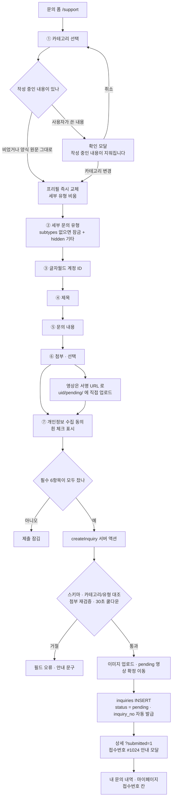
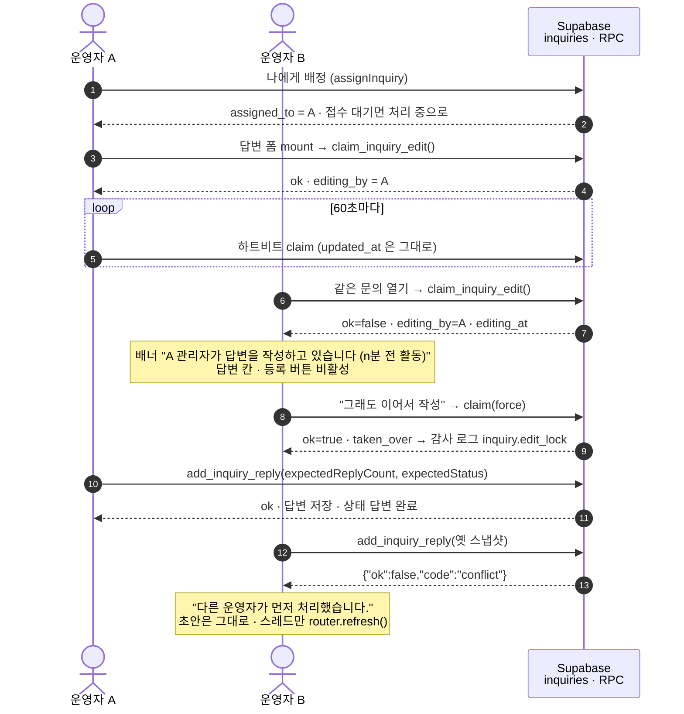

# 1:1 문의 — 2026-09-10 · 09-11 변경 사항 정리

기준 커밋 `fb448aa`(2026-09-11 11:40) · 대상 기간 **2026-09-10 ~ 2026-09-11** · 현재 상태 문서 `docs/admin/INQUIRY-GUIDE.md`

> 같은 내용의 단일 HTML 문서: `docs/admin/INQUIRY-CHANGELOG.html` (다이어그램 포함)
>
> 이 문서는 **무엇이 어떻게 바뀌었는지**만 다룹니다. "지금 어떻게 동작하는가"는 `docs/admin/INQUIRY-GUIDE.md`, 템플릿 세 갈래 비교는 `docs/admin/TEMPLATES-GUIDE.md`, 이메일 유입은 `docs/admin/EMAIL-INQUIRY-PLAN.md` · `EMAIL-INQUIRY-ACTIVATION.md` 입니다.

이틀 동안 1:1 문의는 **폼 하나에서 운영 도구로** 바뀌었습니다. 첫날은 접수가 실제로 되게 만드는 일(첨부 실패 수정 → 카테고리·프리필 → 영상 첨부)이었고, 둘째 날은 들어온 문의를 **여러 운영자가 겹치지 않게 처리**하는 일(필수 규칙 → 답변 템플릿 → 회원 연결 → 배정·잠금·충돌·메모·접수번호)이었습니다.

---

## 1. 한눈에 보기

| 구성 요소                                       | 상태                 | 메모                                                                         |
| ----------------------------------------------- | -------------------- | ---------------------------------------------------------------------------- |
| DB 마이그레이션 8개 추가                        | 적용됨               | `20260910000400` ~ `20260911000400`                                          |
| 사용자 접수 폼                                  | 배포됨               | 필수 6항목 · 카테고리 프리필 · 이미지/영상 첨부 · 접수번호 안내              |
| 관리자 고객지원 모듈                            | 배포됨               | 목록·상세·카테고리 관리·답변 템플릿·담당자·내부 메모                         |
| `purge-withdrawn`                               | 재배포됨(2026-09-10) | pending 첨부 청소 포함(version 4) · **첫 야간 실행 결과는 아직 미확인**      |
| `email-inbound` · `email-outbound`              | 재배포됨(2026-09-11) | 제목 규칙 `[글자월드 문의 #1024]` 반영. **제공자 계정·DNS·secret 은 미연동** |
| 플래그 `NEXT_PUBLIC_FEATURE_MSW_ACCOUNT_FIELDS` | **OFF**              | 꺼져 있으면 계정 ID 프리필이 사실상 비어 있습니다(§7)                        |

| 날짜 · 시각 | 커밋      | 영역                      | 변경 요약                                                                                                 | 마이그레이션                           |
| ----------- | --------- | ------------------------- | --------------------------------------------------------------------------------------------------------- | -------------------------------------- |
| 09-10 10:28 | `900abc5` | 클라                      | **이미지 첨부 실패 수정** — 서버 액션 본문 상한 `14mb`, 첨부 한도 재정의(각 5MB · 합계 12MB · 3개 · webp) | —                                      |
| 09-10 18:34 | `b78dfd7` | 클라 · 관리자 · DB        | **카테고리 8종 · 프리필 양식**, 관리자 카테고리 관리(개명 시 과거 문의 재라벨링)                          | `20260910000400` · `20260910000500`    |
| 09-10 19:30 | `2e3f6ae` | 클라 · 관리자 · DB        | **영상 첨부** — 브라우저 → 스토리지 직접 업로드(각 100MB · 2개) · pending 청소                            | `20260910000600`                       |
| 09-11 08:22 | `af1a886` | 클라 · 관리자 · DB        | **카테고리 연동 세부 문의 유형** · 계정 ID 필수 · 필수 6항목 규칙                                         | `20260910000700` · `000800` · `000900` |
| 09-11 08:48 | `ddd2cc1` | 문서                      | 1:1 문의 개발 가이드 `INQUIRY-GUIDE.md` · `.html` 신규                                                    | —                                      |
| 09-11 08:49 | `0bf646d` | 관리자                    | 감사 로그 라벨 — 문의 카테고리 4종 · 이메일 답변/재발송 한글 표기                                         | —                                      |
| 09-11 09:28 | `643834c` | 클라                      | **체크박스 체크 표시 복구** — 동의·첨부 삭제(`SupportCheckbox`)                                           | —                                      |
| 09-11 09:46 | `e4937d4` | 관리자 · DB               | **답변 템플릿** — 공통/카테고리별 · 자리표시자 4종 · 답변란 불러오기                                      | `20260911000200`                       |
| 09-11 10:14 | `700b22a` | 문서                      | `TEMPLATES-GUIDE.md` · `.html` 신규, 문의 가이드 답변 템플릿 절 갱신                                      | —                                      |
| 09-11 10:28 | `16b435a` | 관리자                    | **회원 상세 1:1 문의 탭**, 문의 목록 회원 필터(`?user=`)                                                  | —                                      |
| 09-11 11:40 | `fb448aa` | 클라 · 관리자 · DB · 메일 | **협업**(담당자 · 작성 중 잠금 · 저장 충돌 · 내부 메모) · **접수번호** · 출처 칸 제거 · 메일 제목 교체    | `20260911000300` · `20260911000400`    |

---

## 2. 사용자 화면 변경(이전 → 이후)

### 2.1 접수 폼 — 필드와 필수 규칙

출처: `components/support/InquiryForm.tsx` · `InquiryFields.tsx` · `InquiryFormRow.tsx` · `lib/validation/inquiry.ts`

| 필드               | 09-09까지                    | 지금(`af1a886` 이후)                                                       | 근거                         |
| ------------------ | ---------------------------- | -------------------------------------------------------------------------- | ---------------------------- |
| 글자월드 계정 ID   | 칸 자체가 없음               | **필수** · `/^[A-Za-z0-9_-]{2,40}$/` · `profiles.msw_uid` 가 있으면 프리필 | `af1a886` · `20260910000900` |
| 카테고리           | 코드 상수 4종                | **DB 8종**(`inquiry_categories`) · 설명 한 줄 · 선택 시 **프리필 교체**    | `b78dfd7` · `20260910000400` |
| 세부 문의 유형     | 고정 3종(문의 · 신고 · 제안) | **고른 카테고리의 `subtypes` 만** · 없으면 셀렉트 잠금 + hidden `기타`     | `af1a886` · `20260910000700` |
| 제목 · 내용        | 필수                         | 그대로(2~~100자 · 5~~4000자). 내용 칸은 프리필이 채웁니다                  | —                            |
| 첨부               | 사실상 필수처럼 안내         | **선택**. 이미지·PDF 와 영상이 서로 다른 경로(§2.3)                        | `af1a886`                    |
| 개인정보 수집 동의 | 필수(접수만)                 | 그대로. 다만 **체크 표시가 보이도록** 고쳤습니다(§2.5)                     | `643834c`                    |

- 필수는 **카테고리 · 세부 유형 · 계정 ID · 제목 · 내용 · 동의** 여섯입니다. 하나라도 비면 제출 버튼이 잠기고 그 아래에 `필수 항목을 모두 입력해 주세요.` 가 섭니다(`isInquiryFormFilled()`).
- 잠금 판정은 **값의 모양을 보지 않습니다** — "아직 아무것도 고르지 않은 폼"만 막습니다. 자릿수·상한은 스키마가 보고 필드 옆 문구로 돌려줍니다.
- 서버 검증도 함께 좁혔습니다 — 유형은 **고른 카테고리 소속**이어야 하고(수정 화면은 접수 당시 값 허용), 허용 목록은 상수가 아니라 `getInquiryCategories()` 로 매번 새로 읽습니다.

### 2.2 프리필 교체 확인

- 카테고리를 고르면 그 카테고리의 `prefill` 이 내용 칸을 **덮어쓰고** 세부 유형 선택이 비워집니다.
- 지울 것이 있을 때만 확인 모달(`작성 중인 내용이 지워집니다` / `카테고리를 바꿀까요?` / `카테고리 변경`)을 세웁니다. 내용이 비었거나 **어느 카테고리의 양식 원문 그대로**면 묻지 않습니다(`isDiscardableContent()` — 수정 화면 때문입니다).
- `20260910000800` 이 프리필 본문에서 "세부 문의 유형" 블록만 도려냈습니다. 셀렉트가 이미 같은 것을 묻는데 본문에도 있으면 어긋난 문의가 들어옵니다.

### 2.3 첨부 — 이미지·PDF vs 영상

|           | 이미지 · PDF                                                            | 영상                                                                  |
| --------- | ----------------------------------------------------------------------- | --------------------------------------------------------------------- |
| 09-09까지 | 각 **200MB** 로 안내(실제로는 서버 액션 본문 1MB 기본값에 막혀 **500**) | 받지 않음                                                             |
| 형식      | jpg · png · gif · **webp** · pdf                                        | mp4 · mov · webm · m4v                                                |
| 크기      | 각 **5MB** · **합계 12MB**                                              | 각 **100MB**                                                          |
| 개수      | 영상과 합쳐 **3개**                                                     | 그중 **2개**까지                                                      |
| 전송      | 폼 → 서버 액션 본문 → 스토리지                                          | 브라우저 → **스토리지 직접**(서명 URL · 진행률 · 취소), 폼에는 경로만 |
| 전처리    | `downscaleImage()` 최대 변 2000px(GIF 제외)                             | 없음. 확장자는 MIME 에서                                              |
| 커밋      | `900abc5`                                                               | `2e3f6ae` · `20260910000600`                                          |

- 합계 12MB 는 버킷이 아니라 **서버 액션 본문 상한**(`SERVER_ACTION_BODY_SIZE_LIMIT = '14mb'`) 때문입니다. `next.config.ts` 와 검증 상수가 **같은 값 하나**를 봅니다.
- 본문 상한을 넘으면 액션이 실행되기도 전에 요청이 끊겨 아무 문구도 못 돌려줍니다 — 그래서 합계 검사는 **보내기 전 화면**에서 합니다.
- 영상은 상세에서 **그 자리에서 재생**합니다(`<video controls preload="metadata">`). 새 탭으로 열면 5분짜리 서명 URL 이 주소창에 남습니다.

### 2.4 접수번호 — 어디에 보이나

`inquiries.inquiry_no`(1001부터)를 `#1024` 한 가지 모양으로 씁니다(`lib/utils/inquiry-no.ts`).

| 자리                   | 이전                                          | 이후                                                 | 파일                                            |
| ---------------------- | --------------------------------------------- | ---------------------------------------------------- | ----------------------------------------------- |
| 접수 완료 모달         | 안내 문구만                                   | `접수번호 #1024 — 문의 내역에서 확인할 수 있습니다.` | `components/support/InquirySubmittedDialog.tsx` |
| 내 문의 내역 행        | 카테고리 · 유형이 첫 줄                       | **접수번호가 맨 앞**, 그다음 카테고리 · 유형         | `components/support/InquiryRow.tsx`             |
| 마이페이지 문의내역 표 | '번호' 칸 = **화면에서 센 순번**(`index + 1`) | '접수번호' 칸 = `#1024`                              | `components/account/InquiryTable.tsx`           |
| 문의 상세              | 제목만                                        | **제목 위**에 접수번호 한 줄                         | `components/support/InquiryDetailCard.tsx`      |
| 답신 메일 제목         | `Re: … [문의 #a1b2c3d4]`(uuid 앞 8자)         | `Re: … [글자월드 문의 #1024]`                        | `supabase/functions/_shared/email/subject.ts`   |

마이페이지가 순번을 쓰던 때는 '더보기'로 목록이 늘어날 때마다 같은 문의가 다른 번호로 보였습니다. uuid 앞 8자는 **사용자 화면 어디에도 없는 값**이라 "그 번호는 어디서 보나요"라는 되물음을 낳았습니다.

### 2.5 체크박스 — 켜짐이 보이지 않던 문제(`643834c`)

- 증상: `appearance-none` 체크박스에 체크 마크를 그리지 않아 **켠 상태가 검은 사각형**으로만 보였습니다(동의 · 첨부 삭제 두 곳).
- 수정: `components/support/SupportCheckbox.tsx` — 네이티브 `<input type="checkbox">` 위에 상태 기반 **흰 체크 SVG**를 얹습니다(시안 실측 30×30 · border 1.5 · radius 5). 동의 줄은 `InquiryConsentField.tsx` 로 떼어 내고 오류 문구를 `aria-describedby` 로 연결했습니다.
- 회귀 방지: 단위 테스트가 "켜면 체크 그림이 나타나는가"를 직접 봅니다(`CHECK_MARK_TEST_ID`) — 스냅샷이 아니라 **보이는 표시**를 고정합니다.

### 2.6 최종 접수 흐름

---

## 3. 관리자 화면 변경(이전 → 이후)

### 3.1 목록 `/inquiries`

| 자리               | 이전                                        | 이후                                                                      | 커밋                  |
| ------------------ | ------------------------------------------- | ------------------------------------------------------------------------- | --------------------- |
| 첫 칸              | 제목                                        | **접수번호**(`#1024`) → 제목                                              | `fb448aa`             |
| 출처 칸            | `웹` · `이메일` 뱃지                        | **삭제**(사이드바가 이미 갈라 둡니다. `?source=` 조건은 그대로)           | `fb448aa`             |
| 출처 선택 상자     | 필터에 있음                                 | **삭제** · 값은 폼의 숨은 필드로 나릅니다                                 | `fb448aa`             |
| 담당자 칸          | 없음                                        | 닉네임 또는 `미배정` · 작성 중이면 `✎ 작성 중 · 닉네임`                   | `fb448aa`             |
| 담당자 필터        | 없음                                        | `?assignee=me` 내 담당 · `none` 미배정 · `<uuid>` 특정 운영자             | `fb448aa`             |
| 검색 `q`           | 제목 · 내용 · 계정 ID · 발신자 주소 `ilike` | **+ 접수번호 정확 일치**(`1024` · `#1024` → `inquiry_no.eq.1024`)         | `fb448aa`             |
| 카테고리·유형 필터 | 코드 상수 목록                              | **DB 기준**(등록된 라벨 + 데이터에만 남은 옛 라벨) · 유형은 카테고리 연동 | `b78dfd7` · `af1a886` |
| 회원 필터          | 없음                                        | `?user=<id>` 로 들어오면 **회원 필터 배너 + 해제 링크**                   | `16b435a`             |

- 칸마다 **최소 폭**을 줍니다. 담당자 칸이 붙으면서 표가 좁아질 때 브라우저가 '카테고리 · 유형'을 한 글자씩 세로로 쌓았습니다 — 넘치면 표가 가로로 스크롤합니다.
- 출처 칸을 걷어낸 것은 2026-09-11 오너 결정입니다. 메뉴가 갈라 놓은 값을 행마다 반복하면 같은 뱃지가 스무 줄 늘어설 뿐이고, 새로 붙은 접수번호·담당자 칸이 들어설 자리만 잃습니다.

### 3.2 상세 `/inquiries/[id]`

카드 순서가 **담당자 → 문의 정보 → 문의 내용 → 스레드 → 내부 메모 → 답변 작성** 으로 바뀌었습니다.

| 요소                | 무엇이 생겼나                                                                                                                  | 파일                                                                           |
| ------------------- | ------------------------------------------------------------------------------------------------------------------------------ | ------------------------------------------------------------------------------ |
| 접수번호            | 제목 아래 첫 항목 · 문의 정보의 첫 줄                                                                                          | `admin/components/inquiries/InquiryMeta.tsx` · `admin/lib/utils/inquiry-no.ts` |
| **배정 카드**       | `미배정` 뱃지 또는 담당자 닉네임 + 배정 시각 · `나에게 배정` · `담당자 변경` · `배정 해제`                                     | `InquiryAssignmentCard.tsx` · `InquiryAssignmentControls.tsx`                  |
| **작성 중 배너**    | `A 관리자가 답변을 작성하고 있습니다 (n분 전 활동)` + 답변 칸·등록 버튼 잠금 · `그래도 이어서 작성`(가로채기)                  | `InquiryEditLockBanner.tsx` · `use-inquiry-edit-lock.ts`                       |
| **충돌 안내**       | 저장 거절 시 `다른 운영자가 먼저 처리했습니다. 최신 내용을 확인해 주세요.` + **초안 유지** · 폴링이 먼저 알면 `최신 내용 보기` | `InquiryReplyForm.tsx` · `admin/lib/actions/inquiry-shared.ts`                 |
| **내부 메모**       | 운영자 전용 카드(최신순) · 머리와 입력칸 양쪽에 `운영자 전용 · 고객에게 보이지 않습니다` · 삭제는 작성자만                     | `InquiryNotes.tsx` · `InquiryNoteDeleteButton.tsx`                             |
| **템플릿 불러오기** | 답변 폼 위 선택 상자(공통 + 그 문의의 카테고리) · 쓰던 글이 있으면 `바꾸기` / `끝에 추가` / `취소`                             | `InquiryReplyTemplatePicker.tsx`                                               |

- 배정 규칙: **미배정 + `접수 대기` 문의를 맡으면 상태도 `처리 중`** 으로 갑니다(상태 select 와 **같은 전이표**를 탑니다). 상태 전이가 실패해도 배정은 되돌리지 않습니다. 확인 창은 **남의 배정을 건드릴 때만** 세웁니다.
- 잠금 숫자: TTL **5분**(`INQUIRY_LOCK_TTL_MS`) · 하트비트 **60초** · 협업 상태 폴링 **20초**(`INQUIRY_COLLAB_POLL_MS`). 하트비트는 `updated_at` 을 밀지 않습니다.
- 충돌 판정은 **화면에 그려진** 스레드 상태(`expectedReplyCount` · `expectedStatus`)를 hidden 으로 보내고 `add_inquiry_reply()` RPC 안에서 비교합니다. 폴링으로 알아낸 값으로 덮어쓰지 않습니다.

### 3.3 카테고리 관리 `/inquiries/categories` (`b78dfd7` · `af1a886`)

| 동작            | 규칙                                                                                                                                               |
| --------------- | -------------------------------------------------------------------------------------------------------------------------------------------------- |
| 추가            | `key` 는 라벨에서 자동 생성(라틴 문자가 없으면 `c-<무작위 8자>`) · `sort_order` 는 맨 뒤 · 중복 라벨은 `이미 같은 이름의 카테고리가 있습니다.`     |
| 수정 · **개명** | `update_inquiry_category()` RPC 한 번 = 한 트랜잭션. 라벨이 바뀌면 **그 라벨로 접수된 과거 문의를 함께 옮기고** 건수를 토스트·감사 로그에 남깁니다 |
| 삭제 가드       | **0건일 때만.** 있으면 `이 카테고리로 접수된 문의가 N건 있습니다. 삭제 대신 비활성화해 주세요.` — 화면과 액션이 같은 규칙                          |
| 세부 유형 편집  | 대화상자 안에서 추가·삭제·순서(≤ 20개 · 각 30자). `formData.getAll('subtypes')` 로 **화면 순서 그대로**, 중복만 거절                               |
| 프리필          | ≤ 2000자 평문. 저장하면 캐시 태그 `inquiry-categories` 무효화 → 사용자 폼에 반영                                                                   |

### 3.4 답변 템플릿 `/inquiries/reply-templates` (`e4937d4`)

- `public.inquiry_reply_templates`(`20260911000200`) — `category_id` 가 **NULL 이면 공통**, 값이 있으면 그 카테고리 전용. 이름 ≤ 40자(묶음 안 중복 불가) · 본문 ≤ **2000자 = 답변 상한**.
- 자리표시자 4종은 **불러오는 순간 치환**됩니다 — `{{닉네임}}` · `{{문의번호}}` · `{{카테고리}}` · `{{제목}}`. 모르는 표시(`{{점검일}}`)는 그대로 둡니다.
- `{{문의번호}}` 는 처음에 **문의 ID 앞 8자리**였고, `fb448aa` 에서 **접수번호(`#1024`)** 로 바뀌었습니다.
- 사용자 사이트는 이 테이블을 읽지 않습니다(정책이 `is_admin()` 하나). 시드 6종은 `where not exists`.

### 3.5 회원 상세 1:1 문의 탭 (`16b435a`)

- 회원 상세 활동 영역에 `1:1 문의 N` 탭 — 접수번호 · 카테고리/유형 · 상태 · 답변 수 · 접수일, 제목을 누르면 문의 상세로 갑니다. 지표 카드와 **같은 집계**를 씁니다.
- `inquiries:read` 권한이 없으면 `문의 조회 권한이 없습니다.` 한 줄만 보여 줍니다(`members:read` 만으로는 부족).
- 최근 **20건**(`ACTIVITY_LIMIT`)까지 표에 담고, 더 있으면 `전체 보기` → `/inquiries?user=<id>` 로 넘겨 목록 쪽 회원 필터 배너를 띄웁니다. 이 탭에서도 출처 칸은 `fb448aa` 에서 함께 뺐습니다.

### 3.6 두 운영자가 같은 문의에 답할 때

---

## 4. 데이터 · 인프라 변경

### 4.1 마이그레이션 8개

| 번호             | 커밋      | 더한 것                                                                                                                                                                                                                                                                                   |
| ---------------- | --------- | ----------------------------------------------------------------------------------------------------------------------------------------------------------------------------------------------------------------------------------------------------------------------------------------- |
| `20260910000400` | `b78dfd7` | `inquiry_categories`(key · label · description · prefill · sort_order · is_active) · 공개 읽기 RLS · **시드 8종**                                                                                                                                                                         |
| `20260910000500` | `b78dfd7` | RPC `inquiry_category_usage()` · `update_inquiry_category()`(7 인자 · 개명 시 과거 문의 재라벨링)                                                                                                                                                                                         |
| `20260910000600` | `2e3f6ae` | 버킷 허용 MIME 에 `video/mp4 · quicktime · webm · x-m4v` · 첨부 3개 CHECK · RPC `stale_inquiry_pending_attachments()`(`SECURITY DEFINER`)                                                                                                                                                 |
| `20260910000700` | `af1a886` | `inquiry_categories.subtypes text[]` · CHECK `inquiry_subtypes_valid()`(≤ 20 · 각 1~30자) · 7종 시드 · `update_inquiry_category()`(8 인자) · `inquiry_type_usage()`                                                                                                                       |
| `20260910000800` | `af1a886` | 운영자가 손댄 프리필에서 "세부 문의 유형" 블록만 정규식으로 제거                                                                                                                                                                                                                          |
| `20260910000900` | `af1a886` | CHECK `inquiries_account_id_length`(null 이거나 1~40자) · 주석 갱신                                                                                                                                                                                                                       |
| `20260911000200` | `e4937d4` | `inquiry_reply_templates`(category_id nullable · name · body ≤ 2000 · sort_order · is_active) · 관리자 전용 RLS · 시드 6종                                                                                                                                                                |
| `20260911000300` | `fb448aa` | `inquiries.assigned_to · assigned_at · editing_by · editing_at` · 부분 인덱스 2개 · `inquiry_notes` + RLS 3종 · RPC `claim_inquiry_edit()` · `release_inquiry_edit()` · `add_inquiry_reply()` · **잠금 열만 바뀐 UPDATE 는 `updated_at` 을 밀지 않는 트리거**(`set_inquiry_updated_at()`) |
| `20260911000400` | `fb448aa` | `inquiries.inquiry_no`(백필 → `generated always as identity` · 유니크 `inquiries_inquiry_no_key`) · 소유자 가드에 열 고정                                                                                                                                                                 |

- `inquiry_notes` 를 `inquiries` 의 열로 두지 않은 이유: 그 테이블은 소유자에게 행이 열려 있어(`inquiries_select_own`) 열을 더하는 순간 사용자 쪽 select 한 줄이면 새어 나갑니다. 별도 테이블 + 관리자 전용 정책이면 **읽을 수 있는 경로 자체가 없습니다**(`anon` 은 권한도 회수).
- 소유자 UPDATE 가드는 `answered_at` · `contact_email` · `privacy_consent` 에 더해 **`assigned_to` · `assigned_at` · `editing_by` · `editing_at` · `inquiry_no`** 를 조용히 되돌립니다.

### 4.2 접수번호를 `generated always` 로 둔 이유

- `by default` 였다면 접수 폼이 값을 실어 보낼 수 있습니다 — 사용자 INSERT 는 `inquiries_insert_own` 으로 열려 있습니다. 누가 큰 번호를 선점하면 **시퀀스가 그 자리에 닿는 순간 접수가 통째로 실패**합니다. `always` 면 Postgres 가 직접 거절하므로 트리거로 막을 것이 없습니다.
- 1001부터 시작합니다. 1 부터면 "몇 번째 문의인지"가 드러나 서비스 규모가 노출되고, 세 자리는 접수번호처럼 보이지도 않습니다.
- 백필은 **접수 순서대로**(`created_at`, 동시각은 `id`) 매기고 `max+1` 에서 identity 를 시작합니다. 재실행해도 안전합니다(`attidentity = ''` 확인 후에만 붙입니다).
- 취소·삭제로 생긴 빈 번호는 **다시 쓰지 않습니다.**

### 4.3 스토리지

- 버킷 `inquiry-attachments`(비공개 · `file_size_limit` 200MiB)는 그대로 두고 **허용 MIME 만** 넓혔습니다(영상 4종 추가 · `20260910000600`).
- 영상 때문에 **새 스토리지 정책은 만들지 않았습니다.** 기존 셋이 전부 **첫 세그먼트(uid)만** 보므로 `<uid>/pending/…` 도 통과합니다.
- 접수 전 영상은 `<uid>/pending/<uuid>.<ext>`, 확정되면 `<uid>/<uuid>-<파일명>` 으로 **서비스 롤이 `move`** 합니다(경로·존재·크기·MIME 재검증 후).

### 4.4 Edge Function

| 함수              | 무엇이 바뀌었나                                                                                                                                                    | 배포                             |
| ----------------- | ------------------------------------------------------------------------------------------------------------------------------------------------------------------ | -------------------------------- |
| `purge-withdrawn` | 개인정보 파기 배치에 **버려진 pending 첨부 청소** 추가(`stale_inquiry_pending_attachments` → Storage API 삭제 → 응답 `pendingAttachmentsRemoved`). 실패는 삼킵니다 | **2026-09-10 재배포**(version 4) |
| `email-outbound`  | 답신 제목이 `replySubject(title, inquiry_no)` — `Re: <제목> [글자월드 문의 #1024]`. 조회 컬럼에 `inquiry_no` 추가                                                  | **2026-09-11 재배포**            |
| `email-inbound`   | 접수 확인 메일(`ack.ts`)과 수신 저장(`received.ts`)이 같은 접수번호를 씁니다. 제목 태그 정규식이 **옛 uuid 태그와 새 번호 태그를 모두** 걷어냅니다                 | **2026-09-11 재배포**            |

제목 태그를 "걷어내기만" 하는 이유: 이미 나간 메일에 답장이 오면 제목에 옛 태그가 그대로 남아 있습니다.

### 4.5 캐시 태그

- 태그는 여전히 **`inquiry-categories` 하나**입니다(`lib/data/cache.ts` ↔ `admin/lib/revalidate.ts`). 관리자에서 카테고리를 저장하면 `revalidateClient()` 가 사용자 사이트의 `POST /api/revalidate` 를 두드립니다.
- 답변 템플릿 · 담당자 · 내부 메모 · 접수번호에는 **새 태그를 만들지 않았습니다.** 관리자 화면은 `dynamic = 'force-dynamic'` 이고 사용자 쪽 문의 본문은 세션마다 직접 읽습니다.

---

## 5. 운영 절차 변화

### 5.1 권장 처리 흐름

1. 목록에서 **`미배정`** 필터(또는 `내 담당`)로 큐를 봅니다.
2. **`나에게 배정`** 을 먼저 누릅니다 — 미배정 + 접수 대기면 상태가 `처리 중` 으로 함께 올라갑니다.
3. 답변 폼을 열면 그 순간부터 **작성 중 잠금**이 잡힙니다(5분 · 60초 하트비트).
4. 필요하면 **템플릿 불러오기** → 문안을 고치고 `답변 등록`(이메일 문의는 `이메일로 답신 보내기`).
5. 상태는 답변 등록이 `답변 완료` 로 올려 줍니다. 추가 확인이 필요하면 `처리 중` 으로 두고 **내부 메모**를 남깁니다.
6. 다 끝나면 `종료`. 배정은 그대로 남습니다 — 누가 처리했는지의 기록입니다.

### 5.2 충돌 안내를 만났다면

- `다른 운영자가 먼저 처리했습니다. 최신 내용을 확인해 주세요.` 는 **저장이 되지 않은 것**입니다. 초안은 그대로 남아 있으니 다시 쓰지 마세요.
- 스레드는 이미 새로 받아 왔습니다. 위로 올라가 **앞선 답변을 읽고** — 같은 말이면 초안을 버리고, 보탤 것이 있으면 고쳐서 다시 등록합니다.
- 배너가 `최신 내용 보기` 로 먼저 알려 준 경우는 아직 저장 전입니다. 눌러서 스레드를 갱신한 뒤 이어 쓰세요.
- **작성 중 배너를 보고도 가로챌 수 있습니다**(`그래도 이어서 작성`). 그때는 감사 로그에 `inquiry.edit_lock` 이 남으므로, 상대가 자리를 비운 것이 확실할 때만 쓰세요.

### 5.3 내부 메모

- "왜 이렇게 판단했는지"를 다음 사람에게 남기는 자리입니다. **고객에게 보이지 않습니다.**
- 답변 폼과 생김새가 비슷합니다 — 머리와 입력칸 양쪽의 `운영자 전용` 문구를 확인하고 쓰세요.
- **고칠 수 없습니다.** 지우는 것은 남긴 사람만 가능하고(확인 창 한 단계), 감사 로그에는 길이만 남고 **본문은 남지 않습니다**.

### 5.4 카테고리 · 세부 유형 · 템플릿 손보기

- 카테고리를 정리할 때는 삭제가 아니라 **비활성화가 기본값**입니다. 옛 라벨을 없애면 그 라벨로 접수된 과거 문의를 **필터로 찾을 길이 사라집니다**.
- 개명은 과거 문의를 함께 옮깁니다 — 그 문의들의 `updated_at` 이 밀리는 것은 정상입니다(내용·상태·이력은 그대로).
- 프리필에 "세부 문의 유형" 목록을 다시 넣지 마세요. 셀렉트가 이미 같은 것을 묻습니다.
- 사용자 폼 반영은 캐시 태그를 타므로 **최대 300초** 늦을 수 있습니다.
- 답변 템플릿은 지우기보다 **비활성**으로 두면 문안이 남습니다. 본문 상한(2000자)은 답변 상한과 같아서, 넘기면 "불러왔는데 등록할 수 없는" 템플릿이 됩니다.

### 5.5 접수번호를 대화에 쓰는 법

- 사용자에게는 `#1024` 한 가지 모양으로만 말합니다(사용자 화면·메일 제목이 모두 이 모양입니다).
- 관리자 검색창에는 `1024` 든 `#1024` 든 넣으면 됩니다 — **정확 일치**로 찾고, 제목에 그 숫자가 든 문의도 함께 나옵니다.
- 템플릿 문안에는 `{{문의번호}}` 를 쓰면 불러오는 순간 접수번호로 치환됩니다.

### 5.6 출처 메뉴

- 목록에 출처 칸·선택 상자가 없습니다. **사이드바의 `1:1 문의` / `이메일 문의`** 가 그 값을 정합니다(같은 라우트의 필터 프리셋).
- 조건을 바꿔도 출처는 폼의 숨은 값으로 유지됩니다. 지금 어느 묶음을 보는지는 **화면 제목**이 말해 줍니다.

---

## 6. 테스트 결과

### 6.1 지금 다시 돌린 결과(2026-09-11)

| 명령                                                                                               | 결과                                         |
| -------------------------------------------------------------------------------------------------- | -------------------------------------------- |
| `pnpm --filter @maple/admin test`                                                                  | **62파일 · 839건 전체 통과**                 |
| `pnpm exec vitest run tests/unit/support tests/unit/validation tests/unit/actions tests/unit/data` | **44파일 · 507건 전체 통과**(문의 관련 범위) |

사용자 사이트 **전체** 단위 테스트는 커밋 `fb448aa` 시점 기준 **1219건**입니다. 위 명령은 문의와 맞닿은 네 디렉터리만 돌린 것이라 숫자가 다릅니다.

### 6.2 커밋이 보고한 수치

| 커밋      | 단위(클라)          | 단위(관리자) | E2E                     |
| --------- | ------------------- | ------------ | ----------------------- |
| `900abc5` | +13건               | —            | 첨부 시나리오 추가      |
| `b78dfd7` | 1108                | 652          | 14건 통과               |
| `2e3f6ae` | 1149                | 652          | 17건 통과               |
| `af1a886` | 1205                | 663          | 21건 통과               |
| `643834c` | +시각 가시성 테스트 | —            | 동의 체크 시나리오 추가 |
| `e4937d4` | —                   | +39건(4파일) | 템플릿 3건              |
| `16b435a` | —                   | +12건(3파일) | —                       |
| `fb448aa` | 1219                | 839          | 통과(협업 3건 포함)     |

### 6.3 알려진 실패 · flaky

- **`admin/tests/e2e/reports-members.spec.ts:162`** — 닉네임 강제 변경 토스트를 `닉네임을 <닉> 로 변경했습니다` 로 기대하지만, 액션은 조사 처리를 거쳐 `…<닉>으로 변경했습니다.` 를 냅니다(`admin/lib/actions/members-actions.ts:204` 의 `josa(nickname, '로')`). **문의 기능과 무관한 선행 실패**이고 이번 작업에서 고치지 않았습니다.
- **카테고리 e2e 는 느립니다.** 사용자 폼 카테고리가 `unstable_cache`(300초)에 담기고 관리자는 다른 프로세스라 `revalidateTag()` 가 닿지 않습니다 — `CLIENT_CACHE_BUDGET_MS`(6분) 예산으로 폴링합니다.
- **사용자 e2e 는 매 실행이 새 계정을 만듭니다.** 계정을 공유하면 접수 쿨다운(30초)에 걸려 간헐 실패합니다. 관리자 e2e 가 `workers: 1` 인 이유도 같습니다(상태 전이 시나리오가 서로를 밟습니다).
- **협업 e2e 는 운영자 계정이 둘 필요합니다** — `inquiry-assignment.spec.ts` 는 부트스트랩 계정과 두 번째 관리자 계정으로 각각 브라우저 컨텍스트를 엽니다.

---

## 7. 미검증 · 후속 과제

| 항목                         | 지금 상태                                                                                                                         |
| ---------------------------- | --------------------------------------------------------------------------------------------------------------------------------- |
| 계정 ID 프리필               | `profiles.msw_uid` 를 채우는 화면이 `NEXT_PUBLIC_FEATURE_MSW_ACCOUNT_FIELDS` **OFF** 라 사실상 비어 있습니다. 대부분 직접 입력    |
| 이메일 제공자                | 코드·DB·함수는 배포됐지만 **계정·DNS·secret 미연동**. 답신이 `503 not_configured` 를 받는 것이 정상 동작                          |
| pending 첨부 청소            | 함수는 재배포(2026-09-10)했지만 **첫 야간 실행 결과(`pendingAttachmentsRemoved`)는 아직 확인하지 않았습니다**                     |
| HEIC · 실기기 촬영본         | 아이폰 기본 촬영 형식은 허용 MIME 에 없습니다. 실기기에서 선택 → 거절 문구까지는 **미검증**                                       |
| 협업 상태 갱신               | realtime 이 아니라 **20초 폴링**입니다. 두 운영자가 초 단위로 겹치면 배너보다 저장 충돌이 먼저 알립니다                           |
| 잠금 해제                    | 언마운트 · `pagehide` 에서 `release_inquiry_edit()` 를 부르지만 **탭을 닫는 경우는 보장되지 않습니다** — 안전망은 5분 만료        |
| 관리자 목록 첨부             | 목록에 **첨부 개수 칸이 없습니다.** 첨부가 있는 문의를 골라 볼 방법은 아직 상세뿐입니다                                           |
| 접수번호 백필                | 운영 DB 적용 후 검증 질의 두 개(`inquiry_no is null` 0건 · 중복 0건)는 마이그레이션 주석에 있고 **실행 기록은 남기지 않았습니다** |
| 첨부 개수 필터 · 담당자 통계 | 담당자별 처리 건수·응답 시간 집계는 없습니다(감사 로그로만 추적)                                                                  |
| 내부 메모 수정               | 의도적으로 **수정 불가**입니다. 고쳐야 한다는 요구가 나오면 UPDATE 정책부터 새로 설계해야 합니다                                  |

---

## 8. 파일 인덱스 (이틀 동안 새로 생겼거나 크게 바뀐 것)

### DB · 함수

| 경로                                                                   | 커밋      |
| ---------------------------------------------------------------------- | --------- |
| `supabase/migrations/20260910000400_inquiry_categories.sql`            | `b78dfd7` |
| `supabase/migrations/20260910000500_inquiry_category_admin.sql`        | `b78dfd7` |
| `supabase/migrations/20260910000600_inquiry_video_attachments.sql`     | `2e3f6ae` |
| `supabase/migrations/20260910000700_inquiry_category_subtypes.sql`     | `af1a886` |
| `supabase/migrations/20260910000800_inquiry_prefill_subtype_block.sql` | `af1a886` |
| `supabase/migrations/20260910000900_inquiry_account_id_required.sql`   | `af1a886` |
| `supabase/migrations/20260911000200_inquiry_reply_templates.sql`       | `e4937d4` |
| `supabase/migrations/20260911000300_inquiry_assignment.sql`            | `fb448aa` |
| `supabase/migrations/20260911000400_inquiry_no.sql`                    | `fb448aa` |
| `supabase/functions/_shared/email/subject.ts`                          | `fb448aa` |
| `supabase/functions/email-inbound/ack.ts` · `received.ts`              | `fb448aa` |
| `supabase/functions/email-outbound/index.ts`                           | `fb448aa` |
| `supabase/functions/purge-withdrawn/index.ts`                          | `2e3f6ae` |

### 사용자 사이트

| 경로                                                                                                                                 | 커밋                              |
| ------------------------------------------------------------------------------------------------------------------------------------ | --------------------------------- |
| `next.config.ts`(`bodySizeLimit`)                                                                                                    | `900abc5`                         |
| `lib/supabase/storage.ts` · `lib/utils/downscale-image.ts`                                                                           | `900abc5`                         |
| `lib/supabase/upload-inquiry-video.ts` · `lib/actions/inquiry-videos.ts`                                                             | `2e3f6ae`                         |
| `lib/validation/inquiry.ts` · `lib/validation/inquiry-video.ts`                                                                      | `900abc5` · `2e3f6ae` · `af1a886` |
| `lib/data/inquiry-categories.ts` · `lib/utils/inquiry-prefill.ts`                                                                    | `b78dfd7`                         |
| `lib/utils/inquiry-subtypes.ts`                                                                                                      | `af1a886`                         |
| `lib/utils/inquiry-no.ts`                                                                                                            | `fb448aa`                         |
| `components/support/InquiryAttachmentField.tsx` · `InquiryAttachmentLists.tsx`                                                       | `900abc5`                         |
| `components/support/use-inquiry-videos.ts` · `InquiryVideoList.tsx`                                                                  | `2e3f6ae`                         |
| `components/support/use-inquiry-prefill.ts` · `InquiryFields.tsx`                                                                    | `b78dfd7` · `af1a886`             |
| `components/support/SupportCheckbox.tsx` · `InquiryConsentField.tsx` · `support-styles.ts`                                           | `643834c`                         |
| `components/support/InquiryRow.tsx` · `InquiryDetailCard.tsx` · `InquirySubmittedDialog.tsx` · `components/account/InquiryTable.tsx` | `fb448aa`                         |

### 관리자 콘솔

| 경로                                                                                                                                               | 커밋                              |
| -------------------------------------------------------------------------------------------------------------------------------------------------- | --------------------------------- |
| `admin/app/(admin)/inquiries/categories/page.tsx` · `admin/components/inquiry-categories/**`                                                       | `b78dfd7` · `af1a886`             |
| `admin/lib/actions/inquiry-category-actions.ts` · `admin/lib/data/inquiry-categories.ts`                                                           | `b78dfd7` · `af1a886`             |
| `admin/app/(admin)/inquiries/reply-templates/page.tsx` · `admin/components/inquiry-reply-templates/**`                                             | `e4937d4`                         |
| `admin/components/inquiries/InquiryReplyTemplatePicker.tsx` · `admin/lib/utils/inquiry-reply-template.ts`                                          | `e4937d4` · `fb448aa`             |
| `admin/components/members/MemberInquiriesTab.tsx` · `admin/lib/data/member-inquiries.ts`                                                           | `16b435a` · `fb448aa`             |
| `admin/components/inquiries/InquiryAssignmentCard.tsx` · `InquiryAssignmentControls.tsx` · `InquiryAssigneeCell.tsx` · `InquiryAssigneeFilter.tsx` | `fb448aa`                         |
| `admin/components/inquiries/use-inquiry-edit-lock.ts` · `InquiryEditLockBanner.tsx`                                                                | `fb448aa`                         |
| `admin/components/inquiries/InquiryNotes.tsx` · `InquiryNoteDeleteButton.tsx`                                                                      | `fb448aa`                         |
| `admin/lib/actions/inquiry-assignment-actions.ts` · `inquiry-lock-actions.ts` · `inquiry-note-actions.ts` · `inquiry-shared.ts`                    | `fb448aa`                         |
| `admin/lib/data/inquiry-detail.ts` · `inquiry-filters.ts` · `inquiry-refs.ts` · `inquiry-assignment.ts`                                            | `fb448aa`                         |
| `admin/lib/validation/inquiry-assignment.ts` · `inquiry-no-search.ts` · `admin/lib/utils/inquiry-no.ts`                                            | `fb448aa`                         |
| `admin/components/audit/audit-labels.ts`                                                                                                           | `0bf646d` · `e4937d4` · `fb448aa` |

### 테스트 · 문서

| 경로                                                                                                                                 | 커밋                                          |
| ------------------------------------------------------------------------------------------------------------------------------------ | --------------------------------------------- |
| `tests/e2e/support-inquiries.spec.ts` · `tests/e2e/video-fixture.ts`                                                                 | `900abc5` · `2e3f6ae` · `af1a886` · `643834c` |
| `admin/tests/e2e/inquiry-categories.spec.ts` · `inquiry-reply-templates.spec.ts` · `inquiry-assignment.spec.ts`                      | `b78dfd7` · `e4937d4` · `fb448aa`             |
| `admin/tests/unit/inquiry-assignment-*.test.ts` · `inquiry-conflict.test.ts` · `inquiry-note-actions.test.ts` · `inquiry-no.test.ts` | `fb448aa`                                     |
| `tests/unit/support/**` · `tests/unit/validation/inquiry*.test.ts` · `tests/unit/utils/inquiry-*.test.ts`                            | 전 구간                                       |
| `docs/admin/INQUIRY-GUIDE.md` · `.html`                                                                                              | `ddd2cc1` · `700b22a` · `fb448aa`             |
| `docs/admin/TEMPLATES-GUIDE.md` · `.html`                                                                                            | `700b22a`                                     |
| `docs/1on1.md`                                                                                                                       | `b78dfd7`                                     |
