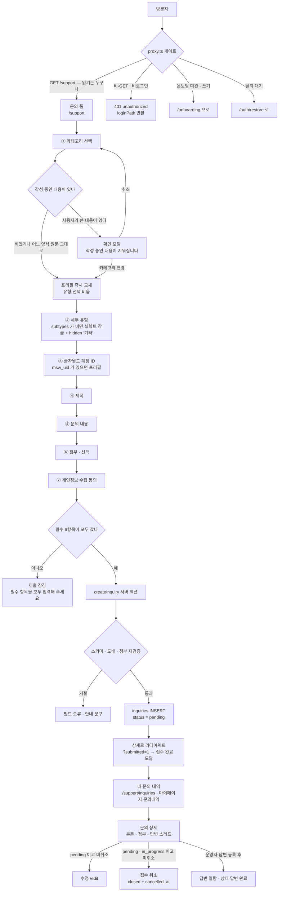
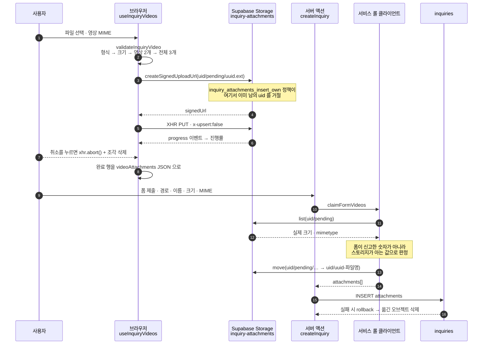
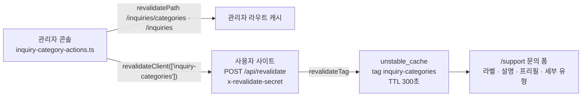
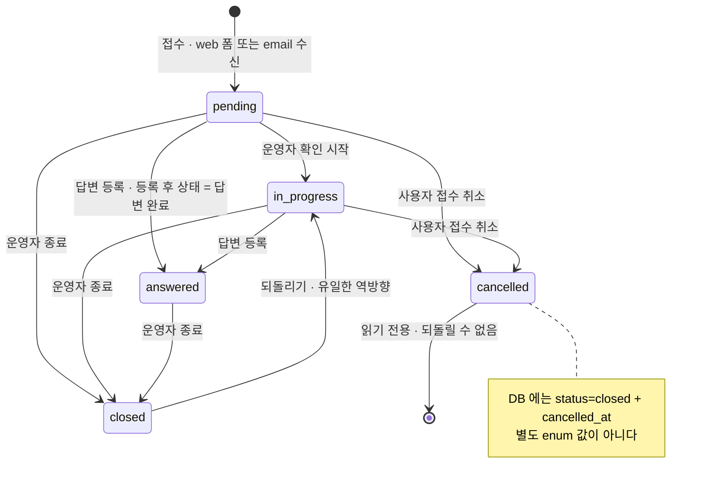

# 1:1 문의 — 개발 가이드

최종 갱신 2026-09-11 · 기준 커밋 `af1a886` · 설계 배경 `docs/admin/DEVELOPER-GUIDE.md` §5.3~§5.4 · 카테고리 원안 `docs/1on1.md` · 이메일 `docs/admin/EMAIL-INQUIRY-PLAN.md` · `docs/admin/EMAIL-INQUIRY-ACTIVATION.md`

> 같은 내용의 단일 HTML 문서: `docs/admin/INQUIRY-GUIDE.html` (다이어그램 포함)
>
> 템플릿 세 갈래(문의 카테고리 프리필 · 뉴스 카테고리 템플릿 · 답변 템플릿)를 한자리에서 비교한 문서: `docs/admin/TEMPLATES-GUIDE.md` · `TEMPLATES-GUIDE.html`

1:1 문의는 **한 테이블(`inquiries`)에 두 경로**가 들어옵니다 — 사용자 사이트의 웹 폼(`source='web'`)과 메일 수신 함수(`source='email'`). 문의의 **분류·세부 유형·프리필 양식은 코드가 아니라 DB(`inquiry_categories`)가 소유**하고, 운영자가 관리자 콘솔에서 고치면 캐시 태그 하나로 사용자 폼이 따라 바뀝니다. 첨부는 크기 때문에 **이미지·PDF 와 영상이 서로 다른 길**로 스토리지에 도착합니다.

---

## 1. 개요 · 용어

### 1.1 상태 보드

| 구성 요소                                       | 상태              | 메모                                                                           |
| ----------------------------------------------- | ----------------- | ------------------------------------------------------------------------------ |
| DB 마이그레이션 9개                             | 적용됨            | `20260908000400` ~ `20260910000900`                                            |
| 사용자 사이트 접수·수정·취소                    | 배포됨            | `/support` · `/support/inquiries` · 마이페이지 문의내역                        |
| 카테고리 · 프리필                               | 2026-09-10        | 커밋 `b78dfd7` · 시드 8종(`docs/1on1.md`)                                      |
| 영상 첨부 직접 업로드                           | 2026-09-10        | 커밋 `2e3f6ae` · 각 100MB · 2개                                                |
| 세부 유형 · 계정 ID 필수                        | 2026-09-11        | 커밋 `af1a886` · 첨부만 선택                                                   |
| 관리자 고객지원 모듈                            | 배포됨            | `/inquiries` · `/inquiries/categories` · 권한 `inquiries`                      |
| `email-inbound` · `email-outbound`              | **제공자 미연동** | 코드·DB·함수는 배포됨. 계정·DNS·secret 만 남음 — `EMAIL-INQUIRY-ACTIVATION.md` |
| 플래그 `NEXT_PUBLIC_FEATURE_MSW_ACCOUNT_FIELDS` | **OFF**           | 꺼져 있으면 계정 ID 프리필이 사실상 비어 있습니다(§8-4)                        |

### 1.2 무엇이 언제 들어갔나

| 시점       | 들어간 것                                                      | 근거                                                                                                    |
| ---------- | -------------------------------------------------------------- | ------------------------------------------------------------------------------------------------------- |
| 2026-09-08 | 문의 · 답변 · FAQ 테이블, RLS, 비공개 첨부 버킷                | `20260908000400_support.sql` · `20260908000700_rls_policies.sql` · `20260908000800_storage_buckets.sql` |
| 2026-09-08 | 소유자의 **수정 · 접수 취소**(`cancelled_at` + DB 가드)        | `20260908001900_inquiries_owner_edit_cancel.sql`                                                        |
| 2026-09-09 | 이메일 유입(`source` · `email_*` · `direction`)                | `20260909000300_email_inquiries.sql`                                                                    |
| 2026-09-10 | 카테고리 8종 · 프리필 양식 · 관리자 카테고리 관리              | `20260910000400` · `20260910000500` · 커밋 `b78dfd7`                                                    |
| 2026-09-10 | 영상 첨부(브라우저 직접 업로드 · `pending` 접두사 · 청소 함수) | `20260910000600` · 커밋 `2e3f6ae`                                                                       |
| 2026-09-11 | 카테고리별 **세부 문의 유형**, 프리필에서 유형 블록 제거       | `20260910000700` · `20260910000800` · 커밋 `af1a886`                                                    |
| 2026-09-11 | **글자월드 계정 ID 필수** + 길이 CHECK(≤ 40)                   | `20260910000900` · 커밋 `af1a886`                                                                       |

### 1.3 용어

| 말            | 실제 값                                                 | 뜻                                                                                                            |
| ------------- | ------------------------------------------------------- | ------------------------------------------------------------------------------------------------------------- |
| **문의**      | `public.inquiries` 한 행                                | 웹 폼 접수와 이메일 수신이 **같은 테이블**에 쌓입니다. 구분은 `source` 하나뿐                                 |
| **카테고리**  | `inquiry_categories.label` → `inquiries.category`(text) | 외래키가 아니라 **라벨 문자열을 복사**합니다. 그래서 이름을 바꾸면 과거 문의를 함께 옮겨야 합니다(§5.5)       |
| **세부 유형** | `inquiry_categories.subtypes[]` → `inquiries.type`      | 고른 카테고리에 매달린 목록. 옛 고정 3종('문의 · 신고 · 제안')은 데이터에만 남아 있습니다                     |
| **프리필**    | `inquiry_categories.prefill`(≤ 2000자)                  | 카테고리를 고르면 "문의 내용" 칸에 채워지는 평문 양식. 카테고리를 바꾸면 **갈아 끼웁니다**                    |
| **계정 ID**   | `inquiries.account_id`(nullable, ≤ 40자)                | 글자월드 계정 ID. 웹 폼에서는 필수, 이메일 문의·옛 문의에는 없습니다. 화면에는 늘 마스킹(`1234****000`)       |
| **첨부**      | `inquiries.attachments` jsonb 배열(≤ 3)                 | `{ name, path, size, mimeType }`. 실체는 비공개 버킷 `inquiry-attachments`, 화면은 5분짜리 서명 URL 로 봅니다 |
| **답변**      | `public.inquiry_replies`                                | `direction='outbound'` 운영자 답변 · `'inbound'` 사용자가 메일로 보낸 회신(이메일 문의만)                     |
| **상태**      | `inquiry_status` enum                                   | `pending` 접수 대기 · `in_progress` 처리 중 · `answered` 답변 완료 · `closed` 종료                            |
| **접수 취소** | `status='closed'` + `cancelled_at`                      | enum 값이 아닙니다. **라벨은 취소가 상태를 이깁니다** — 두 화면이 같은 규칙                                   |
| **출처**      | `inquiries.source` = `web` \| `email`                   | 관리자 사이드바의 '1:1 문의'·'이메일 문의'는 새 라우트가 아니라 이 값의 **필터 프리셋**                       |

> **원칙** — 화면 · 서버 액션 · DB 세 겹으로 같은 규칙을 겁니다. 폼의 잠금은 편의, 서버 액션의 재검증은 신뢰 경계, RLS·CHECK·가드 트리거가 최종 방어선입니다. 서버 액션은 UI 를 거치지 않는 직접 POST 로도 호출되기 때문입니다.

---

## 2. 사용자 흐름

출처: `proxy.ts` · `app/(public)/support/**` · `components/support/**` · `lib/actions/inquiry-actions.ts` · `lib/actions/inquiry-edit-actions.ts`



### 2.1 게이트 — 무엇이 어디서 막히나

| 경로                                 | GET                                      | 비-GET(서버 액션)                                                 | 막는 곳                                                                                  |
| ------------------------------------ | ---------------------------------------- | ----------------------------------------------------------------- | ---------------------------------------------------------------------------------------- |
| `/support`(문의 폼)                  | **열림** — 비로그인도 폼을 봅니다        | 로그인 필요 → `401 {"error":"unauthorized","loginPath":"/login"}` | `proxy.ts` `PROTECTED_MUTATION_PREFIXES`                                                 |
| `/support/inquiries`(목록·상세·수정) | 로그인 필요 → `/login?next=…` 리다이렉트 | 위와 동일                                                         | **페이지가 직접** — `/support` 는 읽기가 열려 있어야 해서 접두사 단위로 잠글 수 없습니다 |
| 온보딩 미완                          | —                                        | `/support` 쓰기 차단                                              | `ONBOARDING_MUTATION_PREFIXES`                                                           |
| 탈퇴 대기 계정                       | `/support/inquiries` → 복구 화면         | `/support` 쓰기 차단                                              | `WITHDRAWN_*_PREFIXES` + RLS `inquiries_insert_own`                                      |

POST 를 로그인 페이지로 **리다이렉트하지 않습니다** — 본문이 유실되고 서버 액션이 깨집니다. 상태 코드와 `loginPath` 만 돌려주고 이동은 클라이언트가 정합니다.

### 2.2 접수 폼의 항목

필수 항목은 **카테고리 · 세부 문의 유형 · 계정 ID · 제목 · 내용 · 동의** 여섯이고 **첨부만 선택**입니다(2026-09-11 제품 결정).

| 필드               | name                               | 필수         | 규칙                                                                | 거절 문구                                                                                  |
| ------------------ | ---------------------------------- | ------------ | ------------------------------------------------------------------- | ------------------------------------------------------------------------------------------ |
| 글자월드 계정 ID   | `accountId`                        | 필수         | `/^[A-Za-z0-9_-]{2,40}$/` · `maxLength=40` · `inputMode="numeric"`  | `글자월드 계정 ID를 입력해 주세요.` / `계정 ID는 영문·숫자·_·- 로 2~40자로 입력해 주세요.` |
| 카테고리           | `category`                         | 필수         | DB 의 **활성** 라벨 목록(수정 화면은 접수 당시 라벨도 허용)         | `카테고리를 선택해 주세요.`                                                                |
| 세부 문의 유형     | `type`                             | 필수         | **고른 카테고리의** `subtypes` 안. 비면 `기타` 하나만               | `세부 문의 유형을 선택해 주세요.`(미선택·엇갈린 조합 모두 같은 문구)                       |
| 제목               | `title`                            | 필수         | 2~100자 · CRLF → LF 정규화 후 trim                                  | `제목은 2자 이상 입력해 주세요.` / `제목은 100자 이하로 입력해 주세요.`                    |
| 문의 내용          | `content`                          | 필수         | 5~~4000자(= 프리필 상한 2000 × 2) · 자동 성장 textarea(150~~420px)  | `내용은 5자 이상 입력해 주세요.` / `내용은 4000자 이하로 입력해 주세요.`                   |
| 첨부파일           | `attachments` · `videoAttachments` | **선택**     | §3                                                                  | §3                                                                                         |
| 개인정보 수집 동의 | `consent`                          | 필수(접수만) | 체크박스 — 값이 아니라 **존재 여부**로 판정. 수정 화면에는 없습니다 | `개인정보 수집 및 이용에 동의해 주세요.`                                                   |

제출 잠금은 **값의 모양을 보지 않습니다** — "아직 아무것도 고르지 않은 폼"만 막습니다(`isInquiryFormFilled()`). 판정은 값마다 상태를 두는 대신 **폼 DOM 을 그대로 읽습니다**(`new FormData(form)`). 잠긴 버튼 아래에는 이유(`필수 항목(*)을 모두 입력해 주세요.`)가 섭니다.

### 2.3 프리필 — 갈아 끼우기와 확인 모달

출처: `components/support/use-inquiry-prefill.ts` · `lib/utils/inquiry-prefill.ts` · `lib/utils/inquiry-subtypes.ts`

1. 카테고리를 고르면 그 카테고리의 `prefill` 이 내용 칸을 **덮어씁니다**(양식이 없으면 비웁니다). 동시에 **세부 유형 선택이 비워집니다** — 남겨 두면 "접속·서버 + 콘텐츠 개선 의견" 같은 성립하지 않는 조합이 저장됩니다.
2. 지울 것이 있을 때만 확인 모달을 세웁니다. `isDiscardableContent()` 가 참이면(내용이 비었거나, 어느 카테고리의 양식 원문과 정규화 후 같으면) 묻지 않고 바로 교체합니다. 두 번째 조건은 수정 화면 때문입니다 — 접수 당시 양식을 그대로 둔 문의는 "사용자가 쓴 값"처럼 보이지만 실제로는 아무것도 쓰지 않은 상태입니다.
3. 모달 문구는 제목 `작성 중인 내용이 지워집니다` · 설명 `카테고리를 바꿀까요?` · 확인 버튼 `카테고리 변경`. 셀렉트와 textarea 를 **제어 입력**으로 둔 이유가 여기 있습니다 — 비제어면 취소해도 셀렉트가 이미 바뀐 채 남습니다.
4. 유형 셀렉트의 선택지는 `inquirySubtypesOf(categories, label)`. 목록이 비면 셀렉트를 **잠그고** `<input type="hidden" name="type" value="기타">` 를 싣습니다(`INQUIRY_SUBTYPE_FALLBACK`). 플레이스홀더는 세 상태로 갈립니다 — `카테고리를 먼저 선택해주세요` / `세부 문의 유형을 선택해주세요` / `기타`.
5. 수정 화면에서 저장된 유형이 목록에 없으면(운영자가 지웠거나 옛 '문의') 셀렉트 **뒤에 붙여** 그대로 보여 줍니다. 붙이지 않으면 브라우저가 첫 항목을 대신 보여 주고, 사용자는 건드린 적 없는 유형으로 문의가 바뀐 것을 알아채지 못합니다.

카테고리 조회가 실패하면 폼은 **정적 폴백 라벨 8개**(`INQUIRY_CATEGORY_FALLBACK`)로 떨어집니다. 폴백에는 프리필도 세부 유형도 없으므로 유형은 `기타` 로 접수되고 양식만 빠집니다 — 카테고리를 못 읽었다고 접수를 막으면 하필 장애 때 "접속이 안 된다"는 문의가 들어올 길이 사라집니다.

### 2.4 접수 서버 액션 — 순서가 곧 방어선

`lib/actions/inquiry-actions.ts` `createInquiry`

1. **로그인 재확인** — 프록시의 검사는 낙관적입니다. → `로그인 후 이용할 수 있습니다.`
2. **스키마 파싱** — 허용 카테고리·세부 유형을 `getInquiryCategories()` 로 **매번 새로** 읽어 스키마를 만듭니다. 상수로 굳히면 운영자가 추가한 카테고리가 서버에서 거절됩니다.
3. **영상 목록 파싱** — `videoAttachments` 숨은 필드의 JSON. 모양이 어긋나면 `null`(빈 목록과 구분) → `영상 첨부 정보가 올바르지 않습니다. 다시 시도해 주세요.`
4. **첨부 재검증** — 개수·형식·각 5MB·합계 12MB. 영상 수를 함께 세어 총 3개를 넘지 않게 합니다.
5. **도배 판정** — 마지막 접수 시각 기준 **30초**(`WRITE_COOLDOWN_SECONDS`). 메모리 카운터가 아니라 DB 의 `created_at` 을 봅니다.
6. **이미지 업로드** — `<uid>/<uuid>-<파일명>`. 도중 실패하면 이미 올린 것을 지웁니다.
7. **영상 확정** — pending 오브젝트를 검증하고 접수 자리로 `move`. 실패하면 이미지 업로드분을 되돌립니다.
8. **INSERT** — `status:'pending'` 을 명시합니다(`inquiries_insert_own` 정책이 `pending` 만 허용).
9. **무효화 · 이동** — `revalidatePath('/support/inquiries')` · `revalidatePath('/support')` 뒤 `redirect(상세?submitted=1)`.

`redirect()` 는 **예외를 던집니다**. 그래서 성공 경로의 마지막에서만 부르고, 그 앞의 롤백은 전부 끝나 있어야 합니다.

### 2.5 목록 · 상세

- **두 개의 목록** — 고객지원 `/support/inquiries`(누적 "더보기" · 10건 단위)와 마이페이지 `/account/inquiries`(첫 10건 표). 둘 다 `getMyInquiries()` 하나를 쓰고 상세는 고객지원 쪽으로 보냅니다.
- **소유권** — RLS 위에 `.eq('user_id', …)` 를 **한 번 더** 겁니다. 관리자 세션에는 전체 행이 열려 있어 조건을 빼면 "내 문의 내역"이 남의 문의를 그립니다.
- **없는 문의는 `notFound()`** — "권한 없음"을 구분해 알리면 남의 문의 id 존재 여부가 새어 나갑니다.
- **답변 수**는 임베드 집계 `inquiry_replies(count)` 로 같은 왕복에서 받습니다.
- **1회성 안내** — `?submitted=1` · `?updated=1` · `?cancelled=1` · `?locked=1`. **문구는 서버가 정합니다** — 주소에 문구를 실으면 링크 하나로 임의 텍스트를 이 화면에 띄울 수 있습니다.
- 목록·상세·수정 모두 `robots: { index:false, follow:false }`. 제목에 개인정보가 섞일 수 있어 메타에도 싣지 않습니다.
- 답변이 없을 때 문구는 상태별로 다릅니다 — 취소 `접수가 취소된 문의입니다.` / 종료 `운영자 검토 후 종료된 문의입니다. 추가 문의는 새 1:1 문의로 남겨 주세요.` / 처리 중 `운영자가 처리 중입니다…` / 그 밖 `운영자가 확인 중입니다…`.

### 2.6 수정 · 접수 취소 규칙

| 동작          | 가능 조건                            | 바뀌는 것                                                     | 막는 세 겹                                                                           |
| ------------- | ------------------------------------ | ------------------------------------------------------------- | ------------------------------------------------------------------------------------ |
| **수정**      | `status='pending'` **이고** 미취소   | 계정 ID · 카테고리 · 유형 · 제목 · 내용 · 첨부                | 화면 `canEditInquiry()` → 액션 재확인 → DB 가드 `guard_inquiry_owner_update()` 42501 |
| **접수 취소** | `pending` 또는 `in_progress`, 미취소 | `status='closed'` + `cancelled_at=now` — **같은 UPDATE** 로만 | 화면 `canCancelInquiry()` → 액션 → DB 가드(취소 해제·따로 찍기 모두 거절)            |

- **재수정 도배 창은 10초**(`REPORT_COOLDOWN_SECONDS` 재사용). 기준은 `updated_at` 이지만 `updated_at === created_at` 이면 "한 번도 고치지 않음"으로 봅니다 — 접수 직후 오타 수정은 정상 행동입니다.
- 수정 화면은 **동의 체크박스를 다시 묻지 않습니다.** 다시 물으면 체크를 푸는 순간 "동의 철회"처럼 보입니다.
- 수정 액션은 **옛 카테고리·옛 유형을 허용**합니다(`withLegacyCategory()` · `updateInquirySchema(…, [현재 type])`).
- 문의 id 는 폼 필드가 아니라 **`bind` 로** 실어 보냅니다.
- 저장이 `42501` 로 떨어지면 `접수 대기 상태의 문의만 수정할 수 있습니다.` 로 안내합니다 — 그 사이 운영자가 상태를 올렸다는 뜻입니다.
- 첨부 삭제는 `removeAttachments`(값 = **오브젝트 키**) 체크박스로 표시하고 **행 저장이 끝난 뒤에** 지웁니다.

---

## 3. 첨부 파일

출처: `lib/supabase/storage.ts` · `lib/supabase/upload-inquiry-video.ts` · `lib/actions/inquiry-attachments.ts` · `lib/actions/inquiry-videos.ts` · `components/support/InquiryAttachmentField.tsx`

한 문의에 붙는 첨부는 **최대 3개**입니다(DB CHECK `inquiries_attachments_max_3`).

|        | 이미지 · PDF                                                                   | 영상                                                      |
| ------ | ------------------------------------------------------------------------------ | --------------------------------------------------------- |
| 형식   | jpg · png · gif · webp · pdf                                                   | mp4 · mov · webm · m4v                                    |
| 크기   | 각 **5MB** · **합계 12MB**                                                     | 각 **100MB**(합계 제한 없음)                              |
| 개수   | 셋을 합쳐 3개 이내. 영상은 그중 **2개**까지 — 최소 한 자리를 이미지에 남깁니다 |                                                           |
| 전송   | 폼 → 서버 액션 본문(`multipart/form-data`) → 스토리지                          | 브라우저 → **스토리지 직접**, 폼에는 경로만               |
| 전처리 | `downscaleImage()` — 최대 변 2000px, GIF 는 건너뜁니다                         | 없음. 확장자는 **MIME 에서 뽑습니다**                     |
| 경로   | `<uid>/<uuid>-<파일명>`                                                        | `<uid>/pending/<uuid>.<ext>` → 확정 시 왼쪽 자리로 `move` |

상수: `INQUIRY_ATTACHMENT_MAX_COUNT=3` · `MAX_BYTES=5MiB` · `TOTAL_MAX_BYTES=12MiB` · `INQUIRY_VIDEO_MAX_BYTES=100MiB` · `INQUIRY_VIDEO_MAX_COUNT=2` · `SERVER_ACTION_BODY_SIZE_LIMIT='14mb'`.

> **14mb** — 합계 12MB 는 버킷이 아니라 **서버 액션 본문 상한** 때문입니다. `next.config.ts` 의 `experimental.serverActions.bodySizeLimit` 은 `SERVER_ACTION_BODY_SIZE_LIMIT` 한 상수를 그대로 씁니다. 본문이 상한을 넘으면 액션이 **실행되기도 전에** 요청이 500 으로 끊겨 아무 문구도 돌려줄 수 없습니다. 그래서 합계 검사는 **보내기 전** 화면에서 합니다.

첨부 오류 문구: `첨부파일은 최대 3개까지 올릴 수 있습니다.` / `jpg · png · gif · webp · pdf 파일만 올릴 수 있습니다.` / `<파일명> 은(는) 5MB 를 넘습니다…` / `첨부파일은 합쳐서 12MB 이하만 올릴 수 있습니다.` / `빈 파일은 올릴 수 없습니다.` / `mp4 · mov · webm · m4v 영상만 올릴 수 있습니다.` / `영상은 최대 2개까지 올릴 수 있습니다.`

### 3.1 영상 경로 — 왜 직접 올리나

상한을 100MB 로 올리면 **모든** 서버 액션이 한 요청에 그만큼을 받아 낼 수 있게 되고, 그래도 파일은 결국 서버를 한 번 더 거쳐 스토리지로 갑니다.



### 3.2 서버가 다시 보는 세 가지

`lib/actions/inquiry-videos.ts` `claimPendingVideos`

1. **경로가 이 사용자의 pending 인가** — `isInquiryPendingPath(path, userId)` 가 uid · 폴더 이름 · **깊이 3** 을 모두 못 박습니다.
2. **오브젝트가 실제로 있고 규칙 안인가** — `list()` 로 pending 폴더를 훑어 `metadata.size` · `metadata.mimetype` 을 읽습니다. 폼이 신고한 값을 믿으면 100MB 제한이 "100 이라고 적어 보내면 통과하는" 규칙이 됩니다.
3. **목적지가 자기 폴더인가** — `isUserScopedPath()` 를 옮기기 직전에 한 번 더 겁니다.

옮기는 주체는 **서비스 롤**입니다. `move` 는 `storage.objects` 의 UPDATE 인데 이 버킷에는 사용자용 UPDATE 정책이 없습니다 — **RLS 가 이 이동을 막아 주지 않으므로** 위 세 검사가 유일한 경계입니다. 서비스 롤 키가 없는 환경에서는 **영상 첨부만** 거절되고(`영상 첨부를 처리할 수 없습니다…`) 영상 없는 접수는 평소대로 됩니다.

### 3.3 버려진 pending 청소

- 폼에 영상만 올려 두고 떠나면 어떤 문의도 참조하지 않는 오브젝트가 남습니다.
- `public.stale_inquiry_pending_attachments(p_cutoff_hours=24, p_limit=500)` — `SECURITY DEFINER` · 실행 권한 **`service_role` 뿐**. 판정은 `bucket_id='inquiry-attachments'` 이고 경로 **두 번째 세그먼트가 `pending`** 이며 생성 24시간 경과.
- Edge Function `purge-withdrawn` 이 경로를 받아 **Storage API** 로 지웁니다(응답의 `pendingAttachmentsRemoved`). SQL 로 `storage.objects` 행만 지우면 실제 파일이 S3 에 남아 용량만 샙니다.
- 개인정보 파기와 독립이라 실패를 삼킵니다.
- 24시간을 두는 이유는 같은 파일을 올려 두고 **다음 날 이어서 쓰는** 사용자를 자르지 않기 위해서입니다.

### 3.4 버킷 · 스토리지 정책

| 항목                              | 값                                                                                                                                                          |
| --------------------------------- | ----------------------------------------------------------------------------------------------------------------------------------------------------------- |
| 버킷                              | `inquiry-attachments` · **비공개** · `file_size_limit` 200MiB                                                                                               |
| 허용 MIME                         | `image/png · image/jpeg · image/gif · image/webp · application/pdf · application/zip · text/plain · video/mp4 · video/quicktime · video/webm · video/x-m4v` |
| `inquiry_attachments_read_own`    | SELECT — 첫 세그먼트가 `auth.uid()` **또는** `is_admin()`                                                                                                   |
| `inquiry_attachments_insert_own`  | INSERT — 첫 세그먼트가 `auth.uid()`(서명 업로드 URL 발급도 여기를 탑니다)                                                                                   |
| `inquiry_attachments_delete_own`  | DELETE — 첫 세그먼트가 `auth.uid()`. pending 은 그 접두사 **안쪽**이라 그대로 통과                                                                          |
| `inquiry_attachments_admin_write` | ALL — `is_admin()`                                                                                                                                          |

zip · txt 는 **이메일 수신 첨부**용이라 웹 폼은 일부러 더 좁게 받습니다. 영상 때문에 **새로 만든 정책은 없습니다** — 기존 셋이 전부 첫 세그먼트(= uid)만 보므로 `<uid>/pending/…` 도 그대로 통과합니다.

### 3.5 보기 — 서명 URL

- 사용자·관리자 상세 **모두 5분(300초)짜리 서명 URL** 을 **세션 클라이언트로** 발급합니다. 서비스 롤로 서명하면 `inquiry_attachments_read_own` 검사가 사라집니다.
- `next/image` 를 쓰지 않습니다 — 최적화기는 만료되는 URL 을 캐시하고, 통과시키려면 스토리지 호스트를 `remotePatterns` 에 열어야 합니다.
- **영상은 그 자리에서 재생**합니다(`<video controls preload="metadata">`). 새 탭으로 열면 서명 URL 이 주소창·방문 기록에 남습니다.
- 내려받기는 `?…&download=<파일명>` 질의 파라미터로 붙입니다 — `<a download>` 은 **동일 출처에서만** 동작합니다.
- 서명 실패 항목은 링크 없이 이름만(관리자는 `(링크 발급 실패)`). 관리자 화면의 이미지는 **다이얼로그 미리보기**입니다.

---

## 4. 데이터 모델

### 4.1 `inquiries`

| 열                               | 타입                      | 메모                                                                                                                                              |
| -------------------------------- | ------------------------- | ------------------------------------------------------------------------------------------------------------------------------------------------- |
| `id`                             | `uuid` PK                 | `gen_random_uuid()`                                                                                                                               |
| `user_id`                        | `uuid` → `profiles(id)`   | `on delete set null`. **이메일 문의는 항상 null** — 발신자 주소는 위조 가능해서 회원 식별에 쓰지 않습니다                                         |
| `account_id`                     | `text`                    | CHECK `inquiries_account_id_length` = null 이거나 1~40자. **NOT NULL 은 걸지 않습니다** — 필수는 웹 폼의 규칙이라 서버 액션 스키마에서 강제합니다 |
| `category`                       | `text` NOT NULL           | 카테고리 **라벨 문자열**                                                                                                                          |
| `type`                           | `text` NOT NULL           | 세부 유형 라벨. 옛 값 `문의`·`신고`·`제안`, 이메일 문의는 `general`                                                                               |
| `title` · `content`              | `text` NOT NULL           | 평문. 화면은 줄바꿈만 살립니다                                                                                                                    |
| `attachments`                    | `jsonb` NOT NULL `'[]'`   | CHECK 둘 — `jsonb_typeof='array'`, `jsonb_array_length <= 3`                                                                                      |
| `privacy_consent`                | `boolean` NOT NULL        | CHECK `privacy_consent or source = 'email'`(`20260909000300` 에서 완화)                                                                           |
| `status`                         | `inquiry_status` NOT NULL | `pending · in_progress · answered · closed`                                                                                                       |
| `cancelled_at`                   | `timestamptz`             | 사용자의 접수 취소 시각. enum 에 값을 더하지 않은 이유는 상태를 읽는 코드가 이미 네 값을 전제로 갈라져 있기 때문                                  |
| `contact_email` · `answered_at`  | `text` · `timestamptz`    | 운영자만 채웁니다. `answered_at` 은 **처음** 답변 완료로 넘어간 시각만 — 갱신하면 첫 응답 시간을 계산할 수 없습니다                               |
| `source`                         | `text` NOT NULL `'web'`   | CHECK `in ('web','email')`                                                                                                                        |
| `email_from` · `email_from_name` | `text`                    | 발신자 주소 · 표시 이름                                                                                                                           |
| `email_message_id`               | `text`                    | 원본 Message-ID. **부분 유니크**                                                                                                                  |
| `email_auth`                     | `jsonb`                   | 제공자의 `{ spf, dkim, dmarc }` 판정 그대로. **차단 근거가 아니라** 콘솔 뱃지용                                                                   |
| `email_thread_key`               | `text`                    | `reply+<key>@` 토큰(24자 url-safe). 부분 유니크 · 화면에 노출하지 않습니다                                                                        |
| `created_at` · `updated_at`      | `timestamptz`             | `set_updated_at` 트리거가 모든 UPDATE 에서 `updated_at` 을 밀어 올립니다                                                                          |

인덱스: `inquiries_user_created_idx(user_id, created_at desc)` · `inquiries_status_created_idx` · `inquiries_source_status_created_idx` · `inquiries_email_from_created_idx` · `inquiries_email_message_id_key` · `inquiries_email_thread_key_key`(둘 다 부분 유니크).

### 4.2 `inquiry_replies`

| 열                          | 메모                                                                                                    |
| --------------------------- | ------------------------------------------------------------------------------------------------------- |
| `inquiry_id`                | → `inquiries(id)` `on delete cascade`                                                                   |
| `author_id` · `author_name` | → `profiles(id)` `on delete set null` · 기본 `'운영자'`. 콘솔 체크박스로 '운영자' 명의/개인 닉네임 선택 |
| `content`                   | 평문. 관리자 입력 상한 **2000자**(`INQUIRY_REPLY_MAX_LENGTH`)                                           |
| `direction`                 | CHECK `in ('outbound','inbound')`. **콘솔에서 쓴 글은 언제나 outbound**                                 |
| `email_message_id`          | outbound 는 제공자 발송 id, inbound 는 원본 Message-ID. **부분 유니크**                                 |
| `delivery_status`           | CHECK `null \| 'queued' \| 'sent' \| 'failed'`. 웹 답변과 inbound 는 `null`                             |

### 4.3 `inquiry_categories`

| 열                         | 제약                                                        | 쓰임                                                               |
| -------------------------- | ----------------------------------------------------------- | ------------------------------------------------------------------ |
| `key`                      | 유니크 · `^[a-z0-9][a-z0-9-]{0,39}$`                        | 안정 식별자. **라벨을 바꿔도 유지**되고 화면에는 보이지 않습니다   |
| `label`                    | 유니크 · 1~20자                                             | 셀렉트 문구이자 `inquiries.category` 에 저장되는 값                |
| `description`              | ≤ 100자 · nullable                                          | 셀렉트 아래 한 줄 안내(빈 문자열은 `null` 로 저장)                 |
| `prefill`                  | ≤ 2000자 · NOT NULL `''`                                    | 문의 내용 양식. 줄바꿈은 LF                                        |
| `subtypes`                 | `text[]` NOT NULL `'{}'` · CHECK `inquiry_subtypes_valid()` | 1차원 · ≤ 20개 · 각 1~30자 · null/공백 금지. 순서가 곧 셀렉트 순서 |
| `sort_order` · `is_active` | —                                                           | 표시 순서 · 사용자 폼 노출                                         |

시드는 `docs/1on1.md` 의 **8종**(`connection · character · save-data · currency · content-balance · account-environment · feature-ui · etc`)이고 `on conflict (key) do nothing` 입니다. `etc`('기타·건의')만 `subtypes` 가 비어 있어 폼이 셀렉트를 잠그고 `기타` 로 접수합니다.

### 4.4 RPC 넷

| 함수                                                                                                             | 보안                                                 | 하는 일                                                                                                                           |
| ---------------------------------------------------------------------------------------------------------------- | ---------------------------------------------------- | --------------------------------------------------------------------------------------------------------------------------------- |
| `update_inquiry_category(p_id, p_key, p_label, p_description, p_prefill, p_sort_order, p_is_active, p_subtypes)` | `SECURITY INVOKER` + 함수 안에서 `is_admin()` 재확인 | 카테고리 수정 **+ 라벨 변경 시 과거 문의 재라벨링**을 **한 트랜잭션**으로. 반환은 옮긴 문의 수. `p_subtypes` 가 null 이면 빈 배열 |
| `inquiry_category_usage()`                                                                                       | `SECURITY INVOKER` · stable                          | 라벨별 문의 수. 삭제 가능 여부(0건일 때만)와 **목록 필터의 옛 라벨**                                                              |
| `inquiry_type_usage()`                                                                                           | 동일                                                 | 유형별 문의 수. 옛 값('문의'·'신고'·'제안'·`general`)을 필터에서 잃지 않기 위해                                                   |
| `stale_inquiry_pending_attachments(p_cutoff_hours, p_limit)`                                                     | `SECURITY DEFINER` · 실행 `service_role` 만          | 24시간 지난 `<uid>/pending/…` 경로 목록(§3.3)                                                                                     |

`update_inquiry_category()` 는 RLS 만 믿지 않고 **함수가 스스로 `is_admin()` 을 다시 봅니다.** RLS 에만 기대면 비관리자가 불렀을 때 "0건 갱신"이 조용히 성공으로 돌아옵니다. 사용 통계 둘은 반대로 `INVOKER` 라서 일반 사용자가 부르면 **자기 문의만** 세어집니다.

### 4.5 RLS 요약

| 테이블                 | 정책                               | 대상                     | 조건                                                                                          |
| ---------------------- | ---------------------------------- | ------------------------ | --------------------------------------------------------------------------------------------- |
| `inquiries`            | `inquiries_select_own`             | authenticated            | `user_id = auth.uid()`                                                                        |
| `inquiries`            | `inquiries_select_admin`           | authenticated            | `is_admin()`                                                                                  |
| `inquiries`            | `inquiries_insert_own`             | authenticated            | `user_id = auth.uid()` **and** `status='pending'` **and** `not is_withdrawn()`                |
| `inquiries`            | `inquiries_update_own`             | authenticated            | `using` 본인 **and** `not is_withdrawn()` · `with check` 본인. 어떤 열을 언제는 가드 트리거가 |
| `inquiries`            | `inquiries_admin_all`              | authenticated            | `is_admin()`                                                                                  |
| `inquiry_replies`      | `inquiry_replies_select_owner`     | authenticated            | 그 문의의 `user_id` 가 나                                                                     |
| `inquiry_replies`      | `inquiry_replies_admin_all`        | authenticated            | `is_admin()`                                                                                  |
| `inquiry_categories`   | `inquiry_categories_select_active` | **anon** + authenticated | `is_active` — 비로그인 방문자도 폼에서 카테고리를 봐야 합니다(제출만 로그인)                  |
| `inquiry_categories`   | `inquiry_categories_admin_all`     | authenticated            | `is_admin()` — 비활성 행까지 보이는 근거                                                      |
| `email_inbound_events` | —                                  | service_role             | anon · authenticated 권한을 **회수**했습니다                                                  |

`anon` 에게는 `inquiries` 의 어떤 행도 열지 않습니다. 테이블 권한(`grant`)도 정책과 **함께** 명시합니다 — 기본 권한이 조여지는 순간 "정책은 있는데 42501" 이 됩니다.

### 4.6 소유자 UPDATE 가드

`public.guard_inquiry_owner_update()` — `20260908001900`. **`SECURITY INVOKER` 여야 합니다.** `DEFINER` 로 두면 `current_user` 가 함수 소유자(postgres)로 평가되어 첫 분기가 항상 참이 되고 가드가 통째로 무력화됩니다.

1. `postgres` · `supabase_admin` · `service_role` 이거나 `is_admin()` 이면 통과.
2. `user_id` · `created_at` 변경 → `42501` 예외.
3. 상태 변경은 **취소 전이 하나만** — `old.status in ('pending','in_progress')` · `new.status='closed'` · `old.cancelled_at is null` · `new.cancelled_at is not null`.
4. `cancelled_at` 을 그 전이 밖에서 건드리면(취소 해제, 상태 없이 따로 찍기) 예외.
5. 본문(제목·카테고리·유형·계정 ID·내용·첨부) 변경은 `old.status='pending'` 이고 미취소일 때만.
6. `answered_at` · `contact_email` · `privacy_consent` 는 **조용히 되돌립니다** — 사용자가 보낼 이유가 없는 값이라 정상 흐름을 예외로 끊을 이유가 없습니다.

거절을 "조용한 되돌리기"로 하면 사용자에게는 **저장됨**으로 보이고 값만 옛것으로 남습니다. 그래서 사용자 입력 계열은 `42501` 예외로 끊습니다.

### 4.7 캐시 태그와 반영 경로



- 관리자와 사용자 사이트는 **별도 배포**입니다. Next 의 데이터 캐시는 프로세스마다 따로 있어 관리자에서 `revalidateTag()` 를 불러도 사용자 사이트에는 아무 일도 일어나지 않습니다.
- 태그는 `inquiry-categories` 하나. 사용자 `lib/data/cache.ts` 의 `CACHE_TAGS` 와 관리자 `CLIENT_CACHE_TAGS` 가 **1:1** 이어야 합니다 — 없는 이름은 400 으로 반려됩니다.
- 무효화가 끊기면 최대 **300초**(`STATIC_REVALIDATE_SECONDS`) 늦게 반영됩니다. 던지지 않으므로 저장 자체는 성공합니다.
- **문의 본문에는 태그가 없습니다.** "내 문의 내역"은 `user_id` 로 세션마다 직접 읽고 캐시하지 않습니다.

---

## 5. 관리자 콘솔

출처: `admin/app/(admin)/inquiries/**` · `admin/components/inquiries/**` · `admin/components/inquiry-categories/**` · `admin/lib/{actions,data,validation}/inquir*.ts`

### 5.1 상태 전이



| from          | 갈 수 있는 곳                         | 메모                                                                                           |
| ------------- | ------------------------------------- | ---------------------------------------------------------------------------------------------- |
| `pending`     | `in_progress` · `answered` · `closed` | 기본 탭 '미처리' 가 `pending + in_progress`                                                    |
| `in_progress` | `answered` · `closed`                 |                                                                                                |
| `answered`    | `closed`                              | **되돌아가지 않습니다** — 사용자 화면의 상태가 앞뒤로 튀면 "답변이 사라졌다"는 문의를 부릅니다 |
| `closed`      | `in_progress`                         | 유일한 역방향. 종료된 문의에는 답변할 수 없고 먼저 이쪽으로 되돌려야 합니다                    |

같은 상태로의 "전이"는 전이가 아닙니다 — `이미 같은 상태입니다. 상태는 바뀌지 않았습니다.` 상세 헤더의 select 에는 **갈 수 있는 곳만** 담습니다.

**사용자가 취소한 접수는 읽기 전용입니다.** 상태 변경 폼과 종료 버튼이 사라지고 답변 폼도 그려지지 않으며, 액션은 `사용자가 접수를 취소한 문의입니다. 상태 변경과 답변 등록을 할 수 없습니다.` 로 거절합니다.

### 5.2 목록 · 필터

`/inquiries` 는 `dynamic = 'force-dynamic'` 입니다. 사이드바의 **1:1 문의**(`?source=web`) · **이메일 문의**(`?source=email`)는 같은 화면의 **필터 프리셋**이고 제목·설명이 프리셋마다 다릅니다.

| 필터     | 쿼리 키       | 규칙                                                                                                                                  |
| -------- | ------------- | ------------------------------------------------------------------------------------------------------------------------------------- |
| 상태 탭  | `status`      | `open`(기본) · `pending` · `in_progress` · `answered` · `closed` · `cancelled` · `all`. 탭 건수는 상태 외 조건을 그대로 적용해 셉니다 |
| 출처     | `source`      | `web` · `email`. 모르는 값은 필터를 걸지 않습니다                                                                                     |
| 카테고리 | `category`    | 등록된 라벨(비활성 포함) + **데이터에만 남은 옛 라벨**. 빈 값·20자 초과면 전체                                                        |
| 유형     | `type`        | 카테고리를 고르면 **그 카테고리의 세부 유형만**(GET 폼이라 왕복이 곧 갱신). 옛 값은 언제나 뒤에. 상한 30자                            |
| 등록일   | `from` · `to` | `YYYY-MM-DD`(KST) → UTC 경계로 환산, **종료일은 그날 24시까지** 포함                                                                  |
| 검색     | `q`           | 제목 · 내용 · 계정 ID · 발신자 주소 `ilike`. 60자. PostgREST `or()` 문법 문자와 LIKE 와일드카드(`, ( ) % _ * \ " '`)를 지웁니다       |

- 이메일 프리셋에서는 **'접수 취소' 탭과 카테고리·유형 필터가 사라집니다**.
- 목록 열: 제목 · 출처 · 계정(마스킹, 이메일이면 발신자 주소) · 카테고리·유형 · 상태 · 답변 수 · 등록일 · 업데이트. 정렬 키 `created_at · updated_at · status · title`, **2차 키 `id`** 로 안정 정렬, 한 페이지 20건.
- 본문(`content`)은 목록에서 읽지 않습니다. 조회가 깨지면 `hasError` 로 배너를 세웁니다.
- 탈퇴로 `user_id` 가 끊긴 문의도 사라지지 않습니다(`(탈퇴한 회원)`).

### 5.3 상세

- **문의 정보** — 작성자(회원 상세 링크) · **계정 ID 마스킹** · 연락 이메일 · 카테고리·유형 · 접수일 · 최근 업데이트 · 첫 답변 · 접수 취소.
- **이메일이면** 항목 자체가 다릅니다 — From · 원본 Message-ID · 카테고리·유형 · 수신 시각 · **SPF·DKIM·DMARC 뱃지** · 최근 업데이트. **작성자 링크와 계정 ID 는 일부러 없습니다**(발신자를 회원으로 확정해 버리는 것을 막습니다).
- 문의 내용은 평문 `whitespace-pre-line`. 첨부는 이미지 = 썸네일 → 다이얼로그, 영상 = 인라인 재생, 그 밖 = `download` 링크.
- 스레드는 웹 "답변 N건" / 이메일 "스레드 N건".
- `read` 면 보기만, `write` 라야 상태 변경·종료·답변·다시 보내기 버튼이 생깁니다.

### 5.4 답변 — 웹과 이메일

`admin/lib/actions/inquiries-actions.ts` `replyToInquiryAction` · `admin/lib/email/send-inquiry-reply.ts`

1. `requirePermission('inquiries','write')` — 레이아웃이 막고 있어도 액션이 **스스로** 부릅니다.
2. 스키마: 내용 1~2000자(CRLF → LF) · `nextStatus` 는 `answered`(기본) 또는 `in_progress` · `useOperatorName`.
3. 상태를 **DB 에서 다시 읽습니다**(`status` · `cancelled_at` · `source`). 취소·종료 문의는 여기서 끊깁니다(`종료된 문의에는 답변할 수 없습니다. 먼저 처리 중으로 되돌려 주세요.`).
4. `inquiry_replies` INSERT — `direction:'outbound'`, 이메일이면 `delivery_status:'queued'` 를 **먼저** 적습니다. 발송이 실패해도 스레드에 "대기"로 남아 다시 보내기를 누를 수 있습니다.
5. 감사 로그 → **그다음** 상태 전이. 순서를 뒤집으면 **답변 없는 답변 완료**가 남습니다. 상태 전이만 실패하면 답변을 되돌리지 않고 "상태를 직접 바꿔 주세요"로 알립니다.
6. 이메일 문의면 Edge Function `email-outbound` 를 호출합니다. **관리자 콘솔은 메일 제공자 비밀을 하나도 갖지 않습니다** — 로그인한 관리자의 액세스 토큰으로 함수를 부르기만 합니다. 200 성공 / 503 설정 없음 / 401·403 권한 / 그 밖 실패. **절대 throw 하지 않습니다**(답신은 이미 저장된 뒤입니다).

답변 폼 문구도 출처에 따라 갈립니다 — 웹 `답변 등록`, 이메일 `이메일로 답신 보내기` + "계정 정보나 개인정보는 적지 마세요". **되돌릴 수 없는 발송**을 "답변 등록"이라고 적으면 콘솔 안에만 남는 메모로 오해합니다.

### 5.5 카테고리 관리

`/inquiries/categories` — 목록 헤더의 '카테고리 관리' 버튼 · 사이드바 고객지원 하위

| 동작               | 규칙                                                                                                                                                                   | 감사 로그                  |
| ------------------ | ---------------------------------------------------------------------------------------------------------------------------------------------------------------------- | -------------------------- |
| **등록**           | `key` 는 라벨에서 자동 생성(남는 라틴 문자가 없으면 `c-<무작위 8자>`). `sort_order` 는 **맨 뒤**. 중복 라벨은 `23505` → `이미 같은 이름의 카테고리가 있습니다.`        | `inquiry_category.create`  |
| **수정 · 개명**    | `update_inquiry_category()` RPC 한 번(= 한 트랜잭션). 라벨이 바뀌면 **과거 문의를 함께 옮기고** 건수를 토스트·감사 로그(`relabelled_inquiries`)에 남깁니다. `key` 유지 | `inquiry_category.update`  |
| **삭제**           | **0건일 때만.** `이 카테고리로 접수된 문의가 N건 있습니다. 삭제 대신 비활성화해 주세요.` 화면·액션이 같은 규칙을 각각 검사                                             | `inquiry_category.delete`  |
| **활성 토글**      | 끄면 사용자 폼에서 사라지고 접수도 거절됩니다. **과거 문의의 분류 문자열은 그대로**                                                                                    | `inquiry_category.update`  |
| **순서**           | 화면 순서를 그대로 `0..n-1` 로 **다시 씁니다**. 행마다 UPDATE 라 **일부만 반영될 수 있고** 실패 문구가 그 사실을 적습니다                                              | `inquiry_category.reorder` |
| **세부 유형 편집** | 항목마다 `name="subtypes"` 인 **진짜 입력**. 서버는 `formData.getAll('subtypes')` 로 **화면 순서 그대로** 받습니다. 빈 칸은 걷어내고 **중복만 막습니다**. 20개·각 30자 | 위 update 에 포함          |

개명에 따른 재라벨링은 그 문의들의 `updated_at` 을 밀어 올립니다(`set_updated_at` 트리거). 트리거를 끄면 잠금 범위가 테이블 전체로 커지므로 그대로 뒀습니다 — "수정일"이 밀릴 뿐 내용·상태·이력은 그대로입니다.

### 5.6 답변 템플릿

`/inquiries/reply-templates` — 카테고리 화면 헤더의 '답변 템플릿' · 사이드바 고객지원 하위

답변에 쓰는 상용구입니다. `public.inquiry_reply_templates`(마이그레이션 `20260911000200`) 한 테이블이 소유하고, **사용자 사이트는 이 테이블을 읽지 않습니다**(관리자 전용 RLS — 아직 공지되지 않은 점검 일정이나 보상 기준이 문안에 적힙니다).

| 열            | 쓰임                                                                                                                               |
| ------------- | ---------------------------------------------------------------------------------------------------------------------------------- |
| `category_id` | 붙는 카테고리. **NULL 이면 공통**(모든 문의에서 보입니다). 카테고리를 지우면 그 전용 템플릿도 함께 사라집니다(`on delete cascade`) |
| `name`        | 선택 상자에 보이는 이름(≤ 40자). 같은 묶음 안에서 중복 불가 — 23505 → `같은 카테고리에 같은 이름의 템플릿이 있습니다.`             |
| `body`        | 답변 칸에 채워지는 평문(**≤ 2000자 = 답변 상한**). 여기가 더 관대하면 "불러왔는데 등록할 수 없는" 템플릿이 만들어집니다            |
| `sort_order`  | 묶음 안에서의 순서. ▲▼ + '순서 저장'(묶음마다 따로 있습니다 — 한 화면에 저장 버튼이 하나면 어느 묶음을 저장하는지 알 수 없습니다)  |
| `is_active`   | 끄면 답변 화면의 선택 상자에서 사라집니다. 행과 문안은 그대로 남습니다                                                             |

**자리표시자는 불러오는 그 순간 치환됩니다**(`admin/lib/utils/inquiry-reply-template.ts`). 저장되는 답변에는 `{{…}}` 가 남지 않습니다 — 남으면 사용자 화면에 그대로 노출됩니다.

| 자리표시자     | 값                                                           |
| -------------- | ------------------------------------------------------------ |
| `{{닉네임}}`   | 문의한 회원의 닉네임(이메일 문의는 발신자 이름). 비면 `고객` |
| `{{문의번호}}` | 문의 ID 앞 8자리(대문자). 사용자가 대조하는 접수번호         |
| `{{카테고리}}` | `inquiries.category`(라벨 문자열)                            |
| `{{제목}}`     | 문의 제목                                                    |

아는 이름만 바꿉니다 — `{{점검일}}` 처럼 모르는 표시는 **그대로 둡니다**(운영자가 손으로 채우려고 적어 둔 것일 수 있고, 조용히 지우면 빈칸인 채로 발송됩니다). 등록 화면은 예시 문의로 **치환된 뒤의 문장**을 미리 보여 줍니다.

- **불러오기**는 문의 상세의 답변 폼 위에 있습니다(웹·이메일 공통 · `admin/components/inquiries/InquiryReplyTemplatePicker.tsx`). 선택지는 **공통 + 그 문의의 카테고리**, 사용 중인 것만입니다. 등록된 카테고리가 없는 옛 라벨('계정' 등)이나 이메일 문의면 공통만 남습니다.
- 답변 칸이 비어 있으면 **묻지 않고** 넣습니다(잃을 것이 없습니다). 쓰던 글이 있으면 확인 창을 세웁니다 — `템플릿으로 바꾸기` / `끝에 추가`(빈 줄 하나를 사이에 둡니다) / `취소`.
- **답변 액션은 그대로입니다.** 템플릿은 입력칸을 채울 뿐이고 저장·발송 경로(§5.4)는 손대지 않았습니다. 다만 답변 textarea 는 이 기능 때문에 **제어 입력**이 되었습니다 — DOM 으로 값을 밀어 넣으면 React 가 모르고 글자수 표시가 멈춥니다.
- 시드 6개(공통 2 · 접속·서버 · 저장·데이터 · 재화·아이템 · 기타·건의)는 `where not exists` 로 넣습니다. 문안을 고치거나 지운 뒤 마이그레이션을 다시 돌려도 되살아나지 않습니다.

### 5.7 권한 · 감사 로그

모듈 키는 `inquiries`(라벨 '1:1 문의') 하나입니다. 문의 목록·상세·답변과 **카테고리 관리 · 답변 템플릿이 같은 모듈**입니다. FAQ 만 하위 메뉴에 있으면서 별도 모듈(`faqs`)입니다.

| 등급    | 되는 것                                                                                                |
| ------- | ------------------------------------------------------------------------------------------------------ |
| `read`  | 목록 · 상세 · 첨부 서명 URL · 카테고리 목록 · 답변 템플릿 목록 보기                                    |
| `write` | + 상태 변경 · 종료 · 답변 등록 · 답신 다시 보내기 · 카테고리 CRUD · **답변 템플릿 CRUD** · 순서 · 토글 |

| `action`                                                             | 대상                      | 남는 내용                                                               | 목록 표기                                    |
| -------------------------------------------------------------------- | ------------------------- | ----------------------------------------------------------------------- | -------------------------------------------- |
| `inquiry.status`                                                     | `inquiries`               | `before {status}` · `after {status}`                                    | 1:1 문의 상태 변경                           |
| `inquiry.reply`                                                      | `inquiry_replies`         | `after {inquiry_id, author_name, length}`                               | 1:1 문의 답변                                |
| `inquiry.email.reply`                                                | `inquiry_replies`         | 동일(이메일 문의의 답신)                                                | 1:1 문의 이메일 답변                         |
| `inquiry.email.resend`                                               | `inquiry_replies`         | `after {result}` = `sent\|queued\|not_configured\|unauthorized\|failed` | 1:1 문의 이메일 재발송                       |
| `inquiry_category.create` · `.update` · `.delete` · `.reorder`       | `inquiry_categories`      | 수정은 `before`/`after` 전체 + `relabelled_inquiries`                   | 문의 카테고리 등록 · 수정 · 삭제 · 순서 변경 |
| `inquiry_reply_template.create` · `.update` · `.delete` · `.reorder` | `inquiry_reply_templates` | 수정·삭제는 `before`/`after` 전체(문안 포함) · 순서는 `after {ids}`     | 답변 템플릿 등록 · 수정 · 삭제 · 순서 변경   |

`admin/components/audit/audit-labels.ts` 는 **영역 + 동작 조합**으로 라벨을 만듭니다. 새 영역을 만들 때는 `DOMAIN_LABELS`(`inquiry_reply_template` → '답변 템플릿')와 `TABLE_LABELS`(`inquiry_reply_templates`)에 한 줄씩 넣으세요 — 빠뜨리면 목록에 **영문 원문**이 그대로 남습니다.

### 5.8 오류 · 문구 규칙

- **운영자가 스스로 고칠 수 있는 실패**는 원인을 그대로 적습니다(중복 라벨, 삭제 불가 건수, 이미 같은 상태). **고칠 수 없는 실패**만 "잠시 후 다시 시도해 주세요"로 뭉갭니다.
- 실패 문구는 **지금 상태와 다음 행동**을 함께 적습니다 — `답신은 저장했지만 메일을 보내지 못했습니다. 스레드에서 다시 보내기를 눌러 주세요.`
- 설정 전(제공자 미연동)은 **실패가 아니라 정상 상태**입니다 — 개발자 로그를 남기지 않고 `이메일 발송 설정이 아직 없습니다. 답신은 저장되었고, 설정 후 '다시 보내기'로 발송할 수 있습니다.` 한 문장을 답변 등록과 다시 보내기가 **함께** 씁니다.
- 성공은 토스트, 필드 오류는 입력 아래, 그 밖은 폼 상단 배너. 답변 등록에 성공하면 폼을 **직접 비웁니다** — `revalidatePath` 로 스레드는 갱신되지만 입력값은 클라이언트 상태라 그대로 남습니다.

---

## 6. 이메일 유입 문의

출처: `supabase/functions/email-inbound/**` · `email-outbound/**` · 설계 `docs/admin/EMAIL-INQUIRY-PLAN.md` · 활성화 `docs/admin/EMAIL-INQUIRY-ACTIVATION.md`

메일로 들어온 문의도 **같은 테이블 · 같은 화면 · 같은 권한 · 같은 감사 로그**를 씁니다. 여기서는 요약만 하고 자세한 것은 위 두 문서를 보세요.

1. **서명 검증** — Svix 표준(`svix-id` · `svix-timestamp` · `svix-signature`). 헤더가 없으면 401, 비밀이 없으면 **503**("설정 안 됨 = 통과"로 두면 누구나 문의를 꽂아 넣습니다).
2. **전달 중복 제거** — `email_inbound_events(id = svix-id)`. 제공자는 2xx 를 받을 때까지 재시도합니다.
3. **루프 방지** — `Auto-Submitted` · `Precedence: bulk|junk|list` · `X-Autoreply` · 우리 발신 주소.
4. **스레드 판정** — 수신 주소가 `reply+<thread_key>@…` 이거나 `In-Reply-To` 가 우리 발송 id 와 맞으면 **기존 문의의 inbound 답글**로 붙이고 `answered → in_progress` 로 되돌립니다.
5. **저장** — `source='email'` · `category='email'` · `type='general'` · **`user_id` 는 null** · `email_thread_key` 발급 · `email_auth` 에 판정 그대로.
6. **접수 확인 메일** — 기본 on(`EMAIL_INQUIRY_ACK`). **같은 발신자에게 24시간 1통**. 폼 동의가 없으므로 개인정보 처리 고지를 여기서 합니다.
7. **발신** — 콘솔 답신 → `email-outbound`. 배달 이벤트가 돌아와 `delivery_status` 를 갱신합니다.

### 6.1 운영자 화면에서 무엇이 다른가

| 자리         | 웹 문의                              | 이메일 문의                                                                        |
| ------------ | ------------------------------------ | ---------------------------------------------------------------------------------- |
| 사이드바     | 고객지원 › 1:1 문의(`?source=web`)   | 고객지원 › 이메일 문의(`?source=email`) — **같은 라우트**                          |
| 메타         | 작성자 링크 · 계정 ID · 연락 이메일  | From · 원본 Message-ID · **인증 뱃지 3종**. 작성자 링크·계정 ID **없음**           |
| 목록 계정 칸 | 마스킹된 계정 ID                     | 발신자 주소 + 필요하면 '인증 실패' 뱃지                                            |
| 필터         | 카테고리 · 유형 · 접수 취소 탭       | 셋 다 **숨김**                                                                     |
| 스레드       | "답변 N건" — 사용자 화면과 같은 순서 | "스레드 N건" — 받은 메일/보낸 답신 분리. **사용자 화면이 없어 여기가 유일한 기록** |
| 답변         | `답변 등록`                          | `이메일로 답신 보내기` + 실패 시 **다시 보내기**                                   |
| 감사 로그    | `inquiry.reply`                      | `inquiry.email.reply` · `inquiry.email.resend`                                     |

**`user_id` 를 채우지 않는 것이 규약입니다.** 발신자 주소가 가입 회원의 이메일과 같아도 연결하지 않습니다 — 메일 주소는 위조 가능해서 회원 식별 근거가 될 수 없습니다. 결과로 **이메일 문의는 사용자 사이트의 "내 문의 내역"에 아예 보이지 않습니다**(의도된 동작). 인증 판정도 **차단 근거가 아닙니다** — 정상 문의가 DMARC 를 통과하지 못하는 경우가 흔해서 뱃지로만 알립니다.

**아직 제공자가 연동되지 않았습니다.** 답변 등록·다시 보내기가 `503 not_configured` 를 받아 "이메일 발송 설정이 아직 없습니다…" 를 돌려주는 것이 지금의 정상 동작입니다.

---

## 7. 테스트 · 검증

### 7.1 단위 테스트

2026-09-11 실행 결과: **사용자 사이트 179개(17파일) · 관리자 119개(9파일) 통과**.

| 파일                                                                                     | 건수  | 무엇을 고정하나                                                                                          |
| ---------------------------------------------------------------------------------------- | ----- | -------------------------------------------------------------------------------------------------------- |
| `tests/unit/validation/inquiry.test.ts`                                                  | 39    | 필수 항목 · 계정 ID 서식 · 상한 · CRLF · 세부 유형 대조 · 첨부 검증 · `isInquiryFormFilled`              |
| `tests/unit/actions/inquiry-edit-actions.test.ts`                                        | 15    | 수정 가능 상태 · 옛 카테고리/유형 허용 · 첨부 분리 · 쿨다운 · 42501 문구 · 취소                          |
| `tests/unit/support/InquiryFields.test.tsx`                                              | 13    | 프리필 교체 · 확인 모달 · 유형 셀렉트 잠금과 hidden '기타' · 계정 ID 프리필                              |
| `tests/unit/validation/inquiry-video.test.ts`                                            | 13    | 영상 MIME·크기·개수 순서 · 숨은 필드 JSON 파싱(`null` vs `[]`)                                           |
| `tests/unit/constants/support.test.ts`                                                   | 12    | 상태 라벨 · 취소 우선 판정 · 첨부 안내 문구가 상수에서 나오는지                                          |
| `tests/unit/actions/inquiry-actions.test.ts`                                             | 11    | 접수 액션의 순서 — 로그인 · 스키마 · 첨부 · 쿨다운 · 롤백 · redirect                                     |
| `tests/unit/actions/inquiry-videos.test.ts`                                              | 11    | `claimPendingVideos` 의 세 검사와 롤백 · 서비스 롤 부재                                                  |
| `tests/unit/data/inquiries.test.ts`                                                      | 10    | jsonb 첨부 좁히기 · 답변 수 집계 · 서명 URL 매핑                                                         |
| `tests/unit/supabase/inquiry-pending-path.test.ts`                                       | 9     | pending 경로 조립과 `isInquiryPendingPath`(깊이 · uid · 트래버설)                                        |
| `tests/unit/support/InquiryAttachmentField.test.tsx` · `InquiryAttachmentVideo.test.tsx` | 9 · 8 | 선택 → 축소 → 잠금 · 삭제 체크의 켜짐 표시 · 영상이 `input.files` 에서 빠지는지 · 진행률/취소/다시 시도  |
| `tests/unit/utils/inquiry-prefill.test.ts`                                               | 8     | `isDiscardableContent` · `withLegacyCategory`                                                            |
| `tests/unit/utils/inquiry-permissions.test.ts`                                           | 5     | `canEditInquiry` · `canCancelInquiry` · 취소 판정                                                        |
| `tests/unit/support/InquiryConsentField.test.tsx` · `InquiryForm.test.tsx`               | 5 · 3 | 동의 체크박스가 보이는지 · 켜짐 표시(흰 체크) · 라벨 클릭 · 오류 연결 · 동의 없이는 제출 잠김            |
| `tests/unit/data/inquiry-categories.test.ts` · `support/InquirySubmittedDialog.test.tsx` | 4 · 4 | 폴백 · 캐시 태그 · 접수 완료 모달                                                                        |
| `admin/tests/unit/inquiries-validation.test.ts`                                          | 33    | 상태 전이표 · 탭 파싱 · 검색어 정제 · 기간 경계(KST) · 마스킹 · 답변 스키마                              |
| `admin/tests/unit/inquiry-category-actions.test.ts`                                      | 18    | RPC 인자 · 23505 문구 · 삭제 0건 가드 · 순서 저장 · 감사 로그 · 무효화                                   |
| `admin/tests/unit/inquiry-categories-validation.test.ts`                                 | 16    | 라벨/설명/프리필 상한 · `toCategoryKey` · 세부 유형 중복·개수·길이                                       |
| `admin/tests/unit/inquiry-email-actions.test.ts`                                         | 7     | 다시 보내기 — 방향 · 출처 · 이미 보낸 답신 차단 · 감사 로그                                              |
| `admin/tests/unit/inquiry-email-auth.test.ts`                                            | 6     | `parseEmailAuth` · `hasEmailAuthFailure`(`none`·null 은 실패가 아니다)                                   |
| `admin/tests/unit/inquiry-reply-template-actions.test.ts`                                | 13    | 권한 가드 5종 · 공통=NULL 저장 · 23505/23503 문구 · 카테고리 이동 시 순서 재배치 · 감사 로그 · 부분 반영 |
| `admin/tests/unit/inquiry-reply-templates-validation.test.ts`                            | 10    | 이름/본문 상한(= 답변 상한) · 경계값 · CRLF · 공통(빈 값) vs uuid · 정렬 입력                            |
| `admin/tests/unit/inquiry-reply-template-placeholders.test.ts`                           | 9     | 자리표시자 4종 치환 · 반복·공백 허용 · 모르는 표시 보존 · 빈 값 폴백 · 접수번호                          |
| `admin/tests/unit/inquiry-reply-template-picker.test.tsx`                                | 7     | 빈 칸이면 바로 삽입 · 쓰던 글이 있으면 확인 창 · 끝에 추가 · 취소 · 선택 전 버튼 잠금                    |

```bash
# 사용자 사이트
pnpm test -- tests/unit/validation/inquiry.test.ts tests/unit/support

# 관리자
cd admin && pnpm test -- tests/unit/inquir
```

### 7.2 E2E

| 파일                                              | 건수 | 시나리오                                                                                                                                                                                                                   |
| ------------------------------------------------- | ---- | -------------------------------------------------------------------------------------------------------------------------------------------------------------------------------------------------------------------------- |
| `tests/e2e/support-inquiries.spec.ts`             | 9    | 프리필·교체 확인 모달 / 필수 항목 잠금 / **동의 체크박스가 보이고 켜짐 표시가 뜨는지** / 비로그인 리다이렉트 / 메뉴 노출 / 접수→목록→운영자 답변 표시 / 수정 후 취소 / 큰 첨부 거절 후 통과 / **영상 직접 업로드 후 재생** |
| `admin/tests/e2e/inquiries.spec.ts`               | 3    | 새 문의가 접수 대기로 보임 / 답변 등록 → 답변 완료 + **사용자 화면 노출** / 취소된 접수는 읽기 전용                                                                                                                        |
| `admin/tests/e2e/inquiry-categories.spec.ts`      | 2    | 등록·개명·프리필 수정·삭제가 **사용자 폼에 반영** / 접수된 문의가 있으면 삭제 대신 비활성화 안내                                                                                                                           |
| `admin/tests/e2e/inquiry-reply-templates.spec.ts` | 3    | 카테고리 화면 → 템플릿 등록(치환 미리보기) / 답변에 불러오기 — 끝에 추가 · 바꾸기 확인 · **저장된 답변에 치환된 닉네임** / 삭제 후 선택지에서 사라짐                                                                       |

1. **스텁 로그인** — 사용자 e2e 는 `/login?next=…` → `button[name="provider"][value="google"]` 클릭. 익명 로그인이 켜져 있으면 매 실행마다 새 계정이 생겨 온보딩(닉네임 · 월드 UID · 약관 3종)을 거치고, 데모 계정 폴백이면 곧장 목적지에 도착합니다.
2. **관리자 e2e 는 자격 증명을 저장소에 두지 않습니다.** `ADMIN_E2E_SECRETS`(기본값은 스크래치패드의 `admin-bootstrap.env`)를 실행 중에만 읽고, 서비스 롤은 `.env.local` 에서 읽어 픽스처·검증에만 씁니다.
3. **두 앱을 함께 띄웁니다.** 사용자 3000 · 관리자 3100. 관리자 e2e 는 `CLIENT_E2E_URL`(기본 `http://localhost:3000`)을 봅니다 — `.env.local` 의 `NEXT_PUBLIC_CLIENT_SITE_URL` 은 배포본을 가리켜서 그대로 쓰면 방금 만든 데이터가 프로덕션 캐시에 막혀 보이지 않습니다.
4. **필수 항목을 먼저 채웁니다.** 첨부·영상 시나리오도 `fillRequiredFields()` 를 먼저 부른 뒤에야 "첨부 때문에 잠겼는가"를 물어볼 수 있습니다.
5. **영상 픽스처는 저장소에 넣지 않습니다.** `tests/e2e/video-fixture.ts` 가 스크래치패드에 만들어 씁니다.

```bash
# 사용자 사이트(3000 자동 기동)
pnpm test:e2e -- tests/e2e/support-inquiries.spec.ts

# 관리자(3100 자동 기동 · 사용자 3000 이 먼저 떠 있어야 한다)
cd admin && pnpm test:e2e -- tests/e2e/inquiries.spec.ts tests/e2e/inquiry-categories.spec.ts tests/e2e/inquiry-reply-templates.spec.ts
```

> **flaky 주의** — 카테고리 e2e 는 캐시 TTL 만큼 기다립니다. 사용자 폼의 카테고리는 `unstable_cache`(태그 `inquiry-categories` · **300초**)에 담기고 관리자는 다른 프로세스라 `revalidateTag()` 가 닿지 않습니다. 저장 뒤 `revalidateClient()` 가 `POST /api/revalidate` 를 두드리지만 그 호출이 끊겼을 때를 대비해 **6분(`CLIENT_CACHE_BUDGET_MS`)** 예산으로 폴링합니다 — 느린 것은 정상입니다. 사용자 e2e 는 `fullyParallel` 이고 매 실행이 새 계정을 만듭니다. 같은 계정을 공유하면 접수 쿨다운(30초)에 걸려 간헐 실패합니다. 관리자 e2e 가 `workers: 1` · `fullyParallel: false` 인 이유도 같습니다 — 상태 전이 시나리오가 서로를 밟습니다.

관리자 `playwright.config.ts` 는 이 머신에 프로젝트-로컬 브라우저가 없어 **헤드리스 셸 경로를 직접 지정**합니다. 다른 환경에서는 `PLAYWRIGHT_CHROMIUM_PATH` 로 덮어쓰거나 CI 기본 경로를 쓰세요.

### 7.3 손으로 확인하는 스크립트

`tests/manual/inquiries-rls-check.mjs`(정책 실호출) · `inquiries-owner-edit-check.mjs`(가드 트리거 거절) · `inquiry-reply-insert.mjs`(서비스 롤로 답변 주입).

---

## 8. 운영 체크리스트 · 주의사항

1. **첨부 상한을 바꾸려면 네 곳이 함께 움직입니다.** `lib/supabase/storage.ts` 상수 → `next.config.ts` 의 `bodySizeLimit` → 버킷의 `file_size_limit`·`allowed_mime_types` → 안내 문구(`ATTACHMENT_NOTICE` 는 상수에서 문구를 만듭니다). 합계(12MB)가 본문 상한(14MB) **안쪽**이어야 하고, 버킷 목록이 앱 목록보다 좁으면 업로드가 **영문 400** 으로 막힙니다.
2. **pending 청소는 함수 배포가 있어야 돕니다.** `20260910000600` 을 적용한 뒤 `supabase functions deploy purge-withdrawn` 을 함께 해야 합니다. 도는지는 배치 응답의 `pendingAttachmentsRemoved` 로 확인합니다. 2026-09-10 에 `purge-withdrawn` 을 재배포했습니다(version 4). 새 환경을 만들 때는 같은 절차를 반복합니다.
3. **옛 카테고리 · 옛 유형은 지우지 마세요.** 목록 필터의 옵션은 "등록된 값 + 데이터에만 남은 옛 값"(`inquiry_category_usage()` · `inquiry_type_usage()`)이라, 옛 값을 없애면 `계정`·`문의`·`신고`·`제안`·`general` 로 접수된 과거 문의를 **필터로 찾을 길이 사라집니다**. 정리할 때는 삭제가 아니라 **비활성화**가 기본값입니다.
4. **계정 ID 프리필은 지금 사실상 비어 있습니다.** 폼은 `profiles.msw_uid` 를 미리 채우는데, 그 값을 입력받는 화면(온보딩·마이페이지의 월드 계정 칸)이 `NEXT_PUBLIC_FEATURE_MSW_ACCOUNT_FIELDS` 플래그로 **기본 OFF** 입니다. 켤 때는 배포 환경 변수에도 함께 넣으세요.
5. **계정 ID 서식은 일부러 느슨합니다.** 숫자 15자리로 굳히지 않고 영문·숫자·`_`·`-` 2~40자만 받습니다 — 클라이언트가 보여 주는 ID 모양이 바뀌었을 때 **접수 자체가 막히는** 것이 오탈자보다 비쌉니다.
6. **마스킹은 두 앱이 같은 규칙입니다.** `1234****000` — 앞 4자 + 고정 `****` + 뒤 3자, 7자 이하이면 `첫 글자 + ****`, 없으면 `-`(`lib/utils/mask.ts` · `admin/lib/validation/inquiries.ts`). **마스크 길이를 원문 길이에 맞추지 않습니다**(자릿수까지 새어 나가지 않게). 관리자 **검색은 원문을 그대로 훑습니다**(`account_id.ilike`).
7. **이메일은 아직 켜지지 않았습니다.** `503 not_configured` 가 정상입니다. 제공자 비밀은 **Supabase Edge Function secret 에만** 들어가고 관리자 콘솔(Vercel)에는 새 환경 변수가 없습니다.
8. **새 감사 영역을 만들면 라벨 두 줄을 함께 넣으세요** — `DOMAIN_LABELS` · `TABLE_LABELS`(§5.7). 빠뜨리면 감사 목록에 영문 원문이 남습니다.
9. **순서 저장은 부분 반영될 수 있습니다.** 행마다 UPDATE 라 중간에 실패하면 앞쪽 몇 건은 이미 저장돼 있습니다.
10. **프리필을 고칠 때 "세부 문의 유형" 목록을 본문에 다시 넣지 마세요.** 셀렉트가 이미 같은 것을 묻습니다 — 두 곳에 두면 어긋난 문의가 들어옵니다(`20260910000800` 이 그 블록만 도려낸 이유).
11. **새 환경을 만들 때** — 마이그레이션 9개 적용 → 시드 8종 확인 → 버킷 MIME·크기 확인 → `SUPABASE_SERVICE_ROLE_KEY`(영상 확정용) → 사용자 사이트 `REVALIDATE_SECRET`/`CLIENT_SITE_URL`(카테고리 무효화) → `supabase functions deploy purge-withdrawn`.

---

## 9. 파일 인덱스

### DB

| 경로                                                                   | 역할                                                                                                          |
| ---------------------------------------------------------------------- | ------------------------------------------------------------------------------------------------------------- |
| `supabase/migrations/20260908000400_support.sql`                       | `inquiries` · `inquiry_replies` · `faqs` 생성                                                                 |
| `supabase/migrations/20260908000700_rls_policies.sql`                  | 문의·답변 RLS 5+2 정책                                                                                        |
| `supabase/migrations/20260908000800_storage_buckets.sql`               | `inquiry-attachments` 버킷과 스토리지 정책                                                                    |
| `supabase/migrations/20260908001900_inquiries_owner_edit_cancel.sql`   | `cancelled_at` · `inquiries_update_own` · `guard_inquiry_owner_update()` · 첨부 삭제 정책                     |
| `supabase/migrations/20260909000300_email_inquiries.sql`               | `source`/`email_*`/`direction`/`delivery_status` · `email_inbound_events` · 버킷 MIME 확장                    |
| `supabase/migrations/20260909000400_account_withdrawal.sql`            | 문의 INSERT·UPDATE 정책에 `not is_withdrawn()` 추가                                                           |
| `supabase/migrations/20260910000400_inquiry_categories.sql`            | `inquiry_categories` · RLS · 시드 8종                                                                         |
| `supabase/migrations/20260910000500_inquiry_category_admin.sql`        | `inquiry_category_usage()` · `update_inquiry_category()`(7 인자)                                              |
| `supabase/migrations/20260910000600_inquiry_video_attachments.sql`     | 영상 MIME · `stale_inquiry_pending_attachments()`                                                             |
| `supabase/migrations/20260910000700_inquiry_category_subtypes.sql`     | `subtypes` · `inquiry_subtypes_valid()` · 시드 · `update_inquiry_category()`(8 인자) · `inquiry_type_usage()` |
| `supabase/migrations/20260910000800_inquiry_prefill_subtype_block.sql` | 운영자가 손댄 프리필에서 "세부 문의 유형" 블록만 제거                                                         |
| `supabase/migrations/20260910000900_inquiry_account_id_required.sql`   | `inquiries_account_id_length`(≤ 40) · 주석 갱신                                                               |

### 사용자 사이트

| 경로                                                                                                | 역할                                                         |
| --------------------------------------------------------------------------------------------------- | ------------------------------------------------------------ |
| `proxy.ts`                                                                                          | `/support` 쓰기 게이트 · 온보딩 · 탈퇴 게이트                |
| `next.config.ts`                                                                                    | `experimental.serverActions.bodySizeLimit = '14mb'`          |
| `app/(public)/support/page.tsx`                                                                     | 문의 폼 화면 — 로그인 여부 · 카테고리 · 계정 ID 프리필       |
| `app/(public)/support/inquiries/page.tsx` · `[id]/page.tsx` · `[id]/edit/page.tsx`                  | 내 문의 내역 목록 · 상세 · 수정                              |
| `app/(auth)/account/inquiries/page.tsx`                                                             | 마이페이지 문의내역 탭(첫 10건 표)                           |
| `components/support/InquiryForm.tsx`                                                                | 접수·수정 공용 폼 · 필수 항목 잠금 · 동의                    |
| `components/support/InquiryFields.tsx`                                                              | 계정 ID · 카테고리/유형 · 제목 · 내용 마크업                 |
| `components/support/InquiryConsentField.tsx` · `SupportCheckbox.tsx`                                | 개인정보 수집·이용 동의 줄 · 보이는 체크박스(켜짐 = 흰 체크) |
| `components/support/use-inquiry-prefill.ts`                                                         | 프리필 상태 기계 · 확인 모달 · 자동 성장 textarea            |
| `components/support/InquiryAttachmentField.tsx` · `InquiryAttachmentLists.tsx`                      | 파일 선택 · 축소 · 잠금 · 기존 첨부 삭제 체크                |
| `components/support/use-inquiry-videos.ts` · `InquiryVideoList.tsx`                                 | 영상 업로드 행 상태 · 진행률 · 취소 · 다시 시도              |
| `components/support/InquiryDetailCard.tsx` · `InquiryAttachmentList.tsx` · `InquiryReplyThread.tsx` | 상세 본문 · 첨부 보기 · 답변 스레드                          |
| `components/support/InquiryOwnerActions.tsx` · `CancelInquiryButton.tsx`                            | 수정 · 접수 취소 버튼과 확인 모달                            |
| `components/account/InquiryTable.tsx`                                                               | 마이페이지 문의내역 표                                       |
| `lib/actions/inquiry-actions.ts`                                                                    | 접수 서버 액션                                               |
| `lib/actions/inquiry-edit-actions.ts`                                                               | 수정 · 접수 취소 서버 액션                                   |
| `lib/actions/inquiry-attachments.ts`                                                                | 이미지 업로드 · 삭제 · 수정 폼의 첨부 분리                   |
| `lib/actions/inquiry-videos.ts`                                                                     | pending 영상 검증 · 확정 이동 · 롤백(서비스 롤)              |
| `lib/validation/inquiry.ts`                                                                         | 접수·수정 스키마 · 필수 항목 · 첨부 검증 · 문구              |
| `lib/validation/inquiry-video.ts`                                                                   | 영상 MIME·크기·개수 · 숨은 필드 JSON 계약                    |
| `lib/data/inquiries.ts`                                                                             | 내 문의 목록·상세·답변·서명 URL                              |
| `lib/data/inquiry-categories.ts`                                                                    | 활성 카테고리 캐시 조회 · 폴백                               |
| `lib/data/cache.ts`                                                                                 | `CACHE_TAGS.inquiryCategories` · `STATIC_REVALIDATE_SECONDS` |
| `lib/supabase/storage.ts`                                                                           | 첨부·영상 상한 상수 · 경로 조립 · pending 판정               |
| `lib/supabase/upload-inquiry-video.ts`                                                              | 서명 업로드 URL + XHR PUT · 진행률 · 취소 · 조각 삭제        |
| `lib/utils/inquiry-prefill.ts` · `inquiry-subtypes.ts` · `inquiry-permissions.ts`                   | 프리필 · 세부 유형 · 소유자 동작 판정(순수 함수)             |
| `lib/utils/downscale-image.ts` · `mask.ts`                                                          | 업로드 전 축소 · 계정 ID 마스킹                              |
| `lib/constants/support.ts`                                                                          | 메뉴 · 상태 라벨 · 안내 문구 · 폴백 카테고리 · 파라미터 이름 |
| `lib/actions/rate-limit.ts`                                                                         | 접수 30초 · 재수정 10초 쿨다운                               |

### 관리자 콘솔

| 경로                                                                                                                                    | 역할                                                              |
| --------------------------------------------------------------------------------------------------------------------------------------- | ----------------------------------------------------------------- |
| `admin/app/(admin)/inquiries/page.tsx`                                                                                                  | 목록 · 출처 프리셋 · 필터 조립                                    |
| `admin/app/(admin)/inquiries/[id]/page.tsx`                                                                                             | 상세 · 상태 · 답변 · 취소 잠금                                    |
| `admin/app/(admin)/inquiries/categories/page.tsx`                                                                                       | 카테고리 관리 화면                                                |
| `admin/components/inquiries/InquiryFilters.tsx` · `InquiryTable.tsx`                                                                    | 상태 탭 + GET 폼 · 목록 표                                        |
| `admin/components/inquiries/InquiryMeta.tsx` · `InquiryEmailMeta.tsx`                                                                   | 웹 · 이메일 메타(인증 뱃지)                                       |
| `admin/components/inquiries/InquiryAttachments.tsx`                                                                                     | 썸네일 · 다이얼로그 · 영상 재생 · 내려받기                        |
| `admin/components/inquiries/InquiryReplyForm.tsx` · `InquiryReplyThread.tsx` · `InquiryEmailThreadItem.tsx` · `InquiryResendButton.tsx` | 답변 작성 · 스레드 · 다시 보내기                                  |
| `admin/components/inquiries/InquiryStatusForm.tsx` · `InquiryCloseButton.tsx` · `InquiryStatusBadge.tsx`                                | 상태 변경 · 종료 · 뱃지                                           |
| `admin/components/inquiry-categories/**`                                                                                                | 목록 · 등록/수정 다이얼로그 · 삭제 · 세부 유형 편집기             |
| `admin/lib/actions/inquiries-actions.ts`                                                                                                | 상태 전이 · 답변 등록 · 메일 발송 위임                            |
| `admin/lib/actions/inquiry-category-actions.ts`                                                                                         | 카테고리 CRUD · 토글 · 순서 · 무효화                              |
| `admin/lib/actions/inquiry-email-actions.ts`                                                                                            | 답신 다시 보내기                                                  |
| `admin/lib/data/inquiries.ts` · `inquiry-replies.ts` · `inquiry-attachments.ts` · `inquiry-email.ts`                                    | 목록·탭 카운트·상세 · 스레드 · 서명 URL · 인증 판정 해석          |
| `admin/lib/data/inquiry-categories.ts`                                                                                                  | 카테고리 목록 · 사용 건수 · 필터 옵션(옛 값 포함)                 |
| `admin/lib/validation/inquiries.ts`                                                                                                     | 상태 전이표 · 탭 · 필터 파싱 · 검색어 정제 · 마스킹 · 답변 스키마 |
| `admin/lib/validation/inquiry-source.ts`                                                                                                | 출처 값·라벨 · `email`/`general` 표시 치환                        |
| `admin/lib/validation/inquiry-categories.ts`                                                                                            | 카테고리 입력 계약 · `toCategoryKey()` · 세부 유형 규칙           |
| `admin/lib/email/send-inquiry-reply.ts`                                                                                                 | `email-outbound` 호출 계약(응답 코드 → 문구)                      |
| `admin/lib/revalidate.ts`                                                                                                               | `CLIENT_CACHE_TAGS.inquiryCategories` · `revalidateClient()`      |
| `admin/lib/nav.ts` · `admin/lib/auth/permissions.ts`                                                                                    | 고객지원 메뉴(출처 프리셋) · `inquiries` 모듈                     |
| `admin/components/audit/audit-labels.ts`                                                                                                | 감사 로그 영역·동작 라벨(§5.7)                                    |

### 이메일 · 배치 · 문서

| 경로                                                               | 역할                                                                                            |
| ------------------------------------------------------------------ | ----------------------------------------------------------------------------------------------- |
| `supabase/functions/email-inbound/**`                              | 서명 검증 · 중복 제거 · 정제 · 스레드 · 첨부 · 접수 확인(`ack.ts`) · 배달 이벤트(`delivery.ts`) |
| `supabase/functions/email-outbound/index.ts`                       | 답신 발송(제공자 API 키는 여기에만)                                                             |
| `supabase/functions/purge-withdrawn/index.ts`                      | 회원 파기 배치 + **버려진 pending 첨부 청소**                                                   |
| `docs/1on1.md`                                                     | 카테고리 8종 · 프리필 양식 · 세부 유형 원안                                                     |
| `docs/admin/DEVELOPER-GUIDE.md` §5.3~§5.4                          | 캐시 태그 매핑 · "관리자 표시 ↔ 실제 클라이언트"                                                |
| `docs/admin/EMAIL-INQUIRY-PLAN.md` · `EMAIL-INQUIRY-ACTIVATION.md` | 이메일 문의 설계 · 활성화 절차                                                                  |
