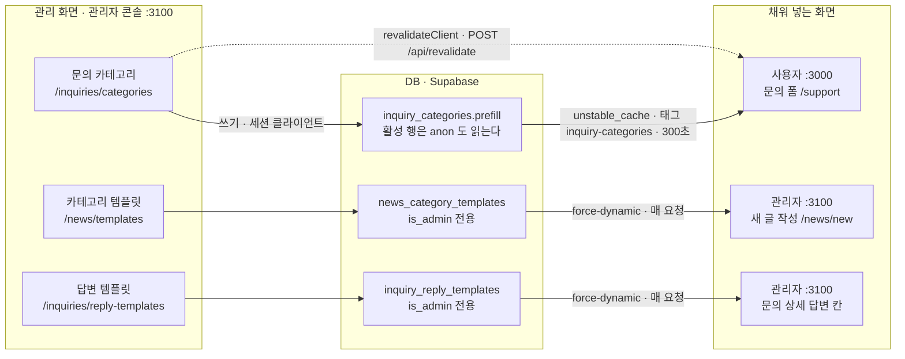
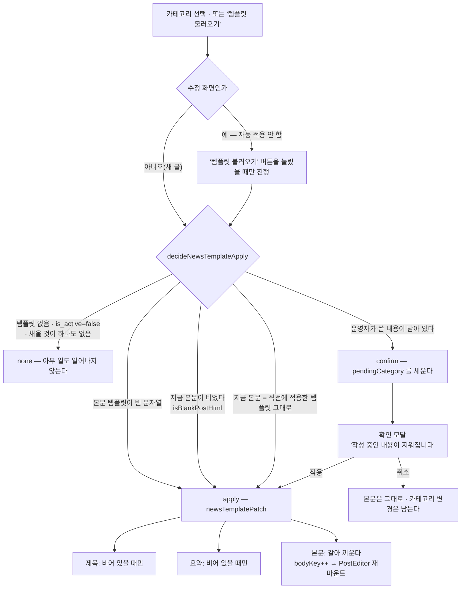
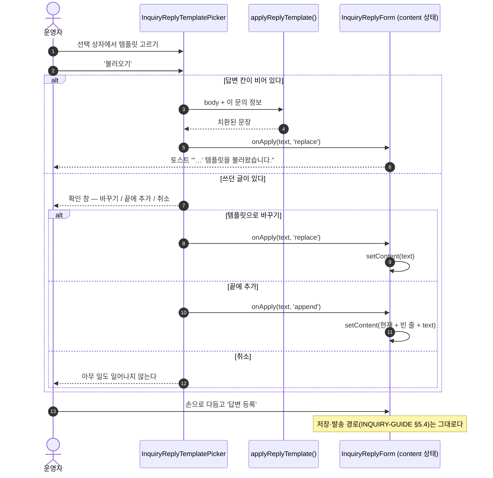

# 템플릿 관리 — 개발 가이드

최종 갱신 2026-09-11 · 기준 커밋 `e4937d4` · 설계 배경 `docs/admin/DEVELOPER-GUIDE.md` §3.4 · §5.4 · 1:1 문의 `docs/admin/INQUIRY-GUIDE.md` §5.5~§5.6

> 같은 내용의 단일 HTML 문서: `docs/admin/TEMPLATES-GUIDE.html` (다이어그램 포함)

글자월드에는 **"미리 적어 두고 나중에 채워 넣는 문안"이 세 갈래** 있습니다. 셋 다 "템플릿"이라 불리지만 **읽는 사람도, 사는 곳도, 무효화 경로도 다릅니다.** 문의 카테고리 프리필만 **사용자 사이트가 읽고**, 나머지 둘은 관리자 콘솔 안에서만 삽니다. 이 문서는 그 셋을 한자리에 놓고 무엇이 같고 무엇이 다른지, 새 카테고리가 생겼을 때 무엇을 함께 해야 하는지를 적습니다.

---

## 1. 개요 · 상태 보드

### 1.1 세 갈래 한눈에

| 갈래                 | 문의 카테고리 프리필                                   | 뉴스 카테고리 템플릿                                       | 1:1 문의 답변 템플릿                                  |
| -------------------- | ------------------------------------------------------ | ---------------------------------------------------------- | ----------------------------------------------------- |
| **채우는 화면**      | 사용자 사이트 문의 폼 `/support`                       | 관리자 새 글 작성 `/news/new`                              | 관리자 문의 상세의 답변 칸 `/inquiries/[id]`          |
| **읽는 사람**        | **방문자(anon 포함)**                                  | 관리자만                                                   | 관리자만                                              |
| **테이블**           | `inquiry_categories.prefill` (카테고리 행의 한 칸)     | `news_category_templates` (전용 테이블)                    | `inquiry_reply_templates` (전용 테이블)               |
| **개수**             | 카테고리당 **0 또는 1**(빈 문자열이면 없음)            | 카테고리당 **정확히 1행**(`unique (category_key)`)         | 카테고리당 **N개** + `category_id IS NULL` = **공통** |
| **RLS**              | `select` 를 **활성 행에 한해 anon 에게 연다**          | `is_admin()` 하나뿐 — anon 은 `select` 도 못 한다          | `is_admin()` 하나뿐 — anon 은 `select` 도 못 한다     |
| **무효화**           | 캐시 태그 `inquiry-categories` + `revalidateClient()`  | `revalidatePath` 3곳(목록 · 편집 · `/news/new`)만          | `revalidatePath` 1곳(목록)만                          |
| **자리표시자**       | 없음 — 사용자가 직접 쓰는 평문 양식                    | **치환하지 않는다** — `{{날짜}}` 는 운영자가 손으로 고친다 | **불러오는 순간 치환**(`{{닉네임}}` 등 4종)           |
| **본문 형식**        | 평문 (≤ 2000자)                                        | Tiptap HTML (≤ 20000자) + 뉴스와 같은 정제기               | 평문 (≤ 2000자 = 답변 상한)                           |
| **덮어쓰기 규칙**    | 카테고리를 바꾸면 **갈아 끼운다**                      | 제목·요약은 **빈 칸에만**, 본문은 갈아 끼운다              | 빈 칸이면 삽입, 아니면 **바꾸기 / 끝에 추가 / 취소**  |
| **권한**             | 관리자 쪽 `inquiries`                                  | `news` — 관리 화면은 **`write` 전용**                      | `inquiries`                                           |
| **들어간 날 · 커밋** | 2026-09-10 · `b78dfd7` (유형 블록 제거 `af1a886`)      | 2026-09-11 · `f3d14f0`                                     | 2026-09-11 · `e4937d4`                                |
| **마이그레이션**     | `20260910000400` · `20260910000500` · `20260910000800` | `20260911000100`                                           | `20260911000200`                                      |



### 1.2 상태

| 구성 요소                              | 상태                                                             |
| -------------------------------------- | ---------------------------------------------------------------- |
| 문의 카테고리 프리필                   | 배포됨 — 시드 8종, 사용자 폼에서 동작                            |
| 뉴스 카테고리 템플릿                   | 배포됨 — 시드 6종(카테고리 6종과 1:1)                            |
| 1:1 문의 답변 템플릿                   | 배포됨 — 시드 6종(공통 2 + 카테고리 4)                           |
| 마이그레이션 `20260911000100/200`      | 커밋에 포함 · **원격 반영은 `db push` 로 따로** (§6-1)           |
| 단위 테스트                            | 관리자 748개 / 51파일 통과 (2026-09-11)                          |
| E2E                                    | `news-templates.spec.ts` 3 · `inquiry-reply-templates.spec.ts` 3 |
| `DEVELOPER-GUIDE.md` 의 뉴스 템플릿 절 | **유실됨** — 커밋 `e4937d4` 가 되돌렸습니다 (§6-7)               |

### 1.3 세 갈래가 공유하는 규칙

- **상한은 목적지 필드와 같은 숫자다.** 템플릿이 더 관대하면 "불러왔는데 저장할 수 없는" 문안이 만들어집니다. 뉴스는 제목 100 · 요약 200(= `NEWS_TITLE_MAX` · `NEWS_SUMMARY_MAX`), 답변 템플릿은 본문 2000(= `INQUIRY_REPLY_MAX_LENGTH`), 문의 프리필은 2000(= 문의 내용 상한).
- **덮어쓰기 전에는 묻는다.** 세 갈래 모두 "사용자/운영자가 쓴 글이 남아 있는가"를 먼저 보고, 남아 있을 때만 확인 창을 세웁니다. 빈 칸이면 묻지 않습니다 — 잃을 것이 없습니다.
- **판정은 순수 함수로 떼어 둔다.** `lib/utils/inquiry-prefill.ts` · `admin/lib/utils/news-template-prefill.ts` · `admin/lib/utils/inquiry-reply-template.ts` 셋 다 컴포넌트 밖에 있고 단위 테스트가 고정합니다. **내용을 지울 수도 있는 결정**이라 폼이 바뀌어도 규칙이 흔들리면 안 됩니다.
- **시드는 `on conflict do nothing` / `where not exists` 다.** 운영자가 문안을 고친 뒤 마이그레이션을 다시 돌려도 원본으로 되돌아가지 않습니다. 되돌리기는 화면의 버튼으로만 일어납니다(뉴스 템플릿에만 있습니다).
- **쓰기는 세션 클라이언트로 한다.** 서비스 롤로 쓰면 RLS 정책이 건너뛰어져 권한 버그가 조용히 통과합니다(`DEVELOPER-GUIDE.md` §5.1).

---

## 2. 뉴스 카테고리 템플릿

출처: `supabase/migrations/20260911000100_news_category_templates.sql` · `scripts/gen-news-templates.mjs` · `admin/lib/constants/news-templates.ts` · `admin/lib/{validation,data,actions}/news-template*.ts` · `admin/lib/utils/news-template-prefill.ts` · `admin/components/news-templates/**` · `admin/components/news/{NewsForm.tsx,use-news-template-prefill.ts}` · `admin/app/(admin)/news/templates/**`

카테고리마다 "글을 어떻게 시작할 것인가"를 미리 적어 두는 양식입니다. 관리 화면은 `/news/templates`(뉴스 목록 헤더의 **카테고리 템플릿** 버튼 · 사이드바 뉴스 하위)이고, 권한은 뉴스와 같은 `news` 모듈이되 **`write` 전용**입니다 — 편집·되돌리기 말고는 아무것도 없는 화면이라 읽기 전용 관리자에게 열어 줄 이유가 없습니다(`admin/lib/nav.ts` 의 `level: 'write'`).

### 2.1 데이터 모델

| 열                 | 쓰임                                                                                             |
| ------------------ | ------------------------------------------------------------------------------------------------ |
| `board`            | 고정값 `'news'`(CHECK `board = 'news'`). **오직 복합 FK 를 걸기 위해 있는 칸**입니다             |
| `category_key`     | `board_categories(board='news')` 의 `key`. `unique (category_key)` 라 **카테고리당 한 행뿐**     |
| `title_template`   | 제목 칸 프리필 (≤ 100자 = `NEWS_TITLE_MAX`)                                                      |
| `summary_template` | 요약 칸 프리필 (≤ 200자 = `NEWS_SUMMARY_MAX`)                                                    |
| `body_template`    | 본문 프리필(Tiptap HTML · ≤ 20000자). 저장 전에 뉴스 본문과 **같은 정제기**를 통과합니다         |
| `is_active`        | 끄면 새 글 폼이 이 카테고리에서 **아무것도 채우지 않습니다**. 행과 문안은 그대로 남습니다        |
| `updated_by`       | 마지막으로 저장한 관리자(`on delete set null`). 누가 무엇을 바꿨는지는 감사 로그가 함께 남깁니다 |

**왜 `posts` 에 임시저장으로 두지 않는가.** 템플릿은 "글"이 아닙니다. `posts` 에 끼워 넣으면 목록·검색·통계가 전부 그것을 글로 세고, 실수로 발행될 수도 있습니다.

**왜 `board` 칸이 필요한가.** `board_categories` 의 키가 `(board, key)` 복합이라 `category_key` 한 칸만으로는 참조할 수 없습니다. 이 한 칸 덕분에 **없는 카테고리를 가리키는 템플릿이 생기지 않고**, 카테고리가 사라지면 템플릿도 함께 갑니다(`on update cascade on delete cascade`).

**상한이 글 필드와 같은 숫자인 것이 핵심입니다.** DB CHECK · zod(`admin/lib/validation/news-templates.ts`) · 화면의 `maxLength` 가 모두 같은 값을 봅니다. 본문만 별도 상한(20000)인데, `posts.content` 에는 길이 제약이 없지만 템플릿은 "채워 넣을 뼈대"라 한 편의 완성된 글보다 길 이유가 없기 때문입니다 — 그보다 긴 값은 붙여넣기 사고에 가깝습니다.

### 2.2 시드와 생성기 — 같은 문자열이 두 곳에 필요하다

같은 문안이 **두 파일**에 있어야 합니다.

1. 마이그레이션 시드 — 첫 배포 때 DB 에 들어가는 값 (`20260911000100_…sql`)
2. 코드 상수 — **'기본값으로 되돌리기'가 읽는 원본** (`admin/lib/constants/news-templates.ts`)

손으로 옮겨 적으면 언젠가 갈라지고, 그때부터 "기본값"은 화면마다 다른 것을 뜻하게 됩니다. 그래서 **한 생성기가 두 파일을 함께 뽑습니다**(`scripts/seed-legal.mjs` 와 같은 규격).

```bash
node scripts/gen-news-templates.mjs
# generated: admin/lib/constants/news-templates.ts · supabase/migrations/20260911000100_news_category_templates.sql
```

> 시드를 고칠 때는 `scripts/gen-news-templates.mjs` 의 `SEEDS` **만** 고치고 다시 돌립니다. 다만 **이미 적용된 마이그레이션을 다시 쓰는 것으로 운영 DB 가 바뀌지는 않습니다** — 배포된 DB 는 그 파일을 다시 읽지 않습니다. 문안을 운영에 반영하려면 새 마이그레이션을 쓰거나 화면에서 고칩니다.

시드 6종(카테고리 6종과 1:1):

| 카테고리 키   | 라벨          | 제목 템플릿                         |
| ------------- | ------------- | ----------------------------------- |
| `notice`      | 공지사항      | `[공지] {{제목}}`                   |
| `maintenance` | 점검안내      | `[점검] {{날짜}} 정기 점검 안내`    |
| `update`      | 업데이트 안내 | `[업데이트] {{날짜}} 업데이트 안내` |
| `patch`       | 패치노트      | `[패치노트] v{{버전}}`              |
| `event`       | 이벤트        | `[이벤트] {{이벤트명}}`             |
| `info`        | 안내사항      | `[안내] {{제목}}`                   |

**`{{날짜}}` 는 치환되지 않습니다.** 운영자가 그 자리를 직접 고쳐 쓰는 평범한 글자이고, DB·앱 어디에도 치환 코드가 없습니다. 자동 치환을 넣으면 "언제 무엇으로 바뀌는가"를 화면이 설명해야 합니다. 관리 화면과 편집 폼의 힌트가 그 사실을 적습니다 — "`{{날짜}}` 처럼 적어 둔 자리는 자동으로 바뀌지 않습니다".

### 2.3 관리 화면

`/news/templates` 는 **언제나 카테고리 6종을 모두** 보여 줍니다. DB 에 행이 없는 카테고리(시드 이후에 추가된 카테고리)는 코드 상수의 기본 템플릿으로 채워 그립니다(`listNewsTemplates()` 의 `fromSeed`, `id` 가 `null` 인 것이 그 표시입니다). 행이 없다고 카드가 사라지면 운영자는 **그 카테고리에 템플릿을 만들 입구를 잃습니다**.

한 줄이 답하는 질문은 셋입니다 — **켜져 있는가 · 어떤 제목으로 시작하는가 · 본문이 어떤 내용인가.** 본문은 HTML 이라 그대로 보여 줄 수 없어 `postHtmlText()` 로 평문을 뽑아 한 줄만 보여 줍니다. `기본값` / `수정됨` 뱃지는 지금 문안이 코드 시드와 **글자 단위로 같은가**로 판정합니다(`isSameAsSeed`).

| 화면 요소           | 동작                                                                                                                                             |
| ------------------- | ------------------------------------------------------------------------------------------------------------------------------------------------ |
| 편집 폼             | 본문은 뉴스 작성 화면과 **같은 `PostEditor`**. 다른 편집기를 쓰면 여기서 만든 서식이 글 화면에서 다르게 보이고 정제기가 지우는 태그도 달라집니다 |
| 저장                | 리다이렉트 없이 제자리. `upsert(onConflict: 'category_key')` 한 번이라 **저장된 적 없는 카테고리도 같은 경로로 첫 행이 생깁니다**                |
| 미리보기            | **저장된 값**을 사용자 사이트와 같은 타이포그래피(`PREVIEW_PROSE_CLASS`)로 그립니다. 편집 중인 내용은 반영되지 않습니다                          |
| 기본값으로 되돌리기 | 페이지 헤더(= 편집 폼 **밖**)에 있습니다. 되돌리기도 서버 액션 폼이라 안에 넣으면 폼이 중첩되고, 중첩된 `form` 은 브라우저가 무시합니다          |

**미리보기가 편집 중인 값을 따라 그리지 않는 이유** — 따라 그리면 "미리보기에는 있는데 저장된 적 없는" 문안이 생깁니다. 카드 설명에 그 사실을 적습니다("편집 중인 내용은 저장해야 반영됩니다").

#### 기본값 복원의 정확한 의미

- 되돌리는 것은 **문안 셋(제목 · 요약 · 본문)뿐**입니다. **활성 여부는 건드리지 않습니다** — "이 카테고리에서 템플릿을 쓸 것인가"는 별개의 결정이라, 문구를 되돌렸다고 꺼 둔 템플릿이 되살아나면 안 됩니다(`resetNewsTemplateAction` 의 `is_active: before?.is_active ?? true`).
- 원본은 **코드 상수**이고, 마이그레이션 시드와 같은 생성기에서 나온 같은 문자열이라 되돌린 결과가 첫 배포 상태와 정확히 같습니다.
- **이미 기본값인 템플릿에는 버튼을 그리지 않습니다.** 아무 일도 하지 않는 버튼은 운영자에게 "무언가 달라졌나"를 되묻게 만듭니다.
- 성공하면 **목록으로 돌아갑니다.** 편집 폼의 입력과 에디터는 비제어라 그 자리에 머물면 서버가 되돌린 문안 대신 화면에 남아 있던 옛 문안을 계속 보여 줍니다. 목록에는 그 카테고리가 '기본값'으로 찍히므로 무엇이 일어났는지가 화면에 남습니다.
- 이전 문안은 **감사 로그의 `before` 에만** 남습니다. 확인 다이얼로그가 그 사실을 적습니다 — "되돌리기"라는 단어만 보면 한 번 더 누르면 다시 돌아올 것처럼 읽힙니다.

### 2.4 프리필 상태 기계

판정은 `admin/lib/utils/news-template-prefill.ts`(순수 함수 · 테스트로 고정)가 쥐고, `components/news/use-news-template-prefill.ts` 는 그 결정을 폼 상태로 옮기기만 합니다.



- **제목·요약은 비어 있을 때만 채웁니다.** 직접 쓴 제목을 카테고리 변경이 덮으면, 운영자는 자기가 지우지 않은 문장이 사라지는 것을 봅니다.
- **직전에 적용한 템플릿 그대로면 묻지 않습니다.** 카테고리를 연달아 바꿔 보는 것은 흔한 동작이고, 그 본문은 운영자가 쓴 글이 아니라 직전 카테고리의 양식이라 잃을 것이 없습니다(`appliedBody` 비교).
- **취소해도 카테고리 변경은 남습니다.** 운영자가 바꾸려던 것은 글의 카테고리이고 템플릿은 그에 딸린 편의입니다 — 확인을 거절했다고 카테고리까지 되돌리면 방금 한 조작이 통째로 사라진 것처럼 보입니다. (문의 폼의 프리필은 **반대**입니다 — §4 참고.)
- **`isBlankPostHtml()` 은 미디어를 본문으로 셉니다.** 태그를 벗겨 글자가 없어도 `<img` 나 `data-video=` 가 있으면 "비어 있지 않다"입니다 — 텍스트만 세면 운영자가 붙여 넣은 이미지를 말없이 지웁니다.
- **수정 화면은 자동 적용하지 않습니다.** 발행된 글의 본문이 카테고리 한 번 바꿨다고 양식으로 덮이면 복구할 길이 없습니다. 대신 카테고리 셀렉트 옆에 **'템플릿 불러오기'** 버튼이 서고(그 카테고리에 쓸 수 있는 템플릿이 있을 때만), 같은 확인을 거쳐 적용합니다.

**본문을 상위 상태로 들고 있지 않습니다.** 에디터를 제어 컴포넌트로 만들면 한 글자마다 폼이 리렌더되고 ProseMirror 가 새 문서를 받아 **한글 조합이 끊깁니다**. 그래서 지금 본문은 판정이 필요한 순간에만 화면이 폼의 숨은 input 에서 읽어 넘기고(`readEditorBody()` — `ref` 가 아니라 이벤트의 `form` 을 탑니다), 갈아 끼울 때만 `bodyKey` 를 올려 에디터를 새 초기값으로 다시 마운트합니다.

### 2.5 정제기 · 권한 · 감사 · 무효화

- **본문은 뉴스 본문과 같은 정제기**(`admin/lib/sanitize/post-html.ts` → `sanitizePostHtml`)를 통과합니다. 템플릿이 더 관대하면 불러온 순간 화면에 보이던 서식이 글 저장에서 사라집니다. 허용 태그 밖의 입력만 보내 **정제 후 빈 문자열**이 되면 저장하지 않고 필드 오류를 돌려줍니다 — `저장할 수 있는 본문이 없습니다.` (그대로 저장하면 운영자는 "본문을 넣었는데 템플릿이 비어 있다"를 겪습니다.)
- **두 액션 모두 스스로 `requirePermission('news','write')` 을 부릅니다.** 레이아웃이 이미 막고 있어도 서버 액션은 UI 를 거치지 않는 직접 POST 로도 호출됩니다.

| `action`               | 대상                      | 남는 내용                          | 목록 표기                        |
| ---------------------- | ------------------------- | ---------------------------------- | -------------------------------- |
| `news_template.update` | `news_category_templates` | `before` / `after` 전체(문안 포함) | 뉴스 카테고리 템플릿 수정        |
| `news_template.reset`  | `news_category_templates` | `before` / `after` 전체(문안 포함) | 뉴스 카테고리 템플릿 기본값 복원 |

라벨은 `admin/components/audit/audit-labels.ts` 의 `DOMAIN_LABELS['news_template']` · `TABLE_LABELS['news_category_templates']` · `VERB_LABELS['reset']` 세 줄이 만듭니다. `reset` 을 `rollback`('되돌리기')과 **일부러 갈라 둔** 이유는 랭킹 스냅샷이 이미 `rollback` 을 쓰고 있어, 목록에서 두 조작이 같은 말로 보이면 무엇을 되돌렸는지 알 수 없기 때문입니다.

- **무효화는 관리자 화면 셋뿐입니다** — `/news/templates` · `/news/templates/[category]` · **`/news/new`**. 새 글 작성 화면을 함께 태우는 이유는 그 화면이 템플릿을 서버에서 받아 폼에 싣기 때문입니다.
- **사용자 사이트 캐시는 태우지 않습니다.** 템플릿은 글이 되기 전의 양식이고, 사용자 사이트는 RLS 때문에 이 테이블을 읽지도 못합니다. "남의 캐시를 이유 없이 비우지 않는다"는 `admin/lib/revalidate.ts` 머리말의 규칙을 그대로 따릅니다.

### 2.6 가장자리

| 상황                                       | 지금 동작                                                                                                                                                                                 |
| ------------------------------------------ | ----------------------------------------------------------------------------------------------------------------------------------------------------------------------------------------- |
| **행이 없는 카테고리**(시드 이후 추가)     | 목록·편집 화면은 **코드 기본값**을 그리고 `id` 는 `null`, '저장된 적 없음'으로 표기합니다. 저장하면 `upsert` 가 첫 행을 만듭니다                                                          |
| **`NEWS_CATEGORY_KEYS` 에 없는 라우트 값** | `/news/templates/[category]` 는 **404**. 빈 폼을 열어 주면 FK 가 막는 저장 실패를 운영자가 이유 없이 만납니다                                                                             |
| **꺼 둔 템플릿**                           | 새 글 폼이 그 카테고리에서 **아무것도 채우지 않습니다**(`decide… → 'none'`). 수정 화면의 '템플릿 불러오기' 버튼도 서지 않습니다                                                           |
| **목록 조회 실패**                         | 관리 화면은 **빈 목록 + 배너**입니다. 코드 기본값을 대신 그리면 운영자가 저장된 문안을 보고 있다고 믿고, 그 화면에서 고친 값이 남의 문안을 덮어씁니다                                     |
| **작성 폼용 조회 실패**                    | `listNewsTemplateOptions()` 가 **빈 배열**을 돌려줍니다 — 카테고리를 골라도 아무 일도 일어나지 않습니다. 코드 기본값으로 대신 채우면 운영자가 꺼 둔 템플릿이 **장애 중에만 되살아납니다** |

---

## 3. 1:1 문의 답변 템플릿

출처: `supabase/migrations/20260911000200_inquiry_reply_templates.sql` · `admin/lib/{validation,data,actions}/inquiry-reply-template*.ts` · `admin/lib/utils/inquiry-reply-template.ts` · `admin/components/inquiry-reply-templates/**` · `admin/components/inquiries/{InquiryReplyTemplatePicker,InquiryReplyForm}.tsx` · `admin/app/(admin)/inquiries/reply-templates/**`

답변에 쓰는 상용구입니다. 관리 화면은 `/inquiries/reply-templates`(문의 카테고리 화면 헤더의 **답변 템플릿** · 사이드바 고객지원 하위), 권한은 문의와 같은 `inquiries` 모듈입니다.

### 3.1 데이터 모델

| 열                          | 쓰임                                                                                                                         |
| --------------------------- | ---------------------------------------------------------------------------------------------------------------------------- |
| `category_id`               | 붙는 카테고리. **NULL 이면 공통**(모든 문의에서 보입니다). `on delete cascade` — 카테고리를 지우면 전용 템플릿도 함께 갑니다 |
| `name`                      | 선택 상자에 보이는 이름(1~40자). 같은 묶음 안에서 중복 불가                                                                  |
| `body`                      | 답변 칸에 채워지는 평문(1~2000자 = `INQUIRY_REPLY_MAX_LENGTH`)                                                               |
| `sort_order`                | 묶음 안에서의 순서. 새 항목은 그 묶음의 **맨 뒤**                                                                            |
| `is_active`                 | 끄면 답변 화면의 선택 상자에서 사라집니다. 행과 문안은 그대로 남습니다                                                       |
| `created_by` · `updated_by` | 만든 사람 · 마지막으로 고친 사람(`on delete set null`)                                                                       |

**왜 `inquiry_categories` 에 칸을 더하지 않는가.** 카테고리 하나에 템플릿은 여러 개입니다('접수 확인' · '추가 정보 요청' …). 배열 칸으로 넣으면 정렬·활성·작성자를 항목마다 들고 있을 수 없고, 한 항목을 고치려고 배열 전체를 다시 써야 합니다.

**`category_id IS NULL` 이 공통입니다.** 별도 플래그(`is_common`)를 두면 "NULL 인데 `is_common` 이 false" 같은 모순 상태가 생깁니다. NULL 하나로 규칙이 닫힙니다.

**이름 중복은 고정 UUID 로 접어 막습니다.**

```sql
create unique index inquiry_reply_templates_name_key
  on public.inquiry_reply_templates
     (coalesce(category_id, '00000000-0000-0000-0000-000000000000'::uuid), name);
```

NULL 은 서로 다른 값으로 취급되므로 그냥 `unique (category_id, name)` 으로는 공통 묶음의 중복을 막지 못합니다. 부분 인덱스 둘로 나누면 "공통 vs 카테고리" 규칙이 두 곳에 흩어집니다. 위반은 `23505` → **필드 오류**로 옮깁니다 — `같은 카테고리에 같은 이름의 템플릿이 있습니다.`

**본문 상한이 답변 입력칸과 같은 2000자인 이유는 하나입니다** — 불러온 문안이 그대로 답변으로 저장됩니다. 여기가 더 관대하면 "불러왔는데 등록할 수 없는" 템플릿이 만들어집니다.

**RLS 는 `is_admin()` 하나뿐**이고 anon·일반 로그인 사용자에게는 `select` 도 열지 않습니다 — 상용구에는 아직 공지되지 않은 점검 일정이나 보상 기준이 적히고, 그것이 사용자에게 먼저 보이면 안 됩니다. Supabase 의 기본 권한은 마이그레이션으로 만든 테이블에 자동으로 붙지 않으므로 `grant` 를 함께 적습니다(빠뜨리면 정책이 통과해도 `42501` 이 납니다 — `20260910000400` 에서 겪은 일).

### 3.2 시드 6종

`where not exists` 로 넣고, 카테고리는 **`key` 로** 찾습니다 — 라벨은 운영자가 바꿀 수 있고 바뀐 뒤에도 같은 행을 가리켜야 합니다. 해당 `key` 가 없으면 그 시드는 조용히 건너뜁니다.

| 묶음                      | 이름                     |
| ------------------------- | ------------------------ |
| 공통 (`category_id` NULL) | 접수 확인 안내           |
| 공통                      | 추가 정보 요청           |
| `connection` 접속·서버    | 서버 점검 안내           |
| `save-data` 저장·데이터   | 데이터 확인 후 복구 안내 |
| `currency` 재화·아이템    | 아이템 지급 처리 완료    |
| `etc` 기타·건의           | 건의 접수 감사           |

### 3.3 자리표시자

치환은 `admin/lib/utils/inquiry-reply-template.ts` 의 순수 함수가 합니다. 관리 화면의 미리보기(클라이언트)와 문의 상세의 '템플릿 불러오기'가 **같은 코드**로 같은 결과를 내야 합니다 — 두 곳에 따로 쓰면 미리보기에서 본 문장과 실제로 삽입되는 문장이 갈립니다.

| 자리표시자     | 값                                                        | 값이 비면 |
| -------------- | --------------------------------------------------------- | --------- |
| `{{닉네임}}`   | 문의한 회원의 닉네임(이메일 문의는 발신자 이름)           | `고객`    |
| `{{문의번호}}` | 문의 ID **앞 8자리(대문자)** — 사용자가 대조하는 접수번호 | `-`       |
| `{{카테고리}}` | `inquiries.category`(라벨 문자열)                         | `문의`    |
| `{{제목}}`     | 문의 제목                                                 | `문의`    |

- **치환은 불러오는 순간 한 번**입니다. 저장되는 답변에 `{{…}}` 가 남으면 **사용자 화면에 그대로 노출됩니다.**
- **모르는 이름은 그대로 둡니다.** `{{점검일}}` 처럼 우리가 모르는 표시는 운영자가 손으로 채우려고 적어 둔 것일 수 있고, 조용히 지우면 **빈칸인 채로 발송됩니다.**
- 패턴은 `/\{\{\s*([^{}]+?)\s*\}\}/g` 입니다 — `{{ 닉네임 }}` 처럼 공백을 넣어도 잡히고, 같은 표시가 여러 번 나와도 모두 바뀝니다.
- **UUID 36자를 그대로 적지 않는 이유** — 사용자가 옮겨 적지 못하고 답변 문장도 읽히지 않습니다. 앞 8자리는 관리자 목록에서 문의를 찾기에 충분하고(주소창의 id 앞부분과 같습니다), 공개돼도 다른 문의를 추측할 수 있는 값이 아닙니다.

### 3.4 관리 화면

목록은 **묶음별 카드**이고 **공통이 언제나 맨 위**입니다 — 어느 문의에서나 보이는 문안이라 운영자가 가장 먼저 확인해야 합니다. 템플릿이 하나도 없는 카테고리도 자리를 남깁니다(어디에 넣는지가 보여야 합니다). 카테고리가 꺼져 있으면 머리글에 `숨긴 카테고리` 뱃지가 붙어 "왜 답변 화면에 안 보이나"를 설명합니다.

| 동작      | 규칙                                                                                                                                                                 | 감사 로그                                       |
| --------- | -------------------------------------------------------------------------------------------------------------------------------------------------------------------- | ----------------------------------------------- |
| 등록      | 그 묶음의 **맨 뒤**(`getNextInquiryReplyTemplateSortOrder`). 중간에 끼우면 기존 순서가 통째로 밀립니다                                                               | `inquiry_reply_template.create`                 |
| 수정      | **카테고리를 옮기면 순서 값을 옮겨 간 묶음의 맨 뒤로 다시 잡습니다.** 그대로 두면 새 묶음에서 같은 순번이 겹쳐 화면 순서가 만든 사람도 모르게 갈립니다               | `inquiry_reply_template.update`                 |
| 삭제      | **건수로 막지 않습니다.** 템플릿은 답변을 만들 때 **복사**되는 문안이라 지워도 이미 등록된 답변은 그대로 남습니다(카테고리와 다른 점)                                | `inquiry_reply_template.delete`                 |
| 활성 토글 | 끄면 답변 화면의 선택 상자에서 즉시 사라집니다                                                                                                                       | `inquiry_reply_template.update`                 |
| 순서      | ▲▼ + '순서 저장' — **묶음마다 따로** 있습니다. 화면 순서를 그대로 `0..n-1` 로 다시 씁니다. 행마다 UPDATE 라 **일부만 반영될 수 있고** 실패 문구가 그 사실을 적습니다 | `inquiry_reply_template.reorder`(`after {ids}`) |

- **순서 저장 버튼이 묶음마다 있는 이유** — 순서는 묶음 안에서만 의미가 있습니다(선택 상자가 공통 → 카테고리 순으로 묶어 보여 줍니다). 한 화면에 저장 버튼이 하나면 어느 묶음을 저장하는지 알 수 없습니다. 항목이 하나뿐인 묶음에는 아예 그리지 않습니다.
- **화면 상태로 들고 있는 것은 순서(id 나열)뿐**입니다. 항목의 내용·사용 여부는 매번 서버가 준 배열에서 읽습니다 — 항목 자체를 상태로 복사하면 토글·수정 뒤 화면이 옛 값을 계속 그립니다.
- **자리표시자 버튼은 커서 자리에 끼워 넣습니다.** 끝에만 붙이면 문장 중간에 넣으려는 운영자가 매번 잘라내기·붙여넣기를 해야 합니다. 값이 바뀐 뒤 `requestAnimationFrame` 으로 커서를 되돌립니다 — 그러지 않으면 포커스가 버튼에 남아 다음 글자가 엉뚱한 곳에 찍힙니다. textarea 요소는 `ref` 가 아니라 이벤트의 `currentTarget` 에서 붙잡습니다(공용 `Textarea` 가 글자수 측정에 자기 `ref` 를 쓰므로 바깥에서 걸 자리가 없습니다).
- **미리보기는 치환된 뒤의 문장**입니다. 자리표시자를 그대로 그리면 운영자는 "`{{닉네임}}` 이 정말 이름으로 바뀌나"를 저장하고 문의를 열어 봐야 확인할 수 있습니다. 예시 문의(`SAMPLE_INQUIRY` — 글자용사 / 재화·아이템)로 채우는 이유는 템플릿이 특정 문의에 매이지 않기 때문입니다.
- **비활성 카테고리도 셀렉트에 남깁니다** — 이미 그 카테고리에 붙어 있는 템플릿을 고치려면 목록에 그 항목이 있어야 하고, 없으면 저장할 때 엉뚱한 곳으로 옮겨집니다. 라벨 뒤에 `(숨김)` 을 붙입니다.

### 3.5 답변 화면의 '템플릿 불러오기'

선택지는 **공통 + 그 문의의 카테고리**, **사용 중인 것만**입니다. 카테고리는 **라벨로** 찾습니다(`inquiries.category` 는 FK 가 아니라 라벨 문자열의 사본입니다 — `INQUIRY-GUIDE.md` §1.2). 등록된 카테고리가 없는 옛 라벨('계정' 등)이나 이메일 문의(`category='email'`)면 **공통만** 남고, 그 경우에도 불러오기를 감추지 않습니다. 쓸 수 있는 템플릿이 하나도 없으면 관리 화면으로 가는 링크 한 줄을 대신 그립니다.



- **'끝에 추가' 는 빈 줄 하나를 사이에 둡니다.** 두 문안이 한 문단으로 붙으면 사용자가 읽을 때 어디서 이야기가 바뀌는지 알 수 없습니다. 여러 문안을 겹쳐 쓰는 답변이 흔해서 이 선택지를 둡니다.
- **웹 문의와 이메일 문의가 같은 컨트롤을 씁니다.** 둘 다 같은 답변 칸(`InquiryReplyForm`)을 쓰므로 불러오기도 하나입니다. 문의 상세는 답변 폼을 그리지 않는 경우(읽기 전용 · 취소 · 종료)에도 템플릿을 함께 읽습니다 — 한 번의 왕복이고, 조건을 나누면 "답변 폼이 보이는데 선택지는 비어 있는" 경로가 생깁니다.
- **답변 액션은 그대로입니다.** 템플릿은 입력칸을 채울 뿐이고 저장·발송 경로는 손대지 않았습니다. 다만 답변 textarea 가 이 기능 때문에 **제어 입력**이 되었습니다 — 비제어 textarea 에 DOM 으로 값을 밀어 넣으면 React 가 그 사실을 모르고 **글자수 표시가 옛 숫자에 멈춥니다.** 그래서 답변 등록에 성공하면 `setContent('')` 로 본문을 직접 비우고, `form.reset()` 은 명의 체크박스·상태 셀렉트를 되돌리는 몫만 합니다.

### 3.6 권한 · 감사 로그

모든 액션이 스스로 `requirePermission('inquiries','write')` 을 부릅니다(목록 화면만 `read`). 쓰기는 세션 클라이언트로만 해서 `inquiry_reply_templates_admin_all` 정책이 다시 검사하게 둡니다.

| `action`                         | 남는 내용                                                 | 목록 표기             |
| -------------------------------- | --------------------------------------------------------- | --------------------- |
| `inquiry_reply_template.create`  | `after` 전체(문안 포함)                                   | 답변 템플릿 등록      |
| `inquiry_reply_template.update`  | `before` / `after` 전체 (토글은 `is_active` 만)           | 답변 템플릿 수정      |
| `inquiry_reply_template.delete`  | `before` 전체                                             | 답변 템플릿 삭제      |
| `inquiry_reply_template.reorder` | `after {ids}` — 대상이 여러 행이라 `targetId` 는 비웁니다 | 답변 템플릿 순서 변경 |

라벨은 `DOMAIN_LABELS['inquiry_reply_template']` → '답변 템플릿' 과 `TABLE_LABELS['inquiry_reply_templates']` 두 줄이 만듭니다.

**무효화할 곳은 목록 화면 하나뿐**입니다(`revalidatePath('/inquiries/reply-templates')`). 문의 상세는 `force-dynamic` 이라 요청마다 다시 읽고, 사용자 사이트는 이 테이블을 보지 않으므로 `revalidateClient()` 를 부르지 않습니다 — **태울 태그가 없습니다.**

---

## 4. 문의 카테고리 프리필과의 관계

자세한 것은 `docs/admin/INQUIRY-GUIDE.md` §2.3(프리필 — 갈아 끼우기와 확인 모달) · §4.3(`inquiry_categories`) · §4.7(캐시 태그와 반영 경로) · §5.5(카테고리 관리)에 있습니다. 여기서는 **템플릿 셋이 서로 무엇을 공유하고 어디서 갈라지는지**만 적습니다.

### 4.1 프리필과 답변 템플릿은 같은 카테고리 행을 본다

`inquiry_categories` 한 행이 **셋**을 들고 있습니다.

1. `prefill` — 사용자가 "문의 내용" 칸에 받아 보는 양식 (≤ 2000자)
2. `subtypes[]` — 그 카테고리에 매달린 세부 문의 유형 목록 (20개 · 각 30자)
3. (외래키로) `inquiry_reply_templates.category_id` — 운영자가 답변에 불러다 쓰는 상용구 N개

**`subtypes` 는 셀렉트, `prefill` 은 본문입니다.** 마이그레이션 `20260910000800` 이 프리필 본문에서 "세부 문의 유형" 블록만 정규식으로 도려낸 이유가 이것입니다 — 셀렉트가 이미 같은 것을 묻는데 본문에도 적어 두면 사용자가 두 번 고르고, 어긋난 문의(셀렉트는 '강제 종료', 본문은 '로그인/접속 불가')가 들어옵니다. **프리필을 손볼 때 유형 목록을 본문에 다시 넣지 마세요.**

### 4.2 개명은 두 방향으로 번진다

카테고리 라벨을 바꾸면 `update_inquiry_category()` RPC 가 한 트랜잭션 안에서 **그 라벨로 접수된 과거 문의를 함께 옮깁니다**(`inquiries.category` 는 FK 가 아니라 라벨 문자열의 사본입니다). 답변 템플릿은 **`category_id` 로 붙어 있어 개명의 영향을 받지 않습니다** — 라벨이 바뀌어도 같은 행을 계속 가리킵니다.

그런데 답변 화면의 선택지는 **라벨로** 찾습니다(`getInquiryReplyTemplateOptions(categoryLabel)`). 개명과 재라벨링이 같은 트랜잭션에서 끝나므로 실무상 어긋나지 않지만, **재라벨링이 닿지 않는 문의**(과거 라벨이 남아 있는 옛 데이터)에서는 그 카테고리 전용 템플릿이 보이지 않고 **공통만** 남습니다. 의도된 동작입니다 — 없는 분류의 상용구를 억지로 끌어오는 것보다 낫습니다.

카테고리를 **삭제**하면(접수 0건일 때만 됩니다) `on delete cascade` 로 그 카테고리 전용 템플릿도 함께 사라집니다. 남겨 두면 어느 문의에서도 보이지 않는 문안이 목록에만 쌓입니다. **공통 템플릿은 카테고리를 가리키지 않으므로 영향받지 않습니다.**

### 4.3 무효화 경로가 다른 이유

프리필만 사용자 사이트가 읽습니다. 그래서 프리필만 **두 프로세스를 건너야** 합니다 — 관리자가 저장하면 `revalidateClient()` 가 사용자 사이트의 `POST /api/revalidate` 를 두드려 `inquiry-categories` 태그(`unstable_cache` · 300초)를 태웁니다. 관리자는 다른 프로세스라 `revalidateTag()` 가 닿지 않기 때문입니다.

뉴스 템플릿과 답변 템플릿은 **관리자 콘솔 안에서만 살기 때문에** 이 왕복이 필요 없습니다. 두 관리 화면과 이들을 소비하는 화면(`/news/new` · `/inquiries/[id]`)이 모두 `force-dynamic` 이라 요청마다 다시 읽습니다. **이들을 위해 클라이언트 캐시 태그를 새로 만들지 마세요** — 태울 것이 없습니다.

### 4.4 취소했을 때의 차이

같은 "확인 모달"인데 **취소 뒤의 결과가 다릅니다.**

| 갈래                 | 확인 모달에서 '취소'를 누르면                                                                                             |
| -------------------- | ------------------------------------------------------------------------------------------------------------------------- |
| 문의 폼 프리필       | **카테고리 선택도 되돌아갑니다.** 셀렉트·textarea 가 제어 입력이라, 화면의 카테고리와 내용이 어긋난 채 제출되면 안 됩니다 |
| 뉴스 카테고리 템플릿 | **카테고리 변경은 남습니다.** 바꾸려던 것은 글의 카테고리이고 템플릿은 그에 딸린 편의입니다                               |
| 답변 템플릿          | 아무 일도 일어나지 않습니다(선택 상자의 선택만 남습니다)                                                                  |

문의 폼은 **사용자**가 쓰는 화면이라 "내가 고른 적 없는 분류로 접수되는" 사고를 막는 쪽이 비싸고, 뉴스 폼은 **운영자**가 쓰는 화면이라 "방금 한 조작이 통째로 사라지는" 쪽이 더 나쁩니다.

---

## 5. 테스트 · 검증

### 5.1 단위 테스트

2026-09-11 실행 결과: **관리자 748개(51파일) 통과** (`pnpm --filter @maple/admin test`). 이 문서가 다루는 파일만 추리면 다음과 같습니다.

| 파일                                                           | 건수 | 무엇을 고정하나                                                                                                                                         |
| -------------------------------------------------------------- | ---- | ------------------------------------------------------------------------------------------------------------------------------------------------------- |
| `admin/tests/unit/news-template-actions.test.ts`               | 15   | 권한 가드 · 정제기 통과 · "저장할 수 있는 본문이 없습니다" · upsert 인자 · 되돌리기가 `is_active` 를 건드리지 않는지 · 감사 로그 · `revalidatePath` 3곳 |
| `admin/tests/unit/news-templates-validation.test.ts`           | 15   | 제목/요약/본문 상한(= 글 필드와 같은 숫자) · 경계값 · CRLF · `parseNewsTemplateCategory` 의 좁히기                                                      |
| `admin/tests/unit/news-template-prefill.test.ts`               | 14   | `isBlankPostHtml`(미디어 전용 본문 포함) · `decideNewsTemplateApply` 6경로 · `newsTemplatePatch` 의 빈 칸 규칙 · `findNewsTemplate`                     |
| `admin/tests/unit/inquiry-reply-template-actions.test.ts`      | 13   | 권한 가드 5종 · 공통=NULL 저장 · 23505/23503 문구 · 카테고리 이동 시 순서 재배치 · 감사 로그 · 부분 반영                                                |
| `admin/tests/unit/inquiry-reply-templates-validation.test.ts`  | 10   | 이름/본문 상한(= 답변 상한) · 경계값 · CRLF · 공통(빈 값) vs uuid · 정렬 입력                                                                           |
| `admin/tests/unit/inquiry-reply-template-placeholders.test.ts` | 9    | 자리표시자 4종 치환 · 반복·공백 허용 · 모르는 표시 보존 · 빈 값 폴백 · 접수번호                                                                         |
| `admin/tests/unit/inquiry-reply-template-picker.test.tsx`      | 7    | 빈 칸이면 바로 삽입 · 쓰던 글이 있으면 확인 창 · 끝에 추가 · 취소 · 선택 전 버튼 잠금                                                                   |
| `admin/tests/unit/nav.test.ts`                                 | 27   | 새 메뉴 둘이 모듈·권한 규칙을 지키는지(`/news/templates` 는 `write` 전용)                                                                               |

```bash
# 전체 (관리자)
pnpm --filter @maple/admin test

# 이 문서의 범위만
cd admin && pnpm test -- tests/unit/news-template tests/unit/inquiry-reply-template
```

### 5.2 E2E

| 파일                                              | 건수 | 시나리오                                                                                                                                                                                    |
| ------------------------------------------------- | ---- | ------------------------------------------------------------------------------------------------------------------------------------------------------------------------------------------- |
| `admin/tests/e2e/news-templates.spec.ts`          | 3    | 고친 템플릿이 새 글 폼을 채우고 **쓰던 내용이 있으면 확인을 받는다**(취소 → 유지 · 적용 → 갈아 끼움) / **기본값으로 되돌리면 시드 문안이 돌아온다** / 꺼 둔 템플릿은 아무것도 채우지 않는다 |
| `admin/tests/e2e/inquiry-reply-templates.spec.ts` | 3    | 카테고리 화면 → 템플릿 등록(치환 미리보기) / 답변에 불러오기 — 끝에 추가 · 바꾸기 확인 · **저장된 답변에 치환된 닉네임** / 삭제 후 선택지에서 사라짐                                        |

```bash
# 관리자 3100 자동 기동 (사용자 사이트 3000 이 먼저 떠 있어야 합니다)
cd admin && pnpm test:e2e -- tests/e2e/news-templates.spec.ts tests/e2e/inquiry-reply-templates.spec.ts
```

- **둘 다 `test.describe.configure({ mode: 'serial' })`** 입니다. 한 줄기(등록 → 사용 → 되돌리기/삭제)라 앞 단계가 실패하면 뒤를 돌릴 이유가 없습니다. 관리자 `playwright.config.ts` 도 `workers: 1` · `fullyParallel: false` 입니다.
- **자격 증명은 저장소에 두지 않습니다.** `ADMIN_E2E_SECRETS`(기본값은 스크래치패드의 `admin-bootstrap.env`)를 실행 중에만 읽고, 서비스 롤은 `.env.local` 에서 읽어 픽스처·검증에만 씁니다(`tests/e2e/inquiry-faq-helpers.ts` — 파일 이름은 고객지원이지만 로그인·서비스 클라이언트는 모듈과 무관한 공용입니다).
- **관리자 셸은 `max-w-[1440px]` 기준**이라 스펙이 뷰포트를 넓혀 찍습니다. 스크린샷은 `NEWS_TEMPLATE_SHOTS` · `INQUIRY_REPLY_TEMPLATE_SHOTS` 로 바꿀 수 있고 기본값은 스크래치패드입니다.

#### 뒷정리

| 스펙                              | `afterAll` 이 하는 일                                                                                                                                                                           |
| --------------------------------- | ----------------------------------------------------------------------------------------------------------------------------------------------------------------------------------------------- |
| `news-templates.spec.ts`          | `title_template` 에 `[E2E]` 가 남은 행을 **삭제**(행이 없으면 화면이 코드 시드로 떨어지므로 결과적으로 기본값) · `info` 카테고리의 `is_active` 를 `true` 로 되돌림 · `[E2E]%` 뉴스 글 물리 삭제 |
| `inquiry-reply-templates.spec.ts` | 이름이 `E2E%` 인 템플릿 삭제 · 픽스처 문의 1건 삭제 · 픽스처 사용자 삭제. **시드 템플릿은 건드리지 않습니다**(운영 문안입니다)                                                                  |

`is_active` 를 되돌리는 것이 특히 중요합니다 — 중간에 실패하면 그 카테고리의 템플릿이 꺼진 채 남아, 다음 사람이 **이유 없이 프리필이 안 되는 화면**을 만납니다.

### 5.3 손으로 확인할 때

- 시드가 들어갔는지: `select category_key, is_active from news_category_templates order by 1;` / `select coalesce(c.label,'(공통)') , t.name, t.sort_order, t.is_active from inquiry_reply_templates t left join inquiry_categories c on c.id = t.category_id order by 1, 3;`
- 생성기 동기화: `node scripts/gen-news-templates.mjs` 뒤 `git diff --exit-code admin/lib/constants/news-templates.ts supabase/migrations/20260911000100_news_category_templates.sql` 가 깨끗해야 합니다.

---

## 6. 운영 체크리스트 · 주의사항

1. **마이그레이션 둘은 순서대로, 그리고 `--include-all` 로 밉니다.** `20260911000100`(뉴스) → `20260911000200`(답변 템플릿). 답변 템플릿 시드가 `inquiry_categories` 를 `key` 로 조회하므로 **카테고리 마이그레이션(`20260910000400`)이 먼저 적용돼 있어야** 시드가 들어갑니다. 원격에 더 늦은 타임스탬프의 마이그레이션이 이미 있으면 `supabase db push` 가 중간 파일을 건너뛰므로, 밀린 파일이 있을 때는 `pnpm dlx supabase db push --dry-run` 으로 먼저 확인하고 `--include-all` 을 붙여 미세요. 적용 뒤 `pnpm gen:types` 로 두 앱의 타입을 다시 뽑습니다.
2. **시드는 한 번만 들어갑니다.** 뉴스는 `on conflict (category_key) do nothing`, 답변 템플릿은 `where not exists (… name = … and category_id is not distinct from …)`. **운영자가 고친 문안은 마이그레이션을 다시 돌려도 덮이지 않습니다.** 뒤집어 말하면, 시드 문안을 바꿔 배포해도 **이미 배포된 환경에는 반영되지 않습니다** — 새 마이그레이션을 쓰거나 화면에서 고칩니다.
3. **뉴스 템플릿 시드를 고칠 때는 생성기만 고칩니다.** `scripts/gen-news-templates.mjs` 의 `SEEDS` → `node scripts/gen-news-templates.mjs`. 상수 파일이나 SQL 을 손으로 고치면 '기본값으로 되돌리기'가 마이그레이션과 다른 문안을 심고, 그때부터 "기본값"은 화면마다 다른 것을 뜻하게 됩니다.
4. **문구는 '카테고리' 로 통일합니다(2026-09-11 운영 요청).** 코드·주석에서 쓰던 **'말머리'는 관리자 화면에 쓰지 않습니다** — 같은 것을 두 이름으로 부르면 운영자가 다른 기능으로 읽습니다(뉴스 목록 필터·표 머리글이 이미 '카테고리' 입니다). 새 문구를 쓸 때 `grep -rn 말머리 admin/` 로 한 번 확인하세요.
5. **상한은 짝으로 움직입니다.** 뉴스 제목 100 · 요약 200 을 바꾸려면 `admin/lib/constants/news.ts` 의 `NEWS_TITLE_MAX`/`NEWS_SUMMARY_MAX`, `news_category_templates` 의 CHECK, `posts` 쪽 검증이 **함께** 가야 합니다. 답변 템플릿 본문 2000 은 `INQUIRY_REPLY_MAX_LENGTH` 와 `inquiry_reply_templates_body_length` CHECK 가 짝입니다. **템플릿 쪽만 늘리면 "불러왔는데 저장할 수 없는" 문안이 생깁니다.**
6. **이 두 테이블에는 클라이언트 캐시 태그를 만들지 마세요.** 사용자 사이트는 RLS 때문에 읽지도 못합니다. 관리 화면은 `force-dynamic` 이고, 쓰기 액션은 `revalidatePath` 로 관리자 화면만 비웁니다(`revalidateClient()` 를 부르면 이유 없이 남의 캐시를 태웁니다).
7. **`DEVELOPER-GUIDE.md` 의 뉴스 템플릿 절이 유실돼 있습니다.** 커밋 `f3d14f0` 이 §5.4 에 넣은 "뉴스 카테고리 템플릿(2026-09-11)" 블록과 §6 감사 표의 `news_template.update`·`news_template.reset` 이, 뒤이은 커밋 `e4937d4` 의 문서 편집(오래된 사본 기준)에서 함께 사라졌습니다. §3.4 의 라우트 표는 남아 있습니다. **다음에 그 문서를 손댈 때 되살려 주세요** — 원문은 `git show f3d14f0 -- docs/admin/DEVELOPER-GUIDE.md` 에 있고, 같은 내용은 이 문서 §2 에 있습니다.
8. **HTML 가이드는 손으로 고치지 않습니다.** `DEVELOPER-GUIDE.html` 은 아직 두 템플릿 기능을 담고 있지 않습니다(`INQUIRY-GUIDE.html` 은 2026-09-11 에 §5.6 을 포함해 재생성했습니다). 원본은 항상 같은 이름의 `.md` 이고, HTML 은 그것을 옮긴 결과입니다.
9. **뉴스 카테고리를 7번째로 추가할 때** — 순서대로 다음 다섯입니다.
   1. `board_categories(board='news')` 에 행을 넣는 마이그레이션(`20260908001600_news_categories` 와 같은 규격).
   2. `admin/lib/constants/news.ts` 의 `NEWS_CATEGORY_KEYS` · `CATEGORY_LABEL` · `CATEGORY_TONE` 에 한 줄씩. **톤은 리터럴 매핑이어야 합니다** — Tailwind 는 소스를 정적으로 훑으므로 조립한 클래스는 생성되지 않습니다.
   3. `scripts/gen-news-templates.mjs` 의 `SEEDS` 에 항목을 넣고 **생성기를 돌려** 상수와 시드를 다시 뽑습니다. 새 시드는 **새 마이그레이션**으로 밀어야 이미 배포된 환경에 들어갑니다(§6-2).
   4. 사용자 사이트 배너(`public/images/news/banners/<key>.*`)와 `admin/components/news/NewsPreview.tsx` 의 `KNOWN_BANNERS`. 빠뜨리면 공지사항 배너로 떨어집니다.
   5. 확인 — `/news/templates` 에 **7줄**이 뜨고(행이 없어도 코드 기본값으로 그려집니다), 편집·저장하면 `upsert` 가 첫 행을 만들고, `/news/new` 에서 그 카테고리를 골랐을 때 폼이 채워지는지. `admin/tests/unit/nav.test.ts` 와 뉴스 검증 테스트도 함께 돌립니다.
10. **문의 카테고리를 추가할 때는 답변 템플릿이 따라오지 않습니다.** `/inquiries/reply-templates` 에 그 카테고리 묶음이 **빈 카드**로 서고, 그 분류의 문의에서는 **공통 템플릿만** 보입니다(카드 안내 문구가 그 사실을 적습니다). 필요하면 '템플릿 추가'로 넣으세요 — 시드는 마이그레이션에만 있고 새 카테고리를 자동으로 채우지 않습니다.
11. **순서 저장은 부분 반영될 수 있습니다.** 답변 템플릿의 정렬은 행마다 UPDATE 를 던지므로 중간에 실패하면 앞쪽 몇 건은 이미 저장돼 있습니다. 실패 문구가 그 사실과 "새로고침해 순서를 확인"을 함께 적습니다.
12. **새 감사 영역을 만들면 라벨을 함께 넣으세요.** `DOMAIN_LABELS` · `TABLE_LABELS`(필요하면 `VERB_LABELS`). 빠뜨리면 감사 로그 목록에 **영문 원문**이 그대로 남습니다.

---

## 7. 파일 인덱스

### DB · 스크립트

| 경로                                                                   | 역할                                                     |
| ---------------------------------------------------------------------- | -------------------------------------------------------- |
| `supabase/migrations/20260911000100_news_category_templates.sql`       | 뉴스 템플릿 테이블 · RLS · 시드 6종                      |
| `supabase/migrations/20260911000200_inquiry_reply_templates.sql`       | 답변 템플릿 테이블 · 이름 유니크 인덱스 · RLS · 시드 6종 |
| `supabase/migrations/20260910000400_inquiry_categories.sql`            | 문의 카테고리 · `prefill` (비교 대상)                    |
| `supabase/migrations/20260910000800_inquiry_prefill_subtype_block.sql` | 프리필 본문에서 "세부 문의 유형" 블록 제거               |
| `scripts/gen-news-templates.mjs`                                       | **시드와 코드 상수를 함께 뽑는 생성기**                  |

### 뉴스 카테고리 템플릿 (관리자)

| 경로                                                                | 역할                                                                            |
| ------------------------------------------------------------------- | ------------------------------------------------------------------------------- |
| `admin/lib/constants/news-templates.ts`                             | 기본값 복원의 원본(**손으로 고치지 않는다**)                                    |
| `admin/lib/constants/news.ts`                                       | `NEWS_CATEGORY_KEYS` · 라벨 · 톤 · `NEWS_TITLE_MAX`/`SUMMARY_MAX`               |
| `admin/lib/validation/news-templates.ts`                            | zod 스키마 · 상한 상수 · `parseNewsTemplateCategory`                            |
| `admin/lib/data/news-templates.ts`                                  | 목록·단건 조회 · **행이 없으면 코드 기본값** · 폼용 옵션                        |
| `admin/lib/actions/news-template-actions.ts`                        | 저장(upsert) · 기본값 복원 · 감사 로그 · `revalidatePath` 3곳                   |
| `admin/lib/utils/news-template-prefill.ts`                          | 순수 판정 — `decideNewsTemplateApply` · `newsTemplatePatch` · `isBlankPostHtml` |
| `admin/components/news/use-news-template-prefill.ts`                | 판정을 폼 상태로 옮기는 훅(`bodyKey` 재마운트)                                  |
| `admin/components/news/NewsForm.tsx`                                | 카테고리 셀렉트 · '템플릿 불러오기' · 확인 모달 · `readEditorBody`              |
| `admin/components/news-templates/NewsTemplateList.tsx`              | 목록 한 줄(언제나 6줄)                                                          |
| `admin/components/news-templates/NewsTemplateForm.tsx`              | 편집 폼(`PostEditor` 공유)                                                      |
| `admin/components/news-templates/NewsTemplatePreview.tsx`           | 저장된 값을 사용자 사이트 서식으로                                              |
| `admin/components/news-templates/NewsTemplateResetButton.tsx`       | 기본값 복원 + 확인 다이얼로그(폼 밖)                                            |
| `admin/app/(admin)/news/templates/page.tsx` · `[category]/page.tsx` | 목록 · 편집(`write` 가드 · `force-dynamic` · 모르는 키는 404)                   |

### 1:1 문의 답변 템플릿 (관리자)

| 경로                                                                            | 역할                                                                    |
| ------------------------------------------------------------------------------- | ----------------------------------------------------------------------- |
| `admin/lib/validation/inquiry-reply-templates.ts`                               | zod 스키마 · 공통(빈 문자열) ↔ `NULL` 변환 · 상한                       |
| `admin/lib/data/inquiry-reply-templates.ts`                                     | 묶음 목록(공통 먼저) · 카테고리 옵션 · 다음 순번 · **답변 화면 선택지** |
| `admin/lib/actions/inquiry-reply-template-actions.ts`                           | CRUD · 토글 · 정렬 · 감사 로그                                          |
| `admin/lib/actions/inquiry-reply-template-shared.ts`                            | 공통 실패 문구 · 23505/23503 → 필드 오류 · 무효화                       |
| `admin/lib/utils/inquiry-reply-template.ts`                                     | 자리표시자 목록 · 치환 · `inquiryNumber` · `SAMPLE_INQUIRY`             |
| `admin/components/inquiry-reply-templates/InquiryReplyTemplateGroup.tsx`        | 묶음 카드 · 순서 상태 · 묶음별 '순서 저장'                              |
| `admin/components/inquiry-reply-templates/InquiryReplyTemplateRow.tsx`          | 한 줄 — ▲▼ · 켜기/끄기 · 수정 · 삭제                                    |
| `admin/components/inquiry-reply-templates/InquiryReplyTemplateFormDialog.tsx`   | 등록·수정 다이얼로그(공통이 첫 항목)                                    |
| `admin/components/inquiry-reply-templates/InquiryReplyTemplateBodyField.tsx`    | 자리표시자 버튼(커서 삽입) + 치환 미리보기                              |
| `admin/components/inquiry-reply-templates/InquiryReplyTemplateDeleteButton.tsx` | 삭제 확인("등록된 답변은 그대로 남습니다")                              |
| `admin/components/inquiries/InquiryReplyTemplatePicker.tsx`                     | 답변 칸의 불러오기 · 바꾸기/끝에 추가/취소                              |
| `admin/components/inquiries/InquiryReplyForm.tsx`                               | 답변 폼(이 기능 때문에 **제어 입력**이 됨)                              |
| `admin/app/(admin)/inquiries/reply-templates/page.tsx`                          | 관리 화면(`read` 가드 · `force-dynamic`)                                |

### 문의 카테고리 프리필 (비교 대상)

| 경로                                        | 역할                                                         |
| ------------------------------------------- | ------------------------------------------------------------ |
| `lib/data/inquiry-categories.ts`            | 익명 클라이언트 + `unstable_cache`(태그 · 300초) · 폴백      |
| `components/support/use-inquiry-prefill.ts` | 카테고리 ↔ 내용 ↔ 세부 유형 상태 기계                        |
| `lib/utils/inquiry-prefill.ts`              | `isDiscardableContent` · `withLegacyCategory`                |
| `admin/components/inquiry-categories/**`    | 카테고리 관리(라벨·설명·프리필·세부 유형·순서·활성)          |
| `admin/lib/revalidate.ts`                   | `CLIENT_CACHE_TAGS.inquiryCategories` · `revalidateClient()` |

### 공용 · 문서

| 경로                                     | 역할                                                           |
| ---------------------------------------- | -------------------------------------------------------------- |
| `admin/lib/sanitize/post-html.ts`        | 뉴스 본문·본문 템플릿의 **같은** 정제기(사용자 사이트 사본)    |
| `admin/components/audit/audit-labels.ts` | `news_template` · `inquiry_reply_template` · `reset` 라벨      |
| `admin/lib/nav.ts`                       | '카테고리 템플릿'(`write` 전용) · '답변 템플릿' 메뉴           |
| `admin/lib/utils/sort-order.ts`          | `moveOrder` · `normalizeOrder` · `hasOrderChanged`             |
| `docs/admin/INQUIRY-GUIDE.md` · `.html`  | 1:1 문의 전반 — 프리필 §2.3 · 카테고리 §5.5 · 답변 템플릿 §5.6 |
| `docs/admin/DEVELOPER-GUIDE.md`          | 권한·캐시·감사 규약 (§3.4 · §5.1~§5.4 · §6)                    |

---

글자월드 템플릿 관리 개발 가이드 · 최종 갱신 2026-09-11 · 기준 커밋 `e4937d4`
